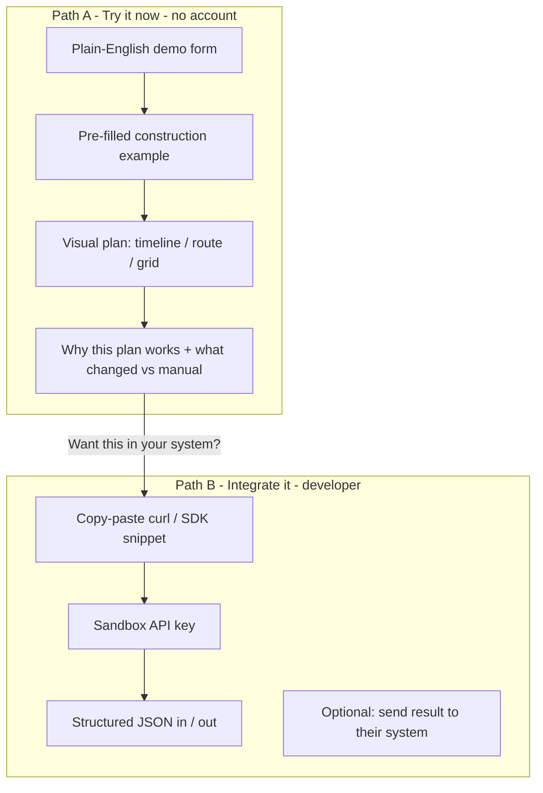
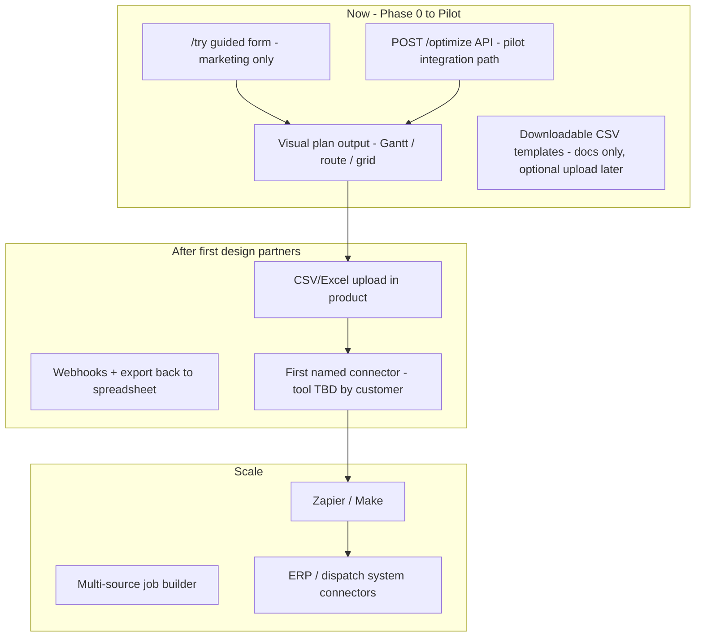
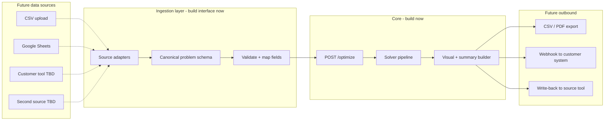
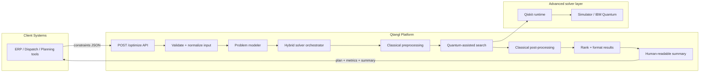
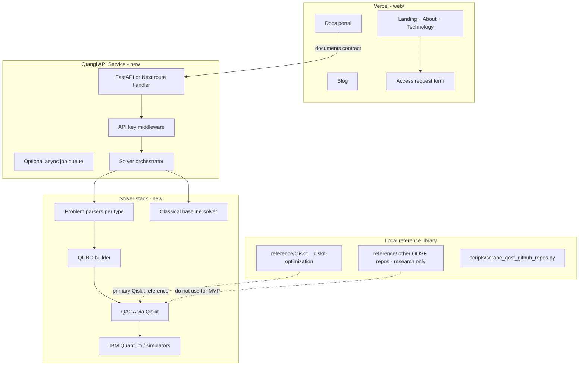
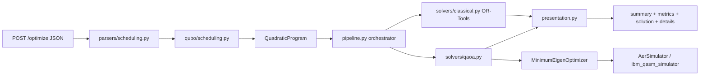

# Qtangl Solution Definition

## The 10-second explanation (for anyone, no quantum knowledge required)

**What it does:** Qtangl takes your planning rules—who needs to be where, what has to happen before what, what windows and capacity you have—and returns the **best feasible plan** instead of making you figure it out in spreadsheets or gut feel.

**How you use it:** Send your problem once (via API or a simple form). Get back a ranked schedule, route, or staffing plan you can review and put into action.

**Why it matters:** When plans break, you pay in delays, overtime, missed deliveries, and idle crews. Qtangl helps teams **make better plans faster** when constraints pile up.

**What it is NOT:** ChatGPT for logistics. A quantum physics demo. A dashboard that still makes you do the hard thinking.

---

## Product clarity principle: outcomes first, quantum never in the pitch

The current plan and site lean too hard on terms like QUBO, QAOA, hybrid-qaoa, and ibm_qasm_simulator. A normal user reads that and thinks: *"I don't know what any of this means, so this isn't for me."*

**The fix is not to hide what Qtangl is. The fix is to separate:**

| Layer | Audience | What they see |
|-------|----------|---------------|
| **Pitch** | Ops leader, buyer | Time saved, fewer delays, better routes, less overtime |
| **Product** | PM, integrator | "Send constraints → get plan" with a visible before/after |
| **Integration** | Developer | JSON API, copy-paste examples, sandbox key |
| **Technology** | Technical evaluators only | `/technology` and `/docs/concepts` explain hybrid + quantum |

**Quantum is a credibility and capability story for `/technology`, not the homepage headline.**

Recommended homepage reframe (replace "Quantum-native optimization platform"):

> **Planning API for schedules, routes, and staffing**  
> Send your constraints. Get back a plan your team can run.

---

## What we are building (exact statement)

**Qtangl is a planning API** that accepts real operational constraints and returns **ranked, feasible schedules, routes, or staffing plans**—the kind of output a dispatcher, project manager, or ops lead can actually use.

Under the hood it uses advanced optimization (including hybrid classical + quantum methods on hard problems). **Users never need to know that to get value.**

It is **not** a quantum research sandbox, demo lab, or generic AI assistant. It is **planning infrastructure** for construction, logistics, and workforce operations.

**One-line (user-facing):** Send your constraints. Get a plan you can run.

**One-line (developer-facing):** One API call turns structured scheduling, routing, or allocation inputs into ranked operational plans.

**Positioning:** Practical planning product with a quantum-native technical foundation—not a quantum product looking for a use case.

---

## "What the fuck does this do?" — three concrete answers

### For a construction PM

> "I have 12 tasks, 3 crews, inspection windows, and dependencies. Every time something slips, I rebuild the schedule by hand. Qtangl takes those rules and gives me a feasible sequence in seconds."

### For a logistics dispatcher

> "I have 8 stops, 2 trucks, delivery windows, and one driver calling in sick. Qtangl returns the best reroute instead of me guessing stop order in a map app."

### For a workforce scheduler

> "I need coverage across shifts with the right skills and no overtime blowout. Qtangl ranks staffing options that fit the rules I already have."

Each answer names **their world**, not quantum physics.

---

## "How do I use it?" — the product experience people actually need

Today the docs jump straight to JSON and `POST /optimize`. That is correct for developers but **wrong as the first impression**. The product needs two entry paths:



### Path A: "Try it" (must build — highest conversion value)

A `/try` or homepage-embedded demo where a user:

1. Picks a scenario: **Construction schedule**, **Delivery routes**, or **Staff shifts**
2. Sees a **pre-filled, editable** example in plain language (not raw JSON first)
3. Clicks **"Generate plan"**
4. Gets a **visual result**: Gantt-style timeline, route map list, or shift grid
5. Sees a short **"Why this works"** panel: constraints satisfied, estimated savings, comparison to naive plan

Only after that: "See the API request" expandable section for developers.

### Path B: API integration (already specced, needs to be live)

Developers send JSON → get JSON. Same underlying engine as Path A.

**Rule:** Every API response should include a **`summary`** field written for humans, not just `method: qaoa`.

Example response shape (revised for clarity):

```json
{
  "status": "success",
  "summary": "All 8 tasks scheduled with no crew conflicts. Foundation completes before framing. Inspection fits the required window.",
  "solution": [ ... ],
  "metrics": {
    "totalDurationDays": 14,
    "constraintViolations": 0,
    "estimatedIdleHoursSaved": 6
  },
  "method": "hybrid",
  "details": { "solver": "qaoa", "backend": "simulator" }
}
```

Move `qaoa` / `ibm_qasm_simulator` into **`details`**—visible in docs, not in the hero demo.

---

## "What's the value?" — measurable outcomes, not technology

Users buy **outcomes**. Every use case card, demo, and sales conversation should lead with numbers they already track:

| Use case | Pain today | Qtangl value | Metric to show in product |
|----------|------------|--------------|---------------------------|
| Construction scheduling | Manual replanning when crews slip | Feasible sequence in seconds | Hours saved replanning; delay risk reduced |
| Logistics routing | Suboptimal stop order; missed windows | Better routes under real constraints | Miles saved; on-time delivery % |
| Workforce allocation | Overtime + coverage gaps | Ranked staffing that fits rules | Overtime hours avoided; coverage score |

**Product requirement:** The demo and API response must surface at least one **concrete metric** (even estimated) so the user feels the value immediately—not just `"cost": 12` with no explanation.

### Before / after (the story every page should tell)

**Before Qtangl**

- Planner spends 2 hours rebuilding a schedule in Excel
- Dispatch sends a driver on a route that misses a delivery window
- Scheduler assigns overtime because skill matching was manual

**After Qtangl**

- Same constraints submitted once → feasible plan in seconds
- Team reviews ranked options and picks one
- Plan goes back into their existing tools via API

This before/after belongs on the homepage, not buried in the blog.

---

## Messaging hierarchy (what to change on the site)

Current site copy in [`web/lib/copy/home.ts`](web/lib/copy/home.ts) still leads with "Quantum-native optimization platform" and "hybrid optimization" in the hero bridge. That is the wrong order for a non-technical visitor.

**Recommended copy stack:**

1. **Hero:** Planning problem → plan output (no quantum words)
2. **Problem section:** Spreadsheet pain, missed windows, idle crews (already good)
3. **Solution section:** "One API. Your constraints in. Ranked plan out."
4. **Use cases:** Before/after with metrics (already structured in constants, needs visuals)
5. **Try it demo:** Interactive proof (new—critical)
6. **API section:** For developers who are already convinced
7. **Technology page:** Where quantum/hybrid explanation lives for evaluators

**Words to demote** (docs/technology only): QUBO, QAOA, Qiskit, simulator names, "quantum-native" in hero

**Words to promote** (everywhere): schedule, route, staffing, constraints, feasible, ranked plan, time saved, on-time, overtime, idle time

---

## Who uses it and why they care

| Persona | Job to be done | What they need to see | What they ignore |
|---------|----------------|----------------------|------------------|
| **Ops leader / buyer** | Stop losing money to bad plans | ROI, before/after, pilot story | API schema, solver names |
| **PM / dispatcher** | A plan I can run today | Visual timeline or route list | JSON, auth headers |
| **Developer / integrator** | Hook this into our system | Quickstart, sandbox, stable schema | Quantum theory |
| **Technical evaluator** | Is this real or hype? | Live demo + `/technology` depth | Marketing fluff |

**Pilot wedge (first customer):** Construction scheduling—one vertical, one demo, one measurable win. Do not sell "quantum optimization for everything" on day one.

**Pilot data path (confirmed):** **API-only for the first design partners.** Do not build live connectors until paying pilot customers tell us which tools they actually use. Marketing `/try` demo uses guided forms; production pilot uses API integration built by the customer's technical partner.

---

## Integrations, data entry, and visual output — should we integrate?

### Short answer

| Question | Answer |
|----------|--------|
| **Should we integrate?** | **Yes — eventually.** Integrations are how Qtangl becomes part of daily workflows instead of a standalone tool nobody opens. |
| **Should we integrate now?** | **No — not for the first pilot.** Build API + visual output first. Let design partners tell us which systems matter. |
| **Do we take data from multiple sources?** | **Yes — architecturally.** One optimization job can merge tasks from a PM tool, crew availability from HR, and windows from dispatch. **MVP pilot: single source via API.** |
| **How do users enter data today?** | Developers send JSON via API. Non-technical users use the `/try` marketing demo (guided form). **Not** ERP connectors yet. |
| **What do users actually want?** | Visual plans (Gantt, routes, grids), not JSON. Uploads/templates feel familiar. Seamless push-back into tools they already use. |

### The product ladder (what we build when)



**Rule:** Never ask a pilot customer to re-key data manually if their team can integrate via API. Never build a connector speculatively before a customer names the tool.

---

## How users enter data (four paths, prioritized)

| Path | Who | MVP / Pilot | Later |
|------|-----|-------------|-------|
| **1. Guided form (`/try`)** | Curious visitor, sales demo | **Build now** — pre-filled examples, no account | Becomes logged-in "quick optimize" |
| **2. API (JSON)** | Customer's developer / integrator | **Pilot path** — primary way design partners connect | SDKs, OpenAPI, sandbox keys |
| **3. CSV / Excel upload** | PM, dispatcher without dev resources | **Docs + templates only** at pilot; upload UI after pilot | Drag-and-drop import with validation preview |
| **4. Live integrations** | Enterprise teams in existing stack | **Out of scope for pilot** | First connector chosen by design partner |

### What "data do I enter?" — answer per use case

Users do not enter "optimization models." They enter **what they already track**:

**Construction scheduling**
- Tasks (name, duration, crew/equipment)
- Dependencies ("framing after foundation")
- Availability ("Crew B unavailable Tuesday")
- Windows ("inspection must happen before close-out")

**Logistics routing**
- Stops (address or ID, service time)
- Vehicles (capacity, shift hours)
- Windows (delivery time ranges)
- Optional: distance matrix or "use default estimates"

**Workforce allocation**
- Shifts to fill
- People (skills, availability, max hours)
- Coverage rules ("2 certified operators per shift")

The product job is to **map familiar fields → canonical problem schema → solver**. Users should see field labels they recognize, not `{}` and `"constraints": []`.

---

## Visual output — required product surface (not optional)

Users want **graphs, charts, and diagrams** — not raw API responses. Visual output is part of the core product, not a nice-to-have.

| Problem type | Primary visual | Secondary metrics |
|--------------|----------------|-------------------|
| **Scheduling** | Gantt / timeline (tasks on rows, time on axis) | Idle time, delay risk, constraint violations |
| **Routing** | Ordered stop list + simple route diagram | Miles, on-time %, capacity used |
| **Allocation** | Shift grid (people × shifts) | Coverage score, overtime hours |

**Where visuals appear:**
- `/try` demo (marketing — build in Phase 0)
- Future pilot dashboard or embeddable widget (post-API)
- API still returns JSON for integrators, but includes `summary` + `metrics` and optionally `visualization` URLs or structured chart data

**Architecture note:** Build a shared `PlanVisualization` component layer in [`web/components/`](web/components/) that renders from a normalized response shape. Same renderer for demo mock data and live API responses.

---

## Integration architecture (build the slot, not the connectors yet)

Even though pilot is API-only, the backend should be **integration-ready** so the first connector is a thin adapter, not a rewrite.



**Build now (pilot):**
- `CanonicalProblem` schema (schedule | routing | allocation)
- `POST /optimize` accepts canonical JSON directly
- Response: `solution` + `summary` + `metrics` + render-friendly structure for visuals
- Adapter **interface** documented (how a future CSV or Procore adapter maps to canonical)

**Build after pilot (customer-driven):**
- First **named connector** — tool chosen by design partner
- CSV upload UI with column-mapping preview
- Webhook or export ("send plan back to…")

**Multi-source (merge jobs):** Supported in schema design — e.g. `sources: [{ type: "tasks", origin: "procore" }, { type: "availability", origin: "hr_export" }]`. **Not implemented until a customer needs it.**

---

## What we tell users about integrations (messaging)

**Homepage / docs (honest, builds trust):**

> "Start with our API or work with us on a pilot integration. We connect to the tools your team already uses — tell us what you run today."

**Access form addition:** "What tools do you use for scheduling / dispatch / staffing today?" — this feeds connector priority.

**Do not promise:** "Integrates with everything" or logos for tools we have not built.

---

## Problem we solve

Operations teams face **constraint-heavy combinatorial problems** that are:

- Too complex for spreadsheets and tribal knowledge
- Poorly served by generic AI (summaries, not feasible plans)
- Hard to integrate from legacy optimization tools

**Initial wedge (3 problem families):**

| Domain | Input | Output | Business value |
|--------|-------|--------|----------------|
| **Scheduling** | Tasks, crews, dependencies, time windows | Feasible task timeline | Less idle time, fewer delays |
| **Routing** | Stops, fleet, capacity, delivery windows | Optimized stop order + assignments | Lower miles, better on-time delivery |
| **Allocation** | People, skills, shifts, coverage targets | Ranked staffing plans | Better coverage, less overtime |

Source: original specs ([`qtangl_info`](qtangl_info), [`qtangl_site`](qtangl_site)) and live copy in [`web/lib/copy/product.ts`](web/lib/copy/product.ts), [`web/lib/constants.ts`](web/lib/constants.ts).

---

## How the solution works

### User-facing flow (what people experience)

1. **Describe the situation** — "These tasks, these crews, these rules."
2. **Get ranked plans** — Qtangl returns one or more feasible options, best first.
3. **Review and act** — Team picks a plan and uses it in their existing workflow.
4. **Re-run when things change** — New sick call or delayed inspection? Submit again.

No step requires understanding quantum computing.

### Technical flow (what we build under the hood)



**Internal detail (not user-facing):** Problem modeler converts to QUBO; quantum-assisted search uses QAOA where it helps. Users see `"method": "hybrid"` and optional `details.solver`.

This matches workflow steps in [`web/lib/constants.ts`](web/lib/constants.ts) but the **product must express step 2 as "evaluate feasible plans"** not "run QAOA."

---

## Exact API contract (product surface)

**Single MVP endpoint:** `POST /optimize`

**Design rule:** The API must be **integrator-friendly** and **human-readable**. Raw solver metadata is nested under `details`, not the first thing a user sees.

**Request shape:**

```json
{
  "type": "schedule | routing | allocation",
  "data": {},
  "constraints": []
}
```

**Concrete quickstart example** (scheduling):

```json
{
  "type": "scheduling",
  "tasks": [
    { "id": "A", "duration": 3 },
    { "id": "B", "duration": 2 }
  ],
  "constraints": ["A must happen before B"]
}
```

**Response shape (revised for product clarity):**

```json
{
  "status": "success",
  "summary": "Task A completes before Task B. Total plan duration: 5 units.",
  "solution": [
    { "task": "A", "start": "09:00" },
    { "task": "B", "start": "12:00" }
  ],
  "metrics": {
    "constraintViolations": 0,
    "totalCost": 12
  },
  "method": "hybrid",
  "details": {
    "solver": "qaoa",
    "backend": "simulator"
  }
}
```

**MVP operational rules** (documented, must be enforced in backend):

- Auth: Bearer API key
- Rate limit: 10 req/min per key
- Errors in plain English: `"Your request is missing required tasks"`, not `"Invalid QUBO dimension"`

**Important:** Today this contract exists only as **static docs and JSON examples** in the Next.js site. There is **no live backend** and no `app/api/**/route.ts` handler.

---

## System architecture (full product)

Two deployable surfaces + one solver service:



| Layer | Location | Status |
|-------|----------|--------|
| Marketing + docs site | [`web/`](web/) | **Built** (13 routes, access form, static API docs) |
| Live optimization API | **Not built** | Needs new service |
| Solver (QUBO + QAOA) | **Not built** | Follow [Quantum Tooling Guide](.cursor/plans/quantum_tooling_guide_0808acee.plan.md); primary ref: [`reference/Qiskit__qiskit-optimization`](reference/Qiskit__qiskit-optimization) |
| Reference corpus | [`reference/`](reference/) + [`scripts/scrape_qosf_github_repos.py`](scripts/scrape_qosf_github_repos.py) | Qiskit-optimization = required; other QOSF repos = research only |

**Deploy target (already chosen):** GitHub repo `charley-forey/qtangl` → Vercel root directory `web/` for the site.

---

## Quantum / solver stack (exact choices)

**Companion doc:** All Qiskit learning, install steps, code patterns, and classical-vs-quantum tradeoffs live in the [Quantum Tooling Guide](.cursor/plans/quantum_tooling_guide_0808acee.plan.md). This section summarizes how that guide maps into Qtangl's backend.

| Decision | Choice | Rationale |
|----------|--------|-----------|
| **Quantum stack** | **Qiskit + qiskit-optimization** | Best fit for QUBO/QAOA + IBM simulators; patterns in [`reference/Qiskit__qiskit-optimization`](reference/Qiskit__qiskit-optimization) |
| **Classical stack** | **OR-Tools CP-SAT** | Required fallback—not optional; often faster/better for MVP-sized problems (≤20 tasks) |
| Formulation | **QUBO** via `QuadraticProgram` | Standard bridge from scheduling/routing/allocation to QAOA |
| Algorithm | **QAOA** via `MinimumEigenOptimizer` | Documented MVP quantum method; wrapped, not exposed raw to users |
| Runtime (MVP) | **AerSimulator / `ibm_qasm_simulator`** | Simulator only; IBM Quantum free-tier account for cloud simulators; hardware post-MVP |
| Execution model | **Hybrid orchestrator** | Classical baseline always runs; QAOA attempted when problem size fits; return best result with `method` metadata |
| What NOT to use | PennyLane, Cirq, 153 QOSF repos | Research noise for MVP—see tooling guide comparison table |

**Critical reality (from tooling guide):** For MVP-sized problems, classical OR-Tools often outperforms QAOA on speed and quality. Quantum is differentiation + research path—not the primary value driver today. The hybrid orchestrator must **honestly fall back** and never block on quantum failure.

---

## How to implement Qiskit (follow the tooling guide)

### Install stack (`backend/requirements.txt`)

```txt
fastapi uvicorn pydantic
qiskit qiskit-aer qiskit-optimization docplex
ortools
```

Optional: IBM Quantum account (free tier) for cloud simulators via Qiskit Runtime.

### Qiskit workflow mapped to `backend/` files

This is the exact pipeline from the [Quantum Tooling Guide](.cursor/plans/quantum_tooling_guide_0808acee.plan.md)—each step maps to a backend module:



| Step | Qiskit / library | Backend file | What it does |
|------|------------------|--------------|--------------|
| 1. Model | Docplex or direct `QuadraticProgram` | `backend/app/qubo/scheduling.py` | Turn tasks + precedence into QUBO |
| 2. Translate | `from_docplex_mp(model)` | same | Docplex → Qiskit `QuadraticProgram` |
| 3. Classical solve | OR-Tools CP-SAT | `backend/app/solvers/classical.py` | Baseline plan + cost (always run first) |
| 4. Configure QAOA | `QAOA(sampler=SamplerV2(...), optimizer=spsa, reps=5)` | `backend/app/solvers/qaoa.py` | Quantum path on simulator |
| 5. Wrap | `MinimumEigenOptimizer(qaoa).solve(problem)` | `backend/app/solvers/qaoa.py` | Run QAOA, get bitstring |
| 6. Post-process | Custom decode | `backend/app/presentation.py` | Bitstring → schedule; compute cost; pick best vs classical |
| 7. Respond | Pydantic models | `backend/app/models/` | `summary`, `metrics`, `details.solver`, `details.backend` |

### Minimal QAOA code shape (from tooling guide)

```python
from qiskit_optimization.algorithms import MinimumEigenOptimizer
from qiskit_optimization.minimum_eigensolvers import QAOA
from qiskit_aer.primitives import SamplerV2
from qiskit_aer import AerSimulator

simulator = AerSimulator()
sampler = SamplerV2(backend=simulator)
qaoa = QAOA(sampler=sampler, optimizer=spsa, reps=5)
result = MinimumEigenOptimizer(qaoa).solve(problem)  # problem = QuadraticProgram
```

**The hard part is step 1:** `parsers/` + `qubo/` that turn JSON from [`web/lib/constants.ts`](web/lib/constants.ts) into a valid `QuadraticProgram`. Qiskit solves the easy part once the QUBO is correct.

### Learning sequence (do before or alongside Phase B)

From the [Quantum Tooling Guide](.cursor/plans/quantum_tooling_guide_0808acee.plan.md)—execute in order:

1. Run Max-Cut tutorial in [`reference/Qiskit__qiskit-optimization/README.md`](reference/Qiskit__qiskit-optimization/README.md)
2. Read [qiskit-optimization tutorials](https://qiskit-community.github.io/qiskit-optimization/tutorials/index.html) — focus on **QuadraticProgram** and **QAOA** only
3. Manually encode a 3–5 task scheduling QUBO (precedence only)
4. Solve same problem with **OR-Tools CP-SAT**; log latency + cost side-by-side
5. Wire both into `POST /optimize` with `method: classical | hybrid` and `details.solver` metadata

**Do NOT learn first:** full quantum mechanics, hardware calibration, error mitigation (Mitiq in reference), or browsing all QOSF repos.

### Hybrid orchestrator rules (`backend/app/pipeline.py`)

```
1. Parse + validate JSON → CanonicalProblem
2. Build QuadraticProgram (if QUBO path applicable)
3. Run classical solver (always) → classical_result
4. If problem size ≤ MVP limits AND timeout budget remains:
     Run QAOA on simulator → quantum_result
5. Pick best feasible result (lowest cost, zero violations)
6. Set method: "classical" | "hybrid" based on which won
7. Build summary + metrics + visualization data via presentation.py
8. Nest solver/backend in details (never lead response with "qaoa")
```

### Primary reference repo (ignore the rest for MVP)

Only [`reference/Qiskit__qiskit-optimization`](reference/Qiskit__qiskit-optimization) is required reading. The broader [`reference/`](reference/) corpus (153+ QOSF repos) stays research-only per the tooling guide.

---

## What is already built (website MVP)

Phases 1–4 from [`qtangl_steps`](qtangl_steps) are largely complete in [`web/`](web/):

- **Routes:** `/`, `/about`, `/technology`, `/access`, `/docs/*`, `/api`, `/blog/*`
- **Content system:** [`web/lib/copy/`](web/lib/copy/), [`web/lib/constants.ts`](web/lib/constants.ts), [`web/lib/siteConfig.ts`](web/lib/siteConfig.ts)
- **Access form:** [`web/app/access/actions.ts`](web/app/access/actions.ts) (Resend/Formspree optional)
- **SEO:** sitemap, robots, OG image
- **Design:** quantum-native monochrome UI (latest commits)

**Known gaps in the site layer:**

- Referenced PNG assets in constants (e.g. `/qtangl-usecase-scheduling.png`) are **missing** from [`web/public/`](web/public/) — only `logo.svg` and `logo-mark.svg` exist today
- Original root spec files (`qtangl_info`, `qtangl_site`, `qtangl_build`, `qtangl_steps`) are **deleted from disk** but recoverable from git commit `0fb1ee8`
- ProductPreview metrics on homepage are **mock data**, not live solver stats

---

## Full product implementation plan

You confirmed the target is the **full product** (site + live API + solver). **Build order changes:** clarity and demo come before solver depth. If people do not understand or feel value in 30 seconds, the backend does not matter.

### Phase 0 — Make the product make sense (3–5 days) **← do this first**

- Rewrite hero, homepage, and docs intro in [`web/lib/copy/`](web/lib/copy/) — outcomes first, quantum demoted to `/technology`
- Add **before/after** blocks to each use case (problem → outcome → metric)
- Build **`/try` interactive demo** (marketing only): guided form → **visual plan** (Gantt / route list / shift grid) → "See API" toggle
- Build **shared visual output components** (timeline, metrics cards) reusable when API goes live
- Add docs page **"Data formats"**: what fields to send, downloadable CSV templates (reference only — no upload UI yet)
- Revise API response contract to include `summary` + `metrics` + visualization-friendly structure
- Update access form: **"What tools do you use today?"** to capture integration demand from pilots
- Replace mock ProductPreview stats with honest labels ("Example output") until live data exists
- Fix missing use-case visuals in [`web/public/`](web/public/)

**Exit criteria:** A non-technical person can explain Qtangl back to you in one sentence after 60 seconds on the site, and a developer understands what JSON fields to send.

### Phase A — Lock the contract (1–2 days)

- Restore canonical specs to repo root (optional but recommended for team alignment)
- Freeze API JSON schemas as OpenAPI or JSON Schema files shared by docs and backend
- Define **`CanonicalProblem`** schema + adapter interface doc (for future CSV/connectors)
- Align doc examples in [`web/lib/constants.ts`](web/lib/constants.ts) with one canonical schema (resolve `schedule` vs `scheduling` naming inconsistency)
- Define MVP problem sizes (e.g. max 20 tasks / 15 stops) and timeout budgets

### Phase B — Solver core (Python, highest risk) (2–4 weeks)

**Follow:** [Quantum Tooling Guide](.cursor/plans/quantum_tooling_guide_0808acee.plan.md) for install, learning sequence, and QAOA code patterns.

Create `backend/` service:

```
backend/
├── app/
│   ├── main.py              # FastAPI entry
│   ├── api/optimize.py      # POST /optimize
│   ├── auth.py              # API key validation
│   ├── models/              # Pydantic request/response + CanonicalProblem
│   ├── adapters/            # Interface only at pilot; CSV/tool adapters later
│   ├── parsers/             # JSON → CanonicalProblem (schedule | routing | allocation)
│   ├── qubo/                # CanonicalProblem → QuadraticProgram (Docplex or direct)
│   ├── solvers/
│   │   ├── classical.py     # OR-Tools CP-SAT baseline (build FIRST)
│   │   └── qaoa.py          # QAOA via qiskit-optimization + AerSimulator
│   ├── pipeline.py          # Hybrid orchestrator (classical always; QAOA when fit)
│   └── presentation.py      # summary + metrics + viz-friendly output
├── tests/
│   ├── test_classical_scheduling.py
│   └── test_qaoa_scheduling.py   # 3–5 task QUBO smoke test
├── requirements.txt         # qiskit, qiskit-aer, qiskit-optimization, docplex, ortools
└── README.md
```

**Build order within Phase B (mandatory sequence from tooling guide):**

| Order | Task | Exit criteria |
|-------|------|---------------|
| B1 | `learn-qiskit-basics` — Max-Cut tutorial + 5-task QUBO by hand | QUBO encodes precedence correctly |
| B2 | `classical-baseline` — parser + OR-Tools on `POST /optimize` | Live API returns feasible schedule + `method: classical` |
| B3 | `compare-classical` — log latency/cost for same 5-task problem | Documented comparison in backend README |
| B4 | `qaoa-solver` — QAOA path via `MinimumEigenOptimizer` | Same API returns `method: hybrid` when quantum wins or ties |
| B5 | Hybrid orchestrator + timeout fallback | Quantum failure never blocks response |

**MVP solver scope (keep narrow):**

1. **Scheduling:** precedence + duration (≤20 tasks) → QUBO → QAOA on simulator; classical always available
2. **Routing:** tiny TSP/VRP (≤10 stops) — **classical only** for MVP; QAOA later
3. **Allocation:** simple assignment — **classical only** for MVP; QAOA later

Start with **AerSimulator / ibm_qasm_simulator only**; IBM hardware is post-MVP.

**Dependencies:** `pip install qiskit qiskit-aer qiskit-optimization docplex ortools` (see tooling guide)

### Phase C — Live API gateway (1 week)

Options (pick one):

- **Option 1 (recommended):** Separate FastAPI service deployed to Railway/Fly/Render; site docs point to `api.qtangl.com`
- **Option 2:** Next.js Route Handler at `web/app/api/v1/optimize/route.ts` proxying to Python solver

Implement: auth, rate limiting, request validation, error mapping, structured logging, health check.

### Phase D — Wire docs + site to reality (3–5 days)

- Connect `/try` demo to **live** backend (same engine as API)
- Update docs quickstart to call live endpoint with sandbox key
- Add "What you get back" section explaining `summary` and `metrics` before JSON schema
- Add API playground for developers (optional but high credibility)

### Phase E — Pilot readiness (1 week)

- Issue pilot API keys manually
- Connect access form to pilot onboarding ("Tell us your scheduling problem" + **"What tools do you use?"**)
- End-to-end demo: customer's developer integrates via API → visual plan in their workflow → one measurable win in plain English
- **Document integration path:** "Your dev sends JSON today; we build a connector to [tool they named] after pilot proves value"

### Phase F — Integrations (after first design partners — customer-driven)

**Do not start until a pilot customer names their stack.**

| Priority | Integration | Trigger |
|----------|-------------|---------|
| 1 | CSV/Excel upload + column mapper | Multiple prospects say "we live in spreadsheets" |
| 2 | First named connector | Design partner commits + names tool (Procore, Smartsheet, Samsara, etc.) |
| 3 | Webhooks + export | Customer needs plan pushed back into their system |
| 4 | Zapier / Make | Self-serve demand from smaller teams |
| 5 | Multi-source merge | Customer has tasks in one system, availability in another |
| 6 | ERP / dispatch deep integrations | Enterprise contracts |

---

## Demo narrative (the story we sell and build against)

**Wrong demo (current risk):** "Here's JSON, we used QAOA on ibm_qasm_simulator, cost is 12."

**Right demo:** A construction PM opens `/try`, sees their world (tasks, crews, inspection window), clicks Generate Plan, and gets:

- A **visual timeline** they can read
- A **one-sentence summary**: "All tasks fit. No crew conflicts. Inspection lands in the required window."
- A **metric**: "Estimated 6 hours less idle crew time vs. manual ordering"
- Expandable "Technical details" for evaluators who want solver info

**Sales line:** "We help you stop rebuilding schedules by hand when constraints change—not 'we do quantum.'"

---

## Success criteria (full product)

| Audience | Success test |
|----------|--------------|
| **Non-technical visitor** | Can answer "what does it do?" and "why would I use it?" after 60 seconds on homepage |
| **Ops leader / buyer** | Sees a before/after with a metric they already track (delay, miles, overtime) |
| **PM / dispatcher** | Can use `/try` demo without reading JSON; understands what data they'd need to provide |
| **Developers (pilot)** | Integrates via API in <1 day with canonical schema docs |
| **Pilot customer** | Gets a feasible plan for a real small problem and states the value in their own words |
| **Founders** | Can pitch without saying QUBO, QAOA, or simulator names unless asked |

**The product fails if only quantum-curious engineers understand it.**

---

## Explicit out-of-scope for MVP / first pilot

- Multi-tenant dashboard / billing (Stripe)
- Custom problem DSL beyond JSON schemas
- Real IBM hardware (simulator first)
- Large-scale VRP (100+ stops)
- **Live ERP / dispatch connectors** (build after customer names tool)
- **CSV upload UI in product** (templates in docs OK; upload UI is Phase F)
- **Multi-source data merge** (schema-ready; not implemented until customer need)
- Async job polling / webhooks (Phase F)
- Zapier / Make (Phase F)
- Using `reference/` repos directly in production without evaluation

**In scope for MVP / pilot:** API integration, visual output components, `/try` guided demo, CSV templates in docs, adapter interface design, "what tools do you use?" on access form.

---

## Recommended immediate next steps (after plan approval)

1. **Phase 0 first:** Rewrite copy, build `/try` demo with **visual plan output**, add "Data formats" docs + CSV templates
2. **Read** [Quantum Tooling Guide](.cursor/plans/quantum_tooling_guide_0808acee.plan.md) and run Max-Cut tutorial from [`reference/Qiskit__qiskit-optimization`](reference/Qiskit__qiskit-optimization)
3. Revise API response: `summary` + `metrics` + visualization-friendly structure
4. Create `backend/` with `CanonicalProblem` schema; implement **OR-Tools classical baseline first** on `POST /optimize`
5. Encode 5-task scheduling QUBO; compare classical vs QAOA latency (document in backend README)
6. Add QAOA via `qiskit-optimization` + hybrid orchestrator with honest fallback
7. Capture **"what tools do you use?"** on access form to prioritize Phase F connectors
8. **Phase F integrations** only after a design partner names their stack

---

## Key source files to treat as living spec

- **Quantum / Qiskit implementation:** [Quantum Tooling Guide](.cursor/plans/quantum_tooling_guide_0808acee.plan.md)
- **Primary Qiskit reference code:** [`reference/Qiskit__qiskit-optimization`](reference/Qiskit__qiskit-optimization)
- Product vision: git `0fb1ee8:qtangl_info`, `0fb1ee8:qtangl_site`
- Build constraints: git `0fb1ee8:qtangl_build`, `0fb1ee8:qtangl_steps`
- Live copy/constants: [`web/lib/copy/product.ts`](web/lib/copy/product.ts), [`web/lib/constants.ts`](web/lib/constants.ts)
- Docs narrative: [`web/app/docs/`](web/app/docs/)
- Research tooling: [`scripts/scrape_qosf_github_repos.py`](scripts/scrape_qosf_github_repos.py)
