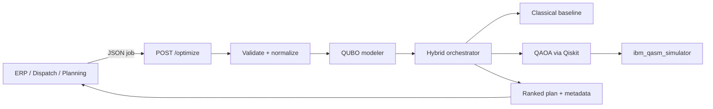
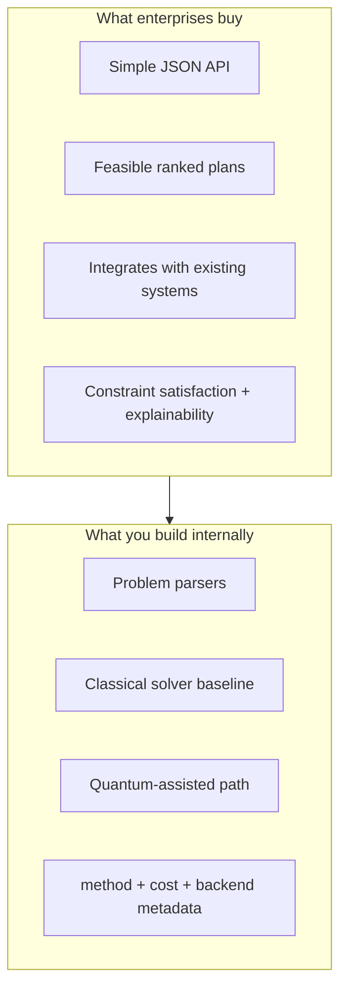

# Quantum Tooling & Enterprise Strategy for Qtangl

## What you are actually building (context)

Your [solution definition](c:\Users\charl\Desktop\qtangl\.cursor\plans\qtangl_solution_definition_d77261b9.plan.md) already nails the right framing: **Qtangl is not a quantum lab—it is enterprise optimization infrastructure** with a quantum-native brand and hybrid execution.



The product value is **feasible schedules, routes, and staffing plans**—not quantum circuits.

---

## Quantum computing in plain terms (what matters for Qtangl)

| Concept | What it is | Why Qtangl cares |
|---------|------------|------------------|
| **Qubit** | A quantum bit that can be in superposition | Enables parallel exploration of many candidate solutions |
| **QUBO** | Quadratic Unconstrained Binary Optimization—decisions as 0/1 variables with pairwise costs | Standard bridge from scheduling/routing/allocation to quantum-friendly solvers |
| **QAOA** | Quantum Approximate Optimization Algorithm—hybrid algorithm for QUBO | Your documented MVP quantum method |
| **Hybrid execution** | Classical prep → quantum search → classical post-processing | **This is the honest enterprise story today** |
| **Simulator vs hardware** | Simulators run on classical CPUs; hardware has noise, queues, limited qubits | MVP should use simulators; hardware is post-MVP |

**Critical reality check:** For most small-to-medium combinatorial problems (≤20 tasks, ≤15 stops), **classical solvers (OR-Tools, CP-SAT, Gurobi) often outperform quantum today** in speed and solution quality. Quantum is a research direction and a differentiation narrative—not yet the primary value driver. Your plan correctly includes a **classical fallback** as required, not optional.

---

## Is Qiskit the best tool? (Honest comparison)

**Short answer:** Qiskit is the **best default for Qtangl's chosen stack** (QUBO + QAOA + IBM Quantum), but it is **not universally "the best"** for all quantum or optimization work.

### When Qiskit is the right choice (your case)

- Combinatorial optimization via **QUBO/QAOA**
- IBM Quantum Runtime / simulators (`ibm_qasm_simulator`, Aer)
- Mature ecosystem: [`qiskit-optimization`](c:\Users\charl\Desktop\qtangl\reference\Qiskit__qiskit-optimization) with Docplex → QuadraticProgram → QAOA pipeline
- Enterprise familiarity (IBM brand, cloud access, documentation)
- Your reference corpus already includes the exact libraries you need

### Alternatives in your [`reference/`](c:\Users\charl\Desktop\qtangl\reference) folder

| Stack | Best for | Fit for Qtangl MVP |
|-------|----------|-------------------|
| **Qiskit + qiskit-optimization** | QUBO, QAOA, IBM hardware/simulators | **Primary choice (already planned)** |
| **OR-Tools / CP-SAT / Gurobi** | Classical combinatorial optimization | **Required fallback—not optional** |
| **D-Wave Ocean** | Quantum annealing for QUBO | Different hardware model; good for some QUBO but separate vendor lock-in |
| **PennyLane** | QML, chemistry, multi-vendor circuits | Strong library, weaker fit for operational QUBO APIs |
| **Cirq** | Google quantum stack | Only if targeting Google hardware |
| **Amazon Braket SDK** | Multi-vendor cloud orchestration | Useful later if you want vendor-neutral cloud routing |
| **PyQuil / Rigetti** | Rigetti hardware | Niche unless targeting that hardware |

**Recommendation:** Stay with **Qiskit for the quantum path** and **OR-Tools/CP-SAT for the classical path**. Do not evaluate all 153 QOSF repos for MVP—your plan correctly treats [`reference/`](c:\Users\charl\Desktop\qtangl\reference) as research-only. The highest-signal reference is [`Qiskit__qiskit-optimization`](c:\Users\charl\Desktop\qtangl\reference\Qiskit__qiskit-optimization).

---

## How to use Qiskit (concrete path for Qtangl)

### 1. Install the stack

```bash
pip install qiskit qiskit-aer qiskit-optimization docplex
# Optional classical comparison:
pip install ortools
```

You will also need an **IBM Quantum account** (free tier) for cloud simulators and eventual hardware access.

### 2. The Qiskit optimization workflow (maps directly to your backend)

This is the pattern from `qiskit-optimization` README—adapt it per problem type in `backend/qubo/`:

1. **Model** — Express problem as Docplex or build `QuadraticProgram` directly (tasks, precedence, costs)
2. **Translate** — `from_docplex_mp(model)` → Qiskit `QuadraticProgram`
3. **Configure solver** — `QAOA` + `SamplerV2` + `AerSimulator` (MVP: simulator only)
4. **Wrap** — `MinimumEigenOptimizer(qaoa).solve(problem)`
5. **Post-process** — Decode bitstring → schedule/route/allocation; compute cost; compare to classical baseline

Minimal example shape (Max-Cut, from your reference):

```python
from qiskit_optimization.algorithms import MinimumEigenOptimizer
from qiskit_optimization.minimum_eigensolvers import QAOA
from qiskit_aer.primitives import SamplerV2
from qiskit_aer import AerSimulator

qaoa = QAOA(sampler=SamplerV2(...), optimizer=spsa, reps=5)
result = MinimumEigenOptimizer(qaoa).solve(problem)
```

For Qtangl, step 1 is the hard part: **parsers** that turn JSON like your documented contract in [`web/lib/constants.ts`](c:\Users\charl\Desktop\qtangl\web\lib\constants.ts) into QUBO matrices.

### 3. Recommended learning sequence (1–2 weeks)

1. Run the Max-Cut tutorial in [`Qiskit__qiskit-optimization/README.md`](c:\Users\charl\Desktop\qtangl\reference\Qiskit__qiskit-optimization\README.md)
2. Read [qiskit-optimization tutorials](https://qiskit-community.github.io/qiskit-optimization/tutorials/index.html) — focus on **QuadraticProgram** and **QAOA**
3. Encode a tiny scheduling problem (3–5 tasks, precedence only) as QUBO manually
4. Run same problem through **OR-Tools CP-SAT** and compare cost + latency
5. Wire both into a single FastAPI `POST /optimize` response with `method` and `backend` metadata (your documented response shape)

### 4. What NOT to learn first

- Full quantum mechanics / linear algebra depth
- Hardware calibration, error mitigation (mitiq in reference)—post-MVP
- All 153 QOSF repos—research noise for now

---

## Use cases and value: quantum vs classical vs generic AI

### Where Qtangl's three problem families create real value

| Domain | Real-world trigger | Buyer | Value metric |
|--------|-------------------|-------|--------------|
| **Construction scheduling** | Crew idle time, trade sequencing, inspection windows | PM / ops director | Days saved, idle crew hours reduced |
| **Logistics routing** | Dynamic dispatch, delivery windows, fleet limits | Dispatch manager | Miles saved, on-time % |
| **Workforce allocation** | Shift coverage, skills matching, overtime | HR ops / scheduler | Coverage gaps, overtime cost |

These are defined in your site copy at [`web/lib/constants.ts`](c:\Users\charl\Desktop\qtangl\web\lib\constants.ts) and align with the plan's pilot demo (8-task construction schedule).

### Value proposition layers (what to sell vs what to build)



**Quantum adds value today primarily as:**
- A **differentiated technology story** for pilots and press
- A **research path** for problems where classical heuristics plateau
- **Hybrid orchestration** that can swap backends as hardware improves

**Quantum does NOT yet reliably add value as:**
- The sole solver for MVP-sized problems
- A replacement for proven classical OR tools
- Something ops teams interact with directly

Your blog already states this well: ["QUBO is a modeling tool, not the product"](c:\Users\charl\Desktop\qtangl\web\app\blog\quantum-optimization\page.tsx) and ["QAOA is a method inside the system rather than the system itself"](c:\Users\charl\Desktop\qtangl\web\app\blog\quantum-optimization\page.tsx).

---

## Most valuable enterprise solution to build on top of this

**The highest-value product is not "Qiskit in a box."** It is:

> **An API-first optimization layer that turns operational JSON into ranked, feasible plans—with classical reliability and quantum-native extensibility.**

### Why this beats alternatives

| Alternative | Gap Qtangl fills |
|-------------|------------------|
| Spreadsheets + tribal knowledge | No systematic constraint handling |
| Generic AI (ChatGPT, etc.) | Summaries, not feasible plans |
| Legacy optimization suites | Hard to integrate, expensive, opaque |
| Raw Qiskit notebooks | Research artifacts, not production APIs |
| Quantum hardware vendors | Hardware/cloud, not domain problem modeling |

### Recommended wedge (highest enterprise value first)

**1. Construction scheduling API (pilot wedge)** — from your plan's Phase E demo:
- Smallest parser scope (precedence + duration + crew windows)
- Clearest ROI story (idle crews cost money daily)
- Easiest pilot buyer (mid-size GC or subcontractor coordinator)
- Problem size fits MVP limits (≤20 tasks)

**2. Logistics routing (second)** — higher complexity (VRP), keep to ≤10 stops for MVP

**3. Workforce allocation (third)** — strong value but more HR/compliance friction

### The "Stripe for optimization" pattern

What makes this enterprise-grade:

- **One endpoint:** `POST /optimize` (already documented, not yet built)
- **Bearer API key auth** + rate limits
- **Structured errors** (`Invalid input`, `Solver failure`, `Timeout`)
- **Response metadata:** `cost`, `method`, `backend` — lets buyers compare hybrid vs classical
- **Honest fallback:** classical result when quantum path fails or is slower

This is more valuable than exposing Qiskit directly because **enterprises buy outcomes, not frameworks**.

---

## How to bring this to market in real, usable use cases

### Phase 1 — Prove the API path (weeks 1–3)

Build what your plan already specifies in [`backend/`](c:\Users\charl\Desktop\qtangl\.cursor\plans\qtangl_solution_definition_d77261b9.plan.md):

1. FastAPI + Pydantic models matching documented contract
2. **Scheduling parser + classical baseline first** (proves value before QAOA complexity)
3. QAOA path on `ibm_qasm_simulator` for smallest scheduling QUBO
4. Deploy to staging; wire docs quickstart to live endpoint

### Phase 2 — Pilot with one vertical (weeks 4–6)

- Target: **one construction PM** or **one dispatch team**
- Deliver: API key, 8-task demo JSON, side-by-side classical vs hybrid metadata
- Success metric: **feasible plan in <30s** that satisfies constraints they recognize
- Do NOT promise quantum advantage—promise **better planning than spreadsheets**

### Phase 3 — Enterprise credibility (weeks 7–12)

- OpenAPI/JSON Schema shared between docs and backend
- Observability: request IDs, solver timing, method used
- Optional API playground page on site
- Case study: "X idle crew hours avoided" (even if classical did the heavy lifting)

### Go-to-market messaging (honest and strong)

**Say:**
- "Submit constraints, get ranked feasible plans via API"
- "Hybrid classical-quantum solver stack with transparent method metadata"
- "Integrates into ERP, dispatch, and planning tools you already use"

**Avoid:**
- "Quantum computers solve your scheduling today"
- Leading with QUBO/QAOA jargon in sales conversations
- Mock metrics (your [`ProductPreview.tsx`](c:\Users\charl\Desktop\qtangl\web\components\marketing\ProductPreview.tsx) currently shows fake stats—replace with real or remove)

### Enhancing Qiskit tooling for market (your moat)

You don't fork Qiskit—you **wrap and operationalize** it:

| Layer | What you add | Market value |
|-------|--------------|--------------|
| **Domain parsers** | JSON → QUBO for schedule/route/allocation | Removes PhD requirement |
| **Hybrid orchestrator** | Auto-select classical vs quantum path | Reliability |
| **Ranking + explanation** | Why plan is feasible, constraint satisfaction | Trust |
| **SLA + auth + logging** | Production API surface | Enterprise adoption |
| **Pilot onboarding** | Access form → API key workflow | Revenue path |

---

## Decision summary

| Question | Answer |
|----------|--------|
| Is Qiskit best? | **Best for your IBM/QAOA/QUBO stack—not best for everything** |
| How to use it? | **qiskit-optimization: model → QuadraticProgram → QAOA → decode; start on simulator** |
| Use case value | **Combinatorial planning (schedule/route/allocate)—classical delivers today, quantum extends tomorrow** |
| Most valuable build | **API-first hybrid optimization platform; construction scheduling wedge first** |
| Go to market | **Live API + pilot + honest classical fallback + outcome metrics—not quantum demos** |

---

## Suggested next actions (when you exit plan mode)

1. Scaffold [`backend/`](c:\Users\charl\Desktop\qtangl) with FastAPI matching the documented `POST /optimize` contract
2. Implement scheduling parser + OR-Tools baseline (proves end-to-end before QAOA)
3. Add QAOA path using patterns from [`Qiskit__qiskit-optimization`](c:\Users\charl\Desktop\qtangl\reference\Qiskit__qiskit-optimization)
4. Run a personal learning exercise: 5-task schedule, compare classical vs QAOA latency and cost
5. Fix doc contract inconsistency (`schedule` vs `scheduling` in [`web/lib/constants.ts`](c:\Users\charl\Desktop\qtangl\web\lib\constants.ts))
