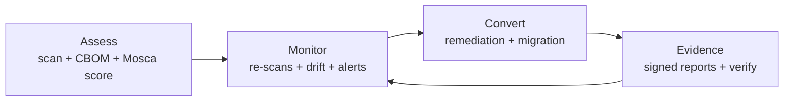
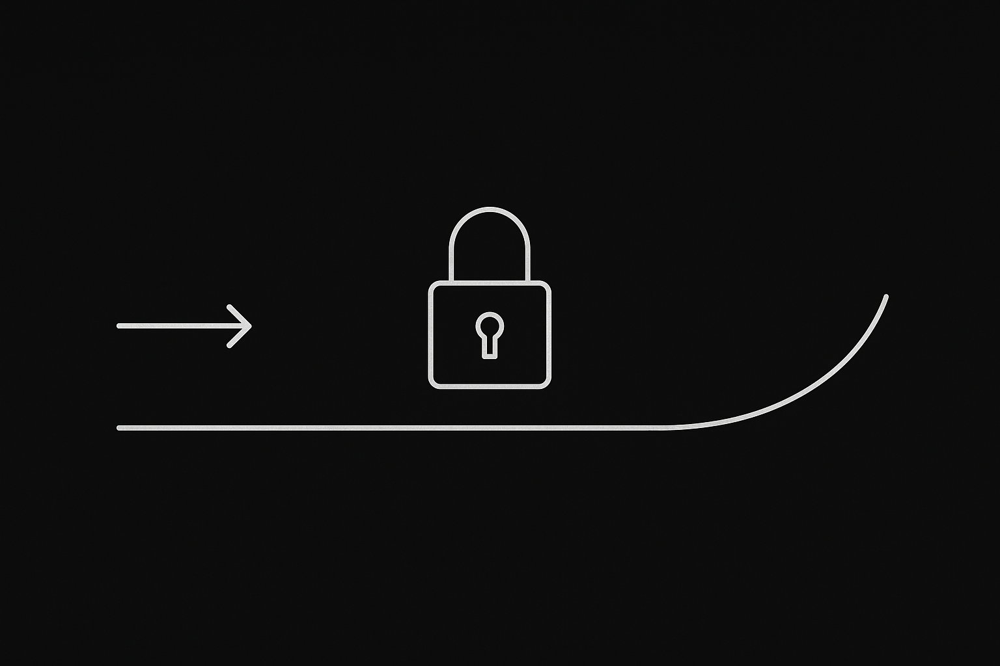
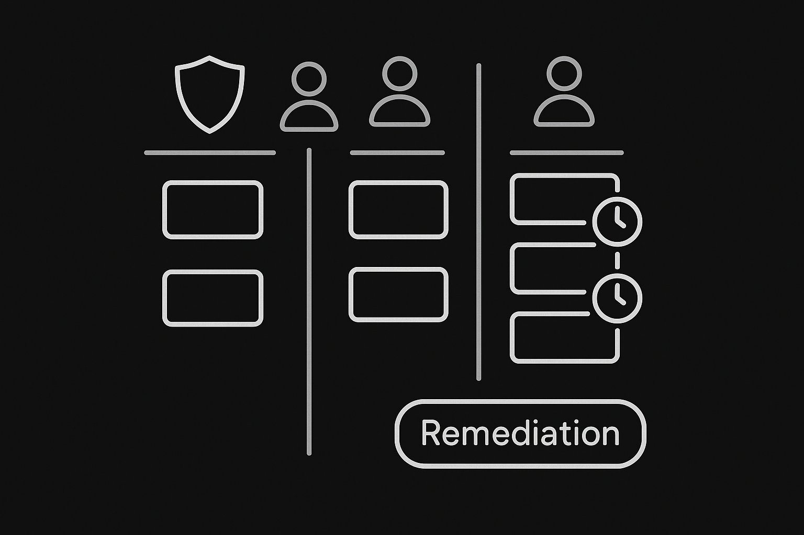
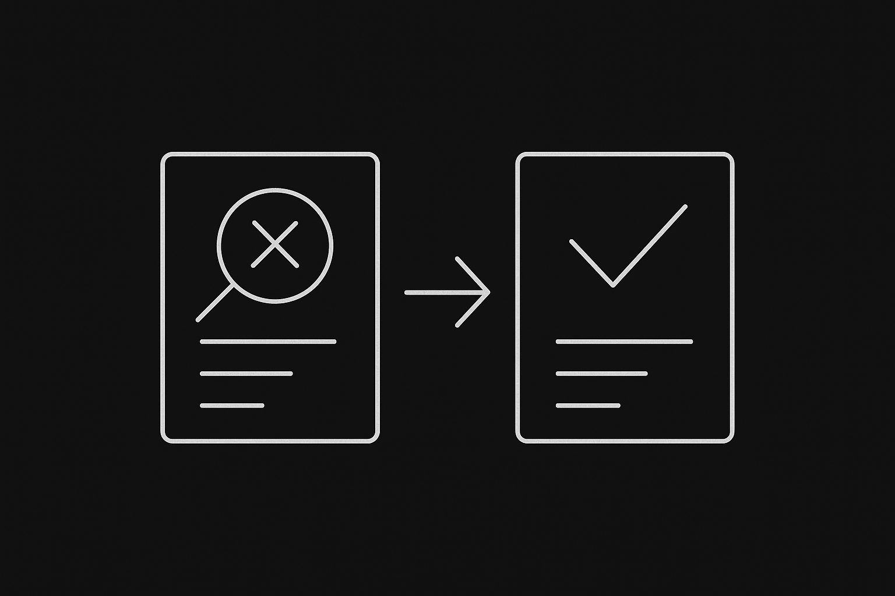
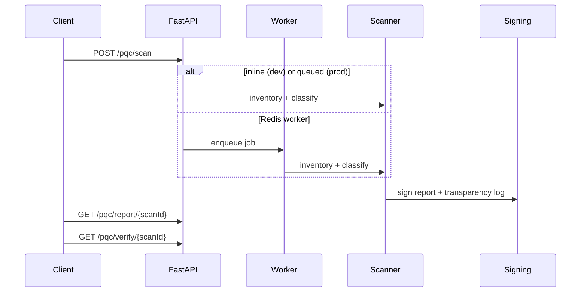

# Qtangl

[](https://github.com/charley-forey/qtangl/actions/workflows/ci.yml)
[](https://api.qtangl.com/openapi.json)
[](./backend/Dockerfile)
[](./web/package.json)

**Post-quantum readiness platform — Assess, Monitor, Convert with signed evidence.**

Qtangl helps organizations inventory quantum-vulnerable cryptography, monitor drift until Q-Day, and convert their stack with auditable, cryptographically signed evidence. Quantum is the **threat** on the PQC path, not the engine — hybrid optimization remains the forward-looking expansion story once defense is proven.

| | |
|---|---|
| **Production** | [www.qtangl.com](https://www.qtangl.com) · [api.qtangl.com](https://api.qtangl.com) |
| **API version** | `0.9.1` |
| **Docs** | [www.qtangl.com/docs](https://www.qtangl.com/docs) · [OpenAPI](https://api.qtangl.com/openapi.json) |
| **Trust** | [www.qtangl.com/trust](https://www.qtangl.com/trust) · [Verify a report](https://www.qtangl.com/verify) |
| **Changelog** | [CHANGELOG.md](./CHANGELOG.md) |

---

## Start here

| I want to… | Go to |
|------------|-------|
| **Run locally in 5 minutes** | [Quick start](#quick-start) |
| **Run full stack (Docker)** | [Docker Compose](#docker-compose) · [`docker-compose.yml`](./docker-compose.yml) |
| **Integrate via API or SDK** | [API & SDKs](#api--sdks) · [sdk/python/README.md](./sdk/python/README.md) |
| **Understand the architecture** | [docs/ARCHITECTURE.md](./docs/ARCHITECTURE.md) |
| **Develop & test** | [docs/DEVELOPMENT.md](./docs/DEVELOPMENT.md) · [CONTRIBUTING.md](./CONTRIBUTING.md) |
| **Deploy to production** | [Deployment](#deployment) · [backend/docs/RAILWAY_DEPLOY.md](./backend/docs/RAILWAY_DEPLOY.md) |
| **Try the product (no clone)** | [www.qtangl.com/assess](https://www.qtangl.com/assess) |
| **Report a security issue** | [.github/SECURITY.md](./.github/SECURITY.md) · [security.txt](https://www.qtangl.com/.well-known/security.txt) |
| **Contribute (humans & agents)** | [AGENTS.md](./AGENTS.md) |
| **Compliance & frameworks** | [docs/COMPLIANCE.md](./docs/COMPLIANCE.md) |
| **Pricing & competitors** | [docs/GTM.md](./docs/GTM.md) |

---

## Repository stats

<!-- AUTO-STATS:START -->
| Metric | Value |
|--------|-------|
| **API version** | `0.9.1` (from `backend/app/main.py`) |
| **Backend test modules** | ~125 |
| **Playwright E2E specs** | ~26 |
| **Alembic migrations** | 19+ |
| **Stats refreshed** | 2026-07-01 |

_Run `node scripts/sync-readme-stats.mjs --write` to refresh this block._
<!-- AUTO-STATS:END -->

**Dev shortcuts:** `make help` · `./scripts/dev.sh help` · `.\scripts\dev.ps1 help` (Windows)

---

## Product at a glance

> **Help organizations assess quantum crypto exposure, monitor drift until Q-Day, and convert their stack with auditable evidence — then unlock quantum advantage when they're ready.**



| Capability | Description |
|------------|-------------|
| Crypto inventory | TLS, CT, SSH, JWKS, SMTP STARTTLS, PEM bundles, cloud/K8s/CLM pulls, CBOM import |
| Risk framing | Mosca HNDL scoring, vulnerability classification, compliance packs |
| Evidence chain | Signed PDF/JSON/CBOM, transparency log, offline `qtangl-verify` |
| Operations | Scheduled re-scans, drift diff, remediation backlog, webhooks, MSSP portfolio |
| Discovery | Host sensor fleets, code/binary scanning, repo webhooks |
| Convert | Crypto-flip via CLM/KMS, remediation programs |

**Personas:** CISO · GRC/compliance lead · VP Engineering · CFO/board (influenced)

**Maturity model:** Unaware → Inventory → Prioritized → Monitored → Converting → Agile → Optimizing

---

## Screenshots

| Assess — HNDL timeline & readiness | Monitor — remediation board |
|:---:|:---:|
|  |  |

| Convert — re-scan verification | Signed PDF evidence |
|:---:|:---:|
|  |  |

*Assets: [`docs/images/readme/`](./docs/images/readme/) — refresh from `web/public/marketing/` when UI changes.*

---

## Package tiers & entitlements

Source of truth: [`backend/app/billing/entitlements.py`](./backend/app/billing/entitlements.py)

| Tier | Assess | Monitor (schedules) | Convert | Evidence | Limits (default) |
|------|--------|---------------------|---------|----------|------------------|
| **free** | Fixture + 1 trial live scan | — | — | Signed report | 5 scans/mo, 0 schedules |
| **monitor** | Live scan (allowlisted) | Drift, webhooks, min 24h cadence | — | Vault + transparency | 100 scans/mo, 10 schedules |
| **convert** | Full inventory | Min 12h cadence | Remediation, CLM flip, integrations | Full audit packs | 500 scans/mo, 25 schedules |
| **enterprise** | Full + discovery | Min 1h cadence, portfolio | KMS prod flip, SSO, audit | Full + MSSP | 5000 scans/mo, 100 schedules |

**Features by tier:** `assess` · `monitor` · `convert` · `integrations` · `sso` · `audit` · `team`

Pricing details: [www.qtangl.com/pricing](https://www.qtangl.com/pricing) · Full GTM doc: [docs/GTM.md](./docs/GTM.md)

### Pricing snapshot (SOW bands)

| Package | Price band | Motion |
|---------|------------|--------|
| Q-Day Assessment | $25K–$50K | One-time land |
| Q-Day Monitor | $75K–$150K/yr | Annual recurring |
| Q-Day Convert | +$50K–$100K/yr | Upsell on Monitor |
| Q-Day Enterprise | $150K–$250K/yr | Multi-domain + MSSP |

---

## Integration matrix

| Integration | Pull inventory | Push / action | Status | Path |
|-------------|----------------|---------------|--------|------|
| AWS ACM / KMS | ✓ | KMS flip (Convert+) | done | `app/integrations/cloud.py`, `kms_flip.py` |
| Azure Key Vault | ✓ | KMS flip | done | `app/integrations/cloud.py` |
| GCP Certificate Manager / Cloud KMS | ✓ | KMS flip | done | `app/integrations/cloud.py` |
| Kubernetes cert-manager | ✓ | — | done | `app/coverage/k8s_pull.py` |
| Keyfactor CLM | ✓ | Certificate flip | done | `app/integrations/pull.py`, `clm_flip.py` |
| DigiCert CLM | ✓ | Certificate flip | done | `app/integrations/clm_flip.py` |
| GitHub App (discovery) | Webhook | Code/binary scan | pilot | `app/discovery/` |
| GitLab / Azure DevOps | Webhook | Repo scan | pilot | `app/discovery/` |
| Jira | Status pull | Ticket push | pilot | `app/integrations/service.py` |
| ServiceNow | CMDB pull | Ticket push | pilot | `app/integrations/broader_ingest.py` |
| Slack / email | — | Alerts, digests | pilot | `app/notifications/` |
| Dependency-Track | SBOM pull | — | pilot | `app/integrations/broader_ingest.py` |
| Host sensor (Go) | Local scan | Push findings | done | `sensor/` |
| Stripe | — | Monitor checkout | pilot | `app/billing/` |
| WorkOS | — | Dashboard SSO | done | `app/auth_workos/` |

Integration docs: [www.qtangl.com/docs/integrations](https://www.qtangl.com/docs/integrations)

---

## Standards & compliance

| Framework | Qtangl artifact |
|-----------|-----------------|
| NSM-10 / CNSA 2.0 | Readiness score, algorithm classification, remediation backlog |
| NIST IR 8547 / ML-KEM | Per-asset migration actions, PQ handshake proof |
| CMMC / FedRAMP | Compliance pack export, audit log, continuous monitor |
| HIPAA HNDL | Mosca inequality score, HNDL timeline |
| EU CRA / PCI DSS 4 | CBOM export, drift alerts, evidence vault |
| CycloneDX CBOM 1.6 | `qtangl-cbom-v1` profile + external ingest |

Full mapping + audit artifacts: **[docs/COMPLIANCE.md](./docs/COMPLIANCE.md)** · Public guides: [www.qtangl.com/q-day/frameworks](https://www.qtangl.com/q-day/frameworks)

---

## Competitive positioning

Qtangl competes in **PQC readiness / cryptographic posture management (CPM)**. We **win** on speed-to-baseline, **signed public verify** (unique), mid-market self-serve, and transparent pricing. We **lose** on deep host-agent or static code coverage vs Keyfactor, IBM, or SandboxAQ — position as a fast external baseline + evidence layer that complements incumbents.

| vs | Qtangl counter-message |
|----|------------------------|
| Enterprise CPM (SandboxAQ, IBM) | Mid-market speed + public `/verify` + price |
| CLM incumbents (Keyfactor, DigiCert) | Agentless assess + Mosca HNDL + signed evidence |
| Consulting inventories (Big 4) | Minutes not months; continuous drift vs one-time spreadsheet |
| Twin scanners (Qinsight, ExeQuantum) | Verifiable evidence chain + transparency log |

Full teardowns: **[docs/GTM.md](./docs/GTM.md)** · [www.qtangl.com/compare](https://www.qtangl.com/compare)

---

## Scan lifecycle



| Mode | Request | When |
|------|---------|------|
| **Fixture** | `useFixture: true` | Demos, CI — **production default** |
| **Live** | `useFixture: false` + `target` | Authorized pilots only |

Full architecture: [docs/ARCHITECTURE.md](./docs/ARCHITECTURE.md)

---

## FAQ & troubleshooting

| Question / symptom | Answer |
|--------------------|--------|
| **Why don't my monitor schedules run?** | Monitor requires **Postgres + Redis + worker** with `QTANGL_ENABLE_SCHEDULER=true` and `QTANGL_INLINE_JOBS=false`. See [Docker Compose](#docker-compose). |
| **Live scan returns 403** | Live scanning is **off by default**. Set `QTANGL_PQC_ENABLE_LIVE_SCAN=true` + allowlist, or use `useFixture: true`. |
| **What's the difference between API URL and PUBLIC_URL?** | `api.qtangl.com` serves the API. `QTANGL_PUBLIC_URL` is the **web** origin (`www.qtangl.com`) for verify links in PDFs and emails. |
| **CORS errors from localhost** | Add `http://localhost:3000` to `QTANGL_CORS_ORIGINS` on the backend. |
| **Dashboard login fails locally** | Configure WorkOS + matching `QTANGL_BFF_SESSION_SECRET` on **both** backend and web, or enable legacy API key mode. |
| **Invalid QTANGL_SECRETS_KEY** | Generate: `python -c "from cryptography.fernet import Fernet; print(Fernet.generate_key().decode())"` |
| **Can I run without Postgres?** | Yes for basic dev — API uses in-memory stores. Monitor, persistence, and RLS need Postgres. |
| **Is live scanning safe in CI?** | Use fixtures. SSRF guards are tested in `tests/test_pqc_safety.py`. |

More: [docs/DEVELOPMENT.md § Troubleshooting](./docs/DEVELOPMENT.md#troubleshooting)

---

## Quick start

### Prerequisites

Python 3.13 · Node.js 20+ · (optional) Go 1.22 · Docker 24+

### 1. Environment files

```bash
cp backend/.env.example .env
cp web/.env.example web/.env.local
```

Edit `web/.env.local`:

```
NEXT_PUBLIC_QTANGL_API_BASE_URL=http://127.0.0.1:8000
```

### 2. Backend

```bash
cd backend
python -m venv .venv
.venv\Scripts\activate          # Windows
# source .venv/bin/activate     # macOS/Linux
pip install -r requirements.lock -r requirements-dev.lock
uvicorn app.main:app --reload
```

### 3. Web

```bash
cd web
npm ci
npm run dev
```

- API: http://127.0.0.1:8000 · Web: http://localhost:3000 · Demo key: `qtangl-demo-key`

```bash
curl http://127.0.0.1:8000/health

curl -X POST http://127.0.0.1:8000/pqc/scan \
  -H "Authorization: Bearer qtangl-demo-key" \
  -H "Content-Type: application/json" \
  -d '{"scenarioId":"bank-tls-inventory","useFixture":true}'
```

### Docker Compose

Full **Monitor-tier** stack (Postgres + Redis + API + worker):

```bash
docker compose up --build
# Then in another terminal: cd web && npm run dev
```

Details: [docs/DEVELOPMENT.md § Docker Compose](./docs/DEVELOPMENT.md#docker-compose-full-stack)

### Windows notes

| Task | Command |
|------|---------|
| Dev helper | `.\scripts\dev.ps1 help` |
| Activate venv | `.venv\Scripts\Activate.ps1` |
| Env var (session) | `$env:QTANGL_API_KEY = "qtangl-demo-key"` |
| Sensor build | `go build -o qtangl-sensor.exe .\cmd\qtangl-sensor` |
| Playwright | `npx playwright install chromium` |
| curl alternative | `Invoke-RestMethod http://127.0.0.1:8000/health` |
| Docker Compose | `docker compose up --build` |

If script execution is blocked: `Set-ExecutionPolicy -Scope CurrentUser RemoteSigned`

Full Windows guide: [docs/DEVELOPMENT.md § Windows](./docs/DEVELOPMENT.md#windows-development-notes)

### Dev shortcuts (all platforms)

```bash
make help              # list targets (requires make)
./scripts/dev.sh api   # macOS/Linux backend
./scripts/dev.ps1 web  # Windows frontend
make compose-up        # Docker full stack
make test              # CI-equivalent tests
```

---

## Common tasks

| Task | Command |
|------|---------|
| Fixture scan | `curl -X POST …/pqc/scan -d '{"scenarioId":"bank-tls-inventory","useFixture":true}'` |
| Download CBOM | `GET /pqc/report/{scanId}?format=cbom` |
| Offline verify | `python backend/scripts/qtangl_verify.py report.json --api-base http://127.0.0.1:8000` |
| Provision tenant | `python backend/scripts/provision_tenant.py --name "Pilot" --tier monitor` |
| OpenAPI sync | `python backend/scripts/export_openapi.py && python scripts/generate_sdk_types.py` |
| CI-equivalent tests | `cd backend && QTANGL_ENABLE_QAOA=false python -m pytest tests/ -q` |
| Production smoke | `python backend/scripts/verify_production_rollout.py --full` |

Full cookbook: [docs/DEVELOPMENT.md § Common tasks](./docs/DEVELOPMENT.md#common-tasks-cookbook)

---

## API & SDKs

| Resource | Link |
|----------|------|
| API reference | [www.qtangl.com/docs/reference](https://www.qtangl.com/docs/reference) |
| OpenAPI JSON | [`backend/docs/openapi.json`](./backend/docs/openapi.json) |
| Python SDK | `pip install qtangl` — [sdk/python/README.md](./sdk/python/README.md) |
| TypeScript SDK | `npm install @qtangl/sdk` |
| React SDK | `npm install @qtangl/sdk-react` — [sdk/react/README.md](./sdk/react/README.md) |
| Offline verifier | `pip install qtangl-verify` — [backend/verifier/README.md](./backend/verifier/README.md) |
| GitHub Action scan | [`.github/actions/qtangl-scan/`](./.github/actions/qtangl-scan/) |
| CLI | [`cli/qtangl.py`](./cli/qtangl.py) |

```python
from qtangl import QtanglClient, new_idempotency_key

client = QtanglClient(base_url="https://api.qtangl.com", api_key="your-key")
scan = client.scan_fixture(idempotency_key=new_idempotency_key())
verify = client.verify_scan(scan["scanId"])
print(verify["verification"]["valid"])
```

---

## Monorepo structure

```
qtangl/
├── backend/           # FastAPI API, worker, Alembic, verifier (PyPI)
├── web/               # Next.js — marketing, dashboard, public docs
├── sensor/            # Go host discovery agent
├── sdk/               # Python, TypeScript, React clients
├── demos/             # PQC, hospital, airline, EV fleet demo data
├── docs/              # Internal ops, ARCHITECTURE, DEVELOPMENT, COMPLIANCE, GTM
├── roadmap/           # Strategy (quantum-readiness/ is primary)
├── scripts/           # Automation, dev.ps1/dev.sh, SDK typegen, CI gates
├── Makefile           # make help, test, compose-up, openapi-sync
├── docker-compose.yml # Local Postgres + Redis + API + worker
├── AGENTS.md          # AI/agent contributor guide
└── CONTRIBUTING.md
```

> Public product docs: `web/app/docs/` · Internal runbooks: `docs/`

Component details: [docs/ARCHITECTURE.md](./docs/ARCHITECTURE.md)

---

## Deployment

| Component | Host | Notes |
|-----------|------|-------|
| API | Railway | Root `backend/`, domain `api.qtangl.com` |
| Worker | Railway | Same DB + Redis, scheduler enabled |
| Web | Vercel | Root directory **`web`** |
| Postgres / Redis | Railway plugins | Private URLs only |

```bash
curl -s https://api.qtangl.com/health/ready | python -m json.tool
```

Deploy runbook: [backend/docs/RAILWAY_DEPLOY.md](./backend/docs/RAILWAY_DEPLOY.md)

---

## Security & responsible disclosure

| Resource | Link |
|----------|------|
| Security policy | [.github/SECURITY.md](./.github/SECURITY.md) |
| Disclosure process | [www.qtangl.com/trust/disclosure](https://www.qtangl.com/trust/disclosure) |
| security.txt | [www.qtangl.com/.well-known/security.txt](https://www.qtangl.com/.well-known/security.txt) |
| Report email | [charley@qtangl.com](mailto:charley@qtangl.com) — subject `[SECURITY]` |
| Trust center | [www.qtangl.com/trust](https://www.qtangl.com/trust) |

**Platform controls:** SSRF guards · tenant RLS · signed reports · transparency log · gitleaks CI · pip/npm audit

Do **not** commit secrets. Live scanning requires written customer authorization.

---

## Development & CI

```bash
# Before opening a PR
cd backend && QTANGL_ENABLE_QAOA=false python -m pytest tests/ -q --tb=short
cd web && npm ci && npm run lint && npm run build && npm run check:docs
node scripts/sync-readme-stats.mjs
node scripts/check-readme-links.mjs
```

| Doc | Contents |
|-----|----------|
| [docs/DEVELOPMENT.md](./docs/DEVELOPMENT.md) | Env vars, testing, scripts, troubleshooting |
| [docs/ARCHITECTURE.md](./docs/ARCHITECTURE.md) | Services, routes, scan lifecycle, deployment |
| [docs/COMPLIANCE.md](./docs/COMPLIANCE.md) | Framework mapping, audit artifacts |
| [docs/GTM.md](./docs/GTM.md) | Pricing, competitive positioning, ICP |
| [CONTRIBUTING.md](./CONTRIBUTING.md) | PR checklist |
| [AGENTS.md](./AGENTS.md) | Agent conventions |

CI badge: [](https://github.com/charley-forey/qtangl/actions/workflows/ci.yml)

---

## Roadmap

Primary initiative: [**quantum-readiness/**](./roadmap/quantum-readiness/README.md) — Assess → Monitor → Convert transformation.

| Audience | Start |
|----------|-------|
| Engineering | [03-solution-architecture.md](./roadmap/quantum-readiness/03-solution-architecture.md) |
| Product / GTM | [02-customer-journey.md](./roadmap/quantum-readiness/02-customer-journey.md) |
| New team member | [23-glossary-and-references.md](./roadmap/quantum-readiness/23-glossary-and-references.md) |

Demos ranked: [`demos/Demo_Use_Cases.md`](./demos/Demo_Use_Cases.md)

---

## Contributing

See [CONTRIBUTING.md](./CONTRIBUTING.md). Quick checklist:

- [ ] Backend tests + web lint/build pass
- [ ] No secrets in diff
- [ ] API changes → OpenAPI + SDK types + docs updated
- [ ] `node scripts/sync-readme-stats.mjs` passes if version changed

---

## Contact

| | |
|---|---|
| Website | [www.qtangl.com](https://www.qtangl.com) |
| API | [api.qtangl.com](https://api.qtangl.com) |
| Docs | [www.qtangl.com/docs](https://www.qtangl.com/docs) |
| Security | [charley@qtangl.com](mailto:charley@qtangl.com) `[SECURITY]` |

---

*Qtangl — post-quantum readiness with evidence you can verify.*
