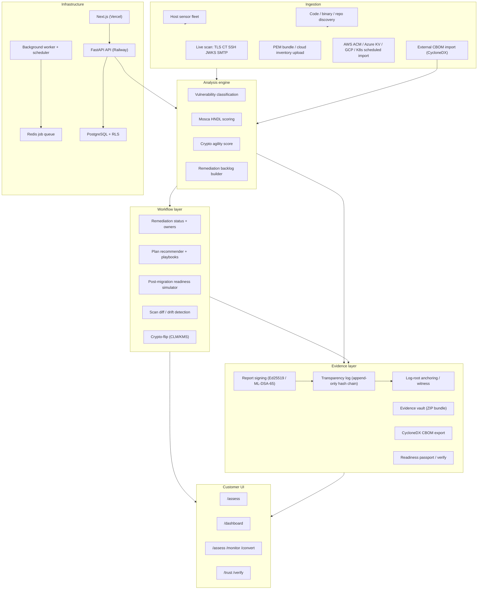
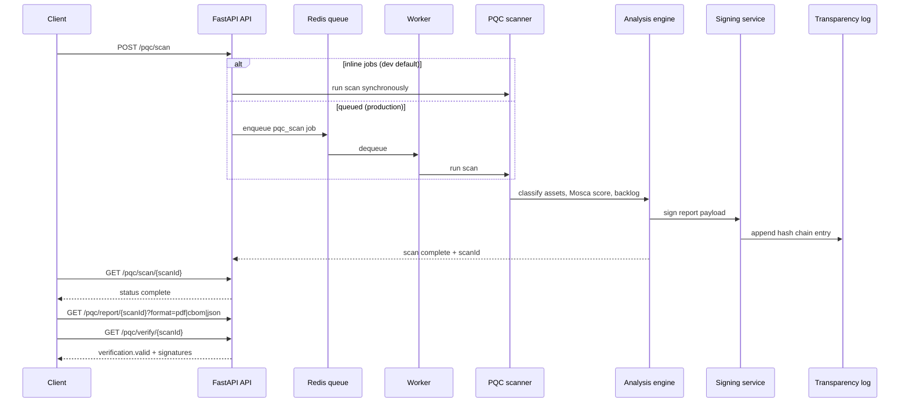
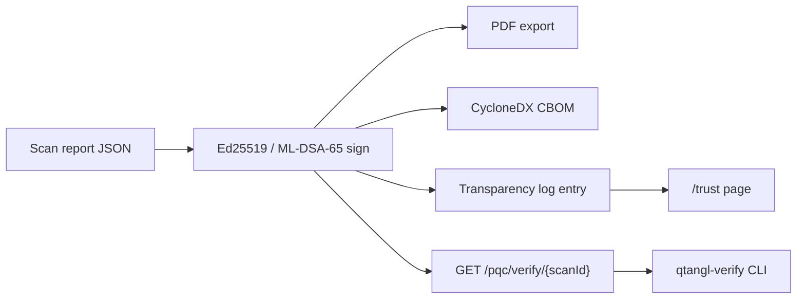

# Qtangl architecture

System design reference for the Qtangl monorepo. For local setup and testing, see [DEVELOPMENT.md](./DEVELOPMENT.md). For product positioning, see the [root README](../README.md).

---

## Table of contents

1. [Platform diagram](#platform-diagram)
2. [Production topology](#production-topology)
3. [Scan lifecycle](#scan-lifecycle)
4. [Evidence & signing flow](#evidence--signing-flow)
5. [Backend (FastAPI)](#backend-fastapi)
6. [Web (Next.js)](#web-nextjs)
7. [Host sensor (Go)](#host-sensor-go)
8. [SDKs & verifier](#sdks--verifier)
9. [Demo scenarios](#demo-scenarios)
10. [API reference overview](#api-reference-overview)
11. [Deployment & infrastructure](#deployment--infrastructure)
12. [Security & compliance](#security--compliance)
13. [Monorepo structure](#monorepo-structure)

---

## Platform diagram



Full capability map (built vs gaps): [`roadmap/quantum-readiness/03-solution-architecture.md`](../roadmap/quantum-readiness/03-solution-architecture.md)

---

## Production topology

| Component | Host | Notes |
|-----------|------|-------|
| **API** | Railway (`backend/`) | Custom domain `api.qtangl.com` |
| **Worker** | Railway | `python -m app.worker` — scan jobs, scheduler, cloud pulls |
| **Postgres + Redis** | Railway plugins | **Private URLs only** — never `DATABASE_PUBLIC_URL` / `REDIS_PUBLIC_URL` in app services |
| **Web** | Vercel | Root directory `web/`; builds SDK packages on install |
| **DNS** | qtangl.com | `www` → Vercel, `api` → Railway |

Deploy guide: [`backend/docs/RAILWAY_DEPLOY.md`](../backend/docs/RAILWAY_DEPLOY.md)

Monitoring: [`backend/docs/MONITORING_OBSERVABILITY.md`](../backend/docs/MONITORING_OBSERVABILITY.md)

---

## Scan lifecycle



### Scan modes

| Mode | Request | When |
|------|---------|------|
| **Fixture** | `useFixture: true` + `scenarioId` | Demos, CI, recordings — **production default** |
| **Live** | `useFixture: false` + `target` | Authorized pilots — requires `QTANGL_PQC_ENABLE_LIVE_SCAN=true` + allowlist |

SSRF guards: `backend/app/pqc/safety.py` (tested in CI via `tests/test_pqc_safety.py`).

---

## Evidence & signing flow



---

## Backend (FastAPI)

**Entry:** `backend/app/main.py` — **Qtangl PQC Readiness API** v0.9.1

| Command | Purpose |
|---------|---------|
| `uvicorn app.main:app --reload` | Development API |
| `python -m app.worker` | Job consumer + scheduler |
| `python -m alembic upgrade head` | Migrations |

### API route groups

| Router | Prefix | Capabilities |
|--------|--------|--------------|
| `app/api/pqc.py` | `/pqc/*` | Scan, reports, verify, transparency, CBOM, dogfood, readiness index |
| `app/api/tenant.py` | `/tenant/*` | Scans, schedules, webhooks, integrations, remediation, audit, portfolio |
| `app/api/discovery.py` | `/tenant/discovery/*`, `/discovery/agent/*` | Sensor fleets, code/binary scans, repo webhooks |
| `app/api/drift.py` | `/tenant/drift/*` | Drift summary, history |
| `app/api/remediation_program.py` | `/tenant/remediation/program/*` | Program CRUD, velocity, simulate, playbooks |
| `app/api/crypto_flip.py` | `/tenant/remediation/*`, `/tenant/flips/*` | CLM/KMS crypto-flip |
| `app/api/public.py` | `/public/*` | Signup, Stripe/WorkOS webhooks |
| `app/api/admin.py` | `/admin/*` | Tenant provisioning, API keys |
| `app/api/internal_dashboard.py` | BFF | Dashboard SSO bootstrap |
| `app/api/optimize.py` | `/optimize` | Hybrid scheduling/routing/allocation |
| `app/api/hospital.py` | `/hospital/*` | Hospital demo |
| `app/api/airline.py` | `/airline/*` | Airline demo |
| `app/api/ev_fleet.py` | `/ev-fleet/*` | EV fleet demo |

**Ops:** `GET /health`, `GET /health/ready`, `GET /metrics`, `GET /r/{token}`

### Core packages

| Package | Role |
|---------|------|
| `app/pqc/` | Scanner, vulnerability, Mosca, CBOM, signing, transparency, reports |
| `app/monitoring/` | Scheduler, diff, drift intelligence |
| `app/remediation/` | Backlog, playbooks, program management |
| `app/discovery/` | Agent enrollment, host/code/binary orchestration |
| `app/integrations/` | Cloud pull, CLM, KMS flip, Jira/ServiceNow |
| `app/billing/` | Stripe entitlements |
| `app/queue/` | Redis job queue |
| `app/db/` | SQLAlchemy, RLS, Alembic |

### Persistence & jobs

| Setting | Behavior |
|---------|----------|
| No `DATABASE_URL` | In-memory stores (dev/CI) |
| `QTANGL_INLINE_JOBS=true` | Sync scan jobs in API process |
| `QTANGL_INLINE_JOBS=false` + Redis | Worker queue |
| `QTANGL_ENABLE_SCHEDULER=true` | Worker runs scheduled re-scans |

**Queues:** `pqc_scan`, `discovery_host`, `discovery_code`, `discovery_binary`

### Docker images

| Image | Path | Use |
|-------|------|-----|
| Production API | `backend/Dockerfile` | liboqs + ML-DSA, Alembic on start |
| Local dev API/worker | `backend/Dockerfile.dev` | Fast compose stack |
| Discovery worker | `backend/docker/discovery-worker.Dockerfile` | Discovery jobs |
| Scanner sandbox | `backend/docker/scanner-sandbox.Dockerfile` | Sandboxed code/binary scan |

Backend-specific notes: [`backend/README.md`](../backend/README.md)

---

## Web (Next.js)

Next.js 16 App Router — marketing, dashboard, docs, learn, blog, trust center.

| Technology | Version |
|------------|---------|
| Next.js | 16 |
| React | 19 |
| Tailwind CSS | 4 |
| WorkOS AuthKit | Dashboard SSO |

### Key routes

| Route | Purpose |
|-------|---------|
| `/assess`, `/assess/start` | Assessment funnel |
| `/monitor`, `/convert` | Journey marketing |
| `/dashboard` | Authenticated workspace |
| `/verify`, `/trust` | Evidence verification |
| `/docs/*` | Public docs site |
| `/demo/hospital` | Optimization demo |

### Dashboard tabs

Overview · Scans · Monitor · Remediate · Settings · Portfolio (MSSP)

Web-specific notes: [`web/README.md`](../web/README.md)

---

## Host sensor (Go)

**Binary:** `sensor/cmd/qtangl-sensor`

| Mode | Flag | Purpose |
|------|------|---------|
| Enroll | `--enroll TOKEN` | Register with tenant |
| Scan | default | JSON to stdout |
| Offline | `--output file.zip` | Air-gapped export |
| Push | `--push` | Send to API |
| Daemon | `--daemon` | Heartbeat + 24h scan loop |

**Platforms:** linux, windows, darwin (amd64) — Go 1.22

**Packaging:** systemd, deb, rpm, MSI, Helm, Ansible, Terraform under `sensor/packaging/`

---

## SDKs & verifier

| Package | Install | Path |
|---------|---------|------|
| `qtangl` | `pip install qtangl` | `sdk/python/` |
| `@qtangl/sdk` | `npm install @qtangl/sdk` | `sdk/typescript/` |
| `@qtangl/sdk-react` | `npm install @qtangl/sdk-react` | `sdk/react/` |
| `qtangl-verify` | `pip install qtangl-verify` | `backend/verifier/` |

OpenAPI is the source of truth — types generated via `scripts/generate_sdk_types.py`.

---

## Demo scenarios

Ranked analysis: [`demos/Demo_Use_Cases.md`](../demos/Demo_Use_Cases.md)

| Rank | Demo | Backend | Web |
|------|------|---------|-----|
| 1 | PQC / Q-Day readiness (primary) | `/pqc/*` | `/assess`, `/verify` |
| 2 | Hospital restaffing | `/hospital/*` | `/demo/hospital` |
| 3 | Airline OCC recovery | `/airline/*` | docs |
| 4 | EV fleet charging | `/ev-fleet/*` | `/demo/ev-fleet/*` |
| 5 | QRNG (conceptual) | — | — |

**PQC fixtures:** `bank-tls-inventory`, `healthcare-insurer-hndl`, `gov-contractor-cmmc` in `demos/pqc_migration/data/scenarios/`

---

## API reference overview

- Interactive: [www.qtangl.com/docs/reference](https://www.qtangl.com/docs/reference)
- OpenAPI artifact: [`backend/docs/openapi.json`](../backend/docs/openapi.json)

### Authentication

| Method | Header |
|--------|--------|
| API key | `Authorization: Bearer <key>` or `X-Api-Key` |
| Admin | `Authorization: Bearer <admin-key>` (`QTANGL_ADMIN_API_KEY`) |
| Dashboard | `X-Qtangl-Session` cookie (WorkOS BFF) |
| Idempotency | `Idempotency-Key: <uuid>` on POST |

### GitHub Actions for customer CI

- [`.github/actions/qtangl-scan/`](../.github/actions/qtangl-scan/) — PQC scan + SARIF
- [`.github/actions/verify/`](../.github/actions/verify/) — Report verification

---

## Deployment & infrastructure

### Railway services

| Service | Command | Required |
|---------|---------|----------|
| API | `uvicorn app.main:app --host 0.0.0.0 --port $PORT` | `DATABASE_URL`, `QTANGL_SECRETS_KEY` |
| Worker | `python -m app.worker` | Same DB, `REDIS_URL`, `QTANGL_ENABLE_SCHEDULER=true` |

**Critical:** `QTANGL_PUBLIC_URL` = web origin (`https://www.qtangl.com`), **not** `api.qtangl.com`.

### Kubernetes

Scanner sandbox: [`backend/k8s/scanner-sandbox-job.yaml`](../backend/k8s/scanner-sandbox-job.yaml)

### Local Docker Compose

```bash
docker compose up --build
# API: http://127.0.0.1:8000  |  Web (host): cd web && npm run dev
```

See [DEVELOPMENT.md](./DEVELOPMENT.md) for compose env overrides.

### Post-deploy smoke

```bash
curl -s https://api.qtangl.com/health/ready | python -m json.tool
python backend/scripts/verify_production_rollout.py --full
```

---

## Security & compliance

| Feature | Location |
|---------|----------|
| SSRF guards | `app/pqc/safety.py` |
| Tenant RLS | `app/db/rls.py` |
| Report signing | `app/pqc/signing.py` |
| Transparency log | `app/pqc/transparency.py` |
| Compliance packs | `app/pqc/compliance_packs.py` |
| Disclosure policy | [`.github/SECURITY.md`](../.github/SECURITY.md) |
| security.txt | [www.qtangl.com/.well-known/security.txt](https://www.qtangl.com/.well-known/security.txt) |

Internal compliance docs: [`docs/compliance/`](../docs/compliance/)

Platform security roadmap: [`roadmap/quantum-readiness/12-platform-security-and-trust.md`](../roadmap/quantum-readiness/12-platform-security-and-trust.md)

---

## Monorepo structure

```
qtangl/
├── backend/          # FastAPI API, worker, migrations, verifier
├── web/              # Next.js frontend + public docs content
├── sensor/           # Go host discovery agent
├── sdk/              # Python, TypeScript, React SDKs
├── cli/              # Terminal CLI
├── demos/            # Demo data and outreach
├── docs/             # ARCHITECTURE, DEVELOPMENT, COMPLIANCE, GTM, ops runbooks
├── roadmap/          # Strategy and execution playbooks
├── scripts/          # dev.ps1, dev.sh, CI gates, SDK typegen
├── Makefile          # make test, compose-up, openapi-sync
└── docker-compose.yml
```

Public product docs: `web/app/docs/` — not repo-root `docs/`.
