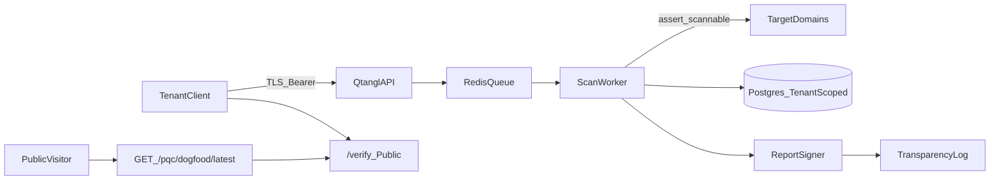

# Qtangl data flow diagram

**Last updated:** 2026-06-10

## Mermaid (source)

## Narrative

1. **Tenant client** sends authenticated scan requests to the Qtangl API over TLS.
2. **Redis** queues async jobs when worker mode is enabled; inline mode runs synchronously on the API.
3. **Scan worker** validates targets against SSRF allowlists, probes endpoints, and writes tenant-scoped bundles to **Postgres**.
4. **Report signer** produces content hashes and signatures; optional **transparency log** append for public inclusion proofs.
5. **Public visitors** verify reports at `/verify` or fetch the latest self-scan via `/pqc/dogfood/latest` without credentials.

## Static asset

SVG published at `/trust/data-flow.svg` for trust center and PDF export.

## Related controls

- SSRF: `backend/app/pqc/safety.py` (`assert_scannable`)
- RLS: `backend/app/db/rls.py`
- Signing: `backend/app/pqc/signing.py`
