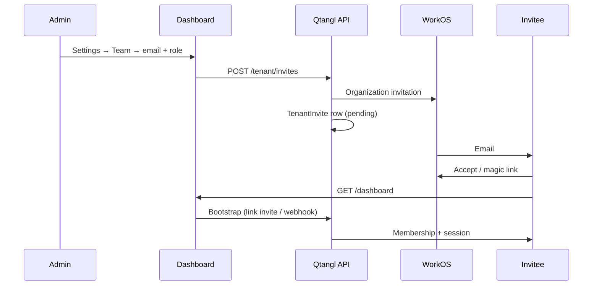

# Dashboard team, invites, and roles

How tenant **admins** invite colleagues, assign privileges, and manage access in the Qtangl command center.

Related: [Dashboard customer guide](./dashboard-customer-guide.md) · [Auth validation checklist](./dashboard-auth-validation.md) · [WorkOS migration](./workos-oidc-migration.md)

---

## Roles at a glance

Qtangl uses three human roles per tenant. They apply to **dashboard sign-in** (WorkOS session), not to automation API keys (those have their own key-level roles).

| Role | Who it's for | Dashboard access |
|------|----------------|------------------|
| **admin** | Workspace owner, IT lead, security lead | Full settings, team management, API keys, SSO portal, all tabs and exports |
| **operator** | Engineers running scans and remediation | Run scans, monitor, remediate; no team or API-key admin |
| **viewer** | Executives, auditors, read-only stakeholders | Overview + scans; compliance widgets; PDF exports only |

Backend APIs enforce the same boundaries (`require_auth_admin`, `require_auth_write`, etc.). The UI hides tabs and widgets according to **role policies** (see below).

---

## Who can manage the team

Only users with the **admin** role see the full **Team members** panel under **Settings**.

Operators and viewers see: *“Admin role required to manage team members.”*

Your role is shown in the workspace header (`email · role`) and in `GET /api/dashboard/me` → `session.role` and `capabilities`.

---

## Inviting a teammate (UI)

1. Sign in at [https://www.qtangl.com/dashboard](https://www.qtangl.com/dashboard) as an **admin**.
2. Open the **Settings** tab.
3. Scroll to **Team members**.
4. Enter the colleague’s **work email**.
5. Choose a **role**: `admin`, `operator`, or `viewer` (default: operator).
6. Click **Send invite**.

The invitee receives a **WorkOS invitation email**. After they sign in:

- Qtangl links them to your tenant with the role you selected.
- They land on `/dashboard` with your tenant’s KPIs and data (not an empty workspace).

### Pending invites

Admins see a **Pending invites** list (email + role). Use **Revoke** to cancel an invite before it is accepted.

### Removing access

Next to each active member, use **Remove** to delete their tenant membership. They lose dashboard access immediately; their WorkOS account may still exist but is no longer linked to your tenant.

---

## Changing a member’s role (UI)

For each active member, admins use the **role dropdown** (admin / operator / viewer). Changes save immediately via `PATCH /tenant/members/{membershipId}`.

**Rules:**

- Admins cannot change **their own** role (prevents accidental lockout).
- Only admins can promote/demote others.

---

## What each role can do (capabilities)

Computed server-side on login (`GET /api/dashboard/me` → `capabilities`):

| Capability | admin | operator | viewer |
|------------|:-----:|:--------:|:------:|
| `canAdmin` — settings, team, SSO, audit | ✓ | | |
| `canWrite` — run scans, remediation actions | ✓ | ✓ | |
| `canViewCompliance` | ✓ | ✓ | ✓ |
| `canManageKeys` — automation API keys | ✓ | | |
| `canInvite` — send team invites | ✓* | | |

\* Requires **Monitor tier or above** (see below).

---

## Dashboard visibility (role policies)

In addition to API enforcement, the UI applies **role policies** from tenant settings (`rolePolicies`). Defaults:

| Role | Tabs | Exports |
|------|------|---------|
| **viewer** | Overview, Scans | PDF |
| **operator** | Overview, Scans, Monitor, Remediate | PDF, board, bundle |
| **admin** | All tabs | All formats |

Widgets on Overview (KPI, trend, digest, compliance, heatmap, etc.) are filtered the same way.

**Custom policies:** Admins can override defaults by updating tenant settings (`PATCH /tenant/settings` with a `rolePolicies` object). There is no Settings form for this yet — contact Qtangl support or use the API for pilot customizations.

**Persona toggle** (Operator vs Executive in the header) is separate from RBAC: it adjusts layout emphasis, not security boundaries.

---

## Automation API keys (not human login)

Under **Settings → Automation API keys** (admin only):

- Create keys labeled for CI, Terraform, scripts, etc.
- Each key has its own role (`admin`, `operator`, or `viewer`).
- Secrets are shown **once** at creation; revoke unused keys promptly.

Humans should **sign in with WorkOS**, not share API keys. See [dashboard-auth-workos ADR](../adr/dashboard-auth-workos.md).

---

## Tier requirements

| Feature | Free (Assess) | Monitor+ |
|---------|:-------------:|:--------:|
| Dashboard sign-in | ✓ | ✓ |
| Self-serve first workspace | ✓ | ✓ |
| **Team invites** | ✗ | ✓ |
| SSO Admin Portal | Enterprise | Enterprise |

If **Send invite** fails with a tier/upgrade message, the tenant is on **free** tier. Upgrade to **Monitor** (or contact Qtangl for a pilot provision) before inviting colleagues.

Invite quotas (Monitor): up to **10 pending/active invites** per tenant by default; enterprise limits are higher.

---

## Invite flow (technical)

**Linking paths** (first login after invite):

1. **WorkOS webhook** `organization_membership.created` → membership row  
2. **Pending `TenantInvite`** matched by email on bootstrap  
3. **`invitation.accepted` webhook** → membership row  

Ensure Railway receives WorkOS webhooks at `POST /public/workos/webhook` with `WORKOS_WEBHOOK_SECRET` set.

---

## Admin API (automation / support)

Tenant admins use the dashboard BFF (`/api/dashboard/tenant/...`) while signed in. Platform operators use the **admin API** with `QTANGL_ADMIN_API_KEY`:

| Action | Method |
|--------|--------|
| Provision tenant + first admin invite | `POST /admin/tenants` |
| Issue break-glass API key | `POST /admin/tenants/{id}/keys` |

See [dashboard-auth-break-glass](../runbooks/dashboard-auth-break-glass.md).

---

## Automation API keys and scan provenance

Dashboard data is **tenant-wide** — all API keys for an org share the same readiness KPIs, scan history, and remediation backlog. Keys are credentials for automation, not data partitions.

Name keys by purpose (for example `ci-prod`, `ci-staging`, `terraform-readonly`). The **Scans** tab shows a **Source** column on each run:

| Source label | Meaning |
|--------------|---------|
| `Dashboard · alice@corp.com` | Human triggered via WorkOS session |
| `Automation · ci-prod` | Named API key |
| `Schedule · weekly-prod` | Recurring monitor job |

**Settings → Automation API keys** shows `lastUsedAt` and scans this month per key. Stale keys unused for 90+ days are flagged in the UI.

---

## Troubleshooting

| Symptom | Likely cause | Fix |
|---------|--------------|-----|
| Invitee sees “No workspace linked” | Invite not linked; wrong email | Same email as invite; admin re-sends invite; check webhooks |
| Send invite fails / 402 | Free tier | Upgrade to Monitor |
| Invitee has wrong role | Role changed after invite | Admin updates role dropdown in Team panel |
| Operator sees Settings team panel | UI bug or cached session | Hard refresh; verify `session.role` in `/api/dashboard/me` |
| Removed user still has access | Session cookie TTL | They must sign out; membership delete revokes session keys server-side |

---

## QA checklist (admins)

- [ ] Admin sends invite with **operator** role → invitee loads dashboard with scans write access  
- [ ] Admin sends **viewer** invite → invitee cannot create API keys or run destructive actions  
- [ ] Admin changes operator → viewer → monitor/remediate tabs disappear  
- [ ] Admin removes member → former member gets 403 on summary  
- [ ] Admin creates automation API key → key works in CI with chosen role  

Full release checklist: [dashboard-auth-validation.md](./dashboard-auth-validation.md).
