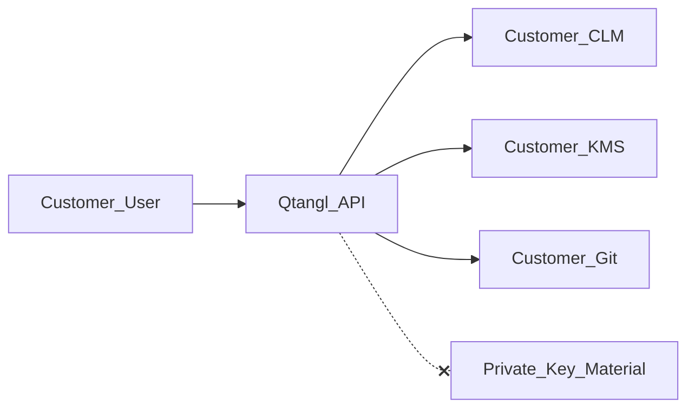

# Crypto flip threat model

## Assets

- Customer integration credentials (CLM API keys, cloud IAM roles, Git tokens)
- Flip job metadata (`request_json`, `external_ref`) — no private keys
- Before/after drift snapshots and signed verification proofs
- Approval audit trail (`flip_approvals`, `audit_log`)

## Trust boundaries

Qtangl **never** crosses into private key material storage. All crypto operations execute in customer systems via delegated least-privilege credentials.

## Threat scenarios

| ID | Threat | Impact | Mitigation |
|----|--------|--------|------------|
| T-F1 | Approval bypass (submit prod flip without approve) | Unauthorized prod change | Policy engine enforces `pending_approval`; API rejects unapproved prod submits |
| T-F2 | Cross-tenant job access | Data leak / wrong flip | RLS on `crypto_flip_jobs`; authZ checks tenant_id on every mutation |
| T-F3 | Credential exfiltration from Qtangl DB | Customer CLM/KMS compromise | Encrypted at rest; short-lived OAuth for Enterprise cloud flip |
| T-F4 | KMS flip without two-person rule | Single insider prod key rotation | Enterprise prod KMS requires approver ≠ submitter |
| T-F5 | Private key persisted in job JSON | Key material breach | CI contract tests assert no PEM/DER patterns in `result_json` |
| T-F6 | Partner over-scope approve | Child tenant unauthorized flip | Partner RBAC: child tenants only; audit on approve |
| T-F7 | Provider API MITM | Malicious cert/key metadata | TLS verify; pinned base URLs in integration config |
| T-F8 | Rate abuse (flip spam) | Provider lockout / cost | Per-tenant flip budget; 24h KMS prod cooldown |

## Blast radius

- **Overlay:** Limited to targeted repo/namespace; dry-run mandatory; rollback via revert
- **CLM:** Single cert request/order per job; no bulk CA operations
- **KMS:** Alias pointer update only; deny `kms:Decrypt`, `kms:GetPublicKey` export in flip IAM policy

## Residual risk

- Customer misconfigures IAM with excessive permissions — mitigated by documented least-privilege templates and policy lint in dry-run
