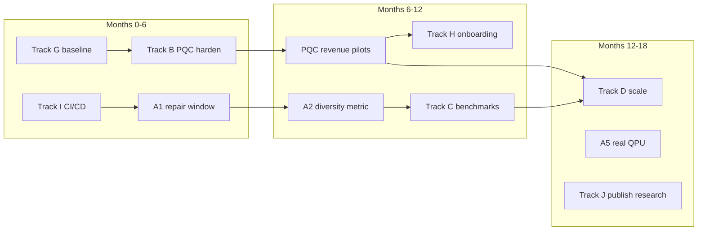

# 03 — Strategy & Priorities

Prioritization framework, ranked priorities, and sequencing rationale for Qtangl development and GTM.

---

## Prioritization framework

Score each initiative on three axes (1–5 each):

| Axis | Question |
|------|----------|
| **Value** | Revenue, credibility, or unlock for other work? |
| **Unlock** | Does this unblock downstream epics? |
| **Effort** | Inverse score — lower effort = higher score |

**Priority score = (Value × Unlock) / Effort**

Always apply **gates:**
- No regulated-data pilots without Track G minimum (secrets, threat model, BAA/DPA draft).
- No "quantum wins" marketing without Track C benchmark evidence.
- No enterprise multi-tenant without Track D persistence.

---

## Ranked priorities (top 10)

| Rank | Priority | Track | Rationale |
|------|----------|-------|-----------|
| **1** | Local repair window extractor | A1 | Keystone — without it, hybrid is narrative only |
| **2** | PQC product hardening → revenue | B | Only pillar with defensible advantage today |
| **3** | Security & compliance baseline | G | Required before hospital PHI / gov pilots |
| **4** | CI/CD + dependency pinning | I | Foundation for reproducible builds and team scale |
| **5** | Fill benchmark table + diversity metric | C + A2 | Due diligence + honest value proposition |
| **6** | Product onboarding (demo → pilot) | H | Bridge from fixture demos to paying customers |
| **7** | Real QPU opt-in path | A5 | Technical credibility under investor scrutiny |
| **8** | Enterprise persistence + tenancy | D | Multi-instance production |
| **9** | GTM: PQC + hospital design partners | E | Revenue + case studies |
| **10** | Solver research agenda | J | Long-term core-tech expansion |

---

## Two-product sequencing

**Rule:** PQC revenue funds optimization R&D. Do not defer PQC for optimizer perfection.

---

## What we explicitly do NOT prioritize (yet)

| Item | Defer until | Why |
|------|-------------|-----|
| QRNG-as-a-Service | Series A+ | Small market; Rank #5 |
| Full FedRAMP authorization | First gov $500K+ contract | $1M+ and 12+ months |
| Generic allocation solver | After routing live | Vertical demos prove pattern first |
| Mobile apps | Never? | API-first; web demos sufficient |
| Custom QPU hardware partnerships | After A5 reproducible run | Credibility before scale |

---

## Honesty as strategy

**Do:**
- Publish when classical wins and by how much
- Lead scoreboards with "distinct feasible plans" and "audit pack available"
- Say "fixture replay" in production demo mode — don't imply live QPU

**Don't:**
- Claim quantum speedup without benchmark row in [backend/README.md](../backend/README.md)
- Hide QAOA failures — diagnostics block exists for a reason
- Sell optimization to buyers who only need PQC (stay focused)

---

## Decision rights

| Decision type | Owner | Escalation |
|---------------|-------|------------|
| Epic priority swap | Product + eng lead | If gate violated |
| Public benchmark claims | Eng + legal review | Requires Track C sign-off |
| Regulated pilot (PHI, CMMC) | Security (Track G) | No override |
| Pricing / packaging | GTM | Board if >$100K ACV change |

---

## Success criteria (strategy level)

| Horizon | Must be true |
|---------|--------------|
| **6 mo** | ≥1 paying PQC pilot; repair window live in hospital + `/optimize`; CI green |
| **12 mo** | ≥$500K ARR run-rate; benchmark table public; SOC2 Type I started |
| **18 mo** | Multi-tenant SaaS; 2 vertical case studies; Series A deck backed by metrics |

---

## Related docs

- Epics: [backlog/epics.md](./backlog/epics.md)
- Timeline: [15-timeline-and-milestones.md](./15-timeline-and-milestones.md)
- Architecture target: [04-architecture-blueprint.md](./04-architecture-blueprint.md)
