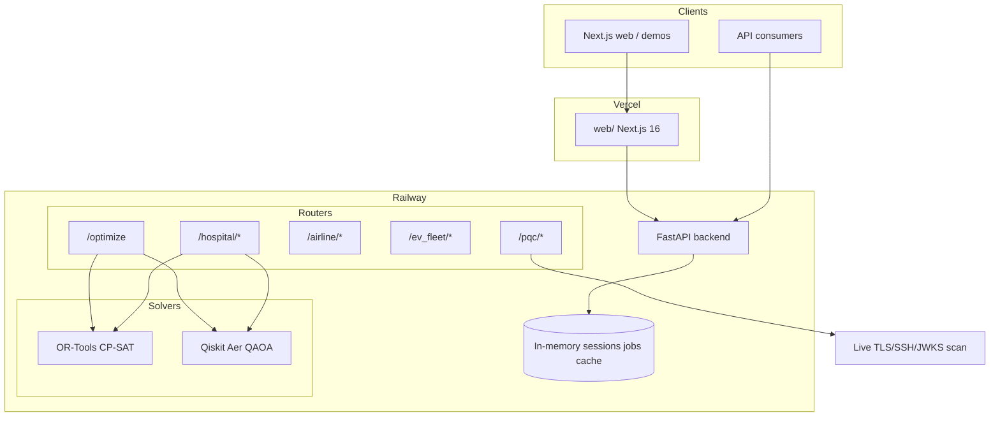
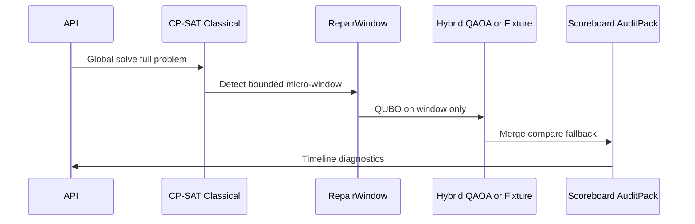
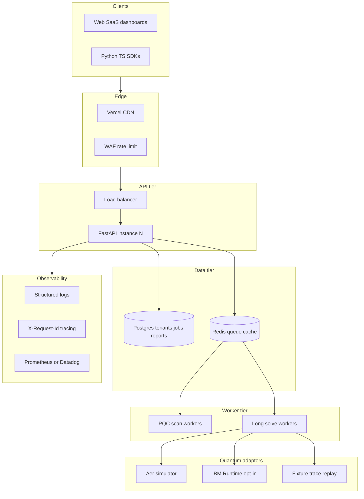
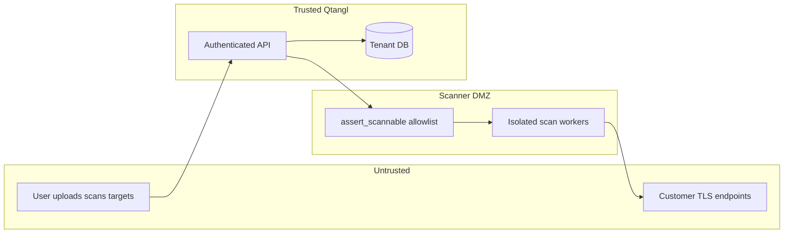

# 04 — Architecture Blueprint

Current vs target architecture for Qtangl. Feeds Track G threat model and Track D implementation.

---

## Current architecture (as-built)



### Reusable vertical solve pattern

Every vertical implements the same orchestration:



**Reference implementations:**
- Generic (incomplete RW): [backend/app/pipeline.py](../backend/app/pipeline.py)
- Hospital: [backend/app/hospital/pipeline.py](../backend/app/hospital/pipeline.py)
- Airline: [backend/app/airline/pipeline.py](../backend/app/airline/pipeline.py)
- EV fleet: [backend/app/ev_fleet/pipeline.py](../backend/app/ev_fleet/pipeline.py)

---

## Target architecture (18-month)



---

## Canonical contract evolution

**Today:** [backend/app/models/canonical.py](../backend/app/models/canonical.py)

```python
ProblemType = Literal["schedule", "routing", "allocation"]
```

| Type | Parser | Pipeline | Status |
|------|--------|----------|--------|
| `schedule` | [backend/app/parsers/scheduling.py](../backend/app/parsers/scheduling.py) | [backend/app/pipeline.py](../backend/app/pipeline.py) | `pilot` |
| `routing` | [backend/app/parsers/routing.py](../backend/app/parsers/routing.py) | Not wired | `coming-soon` |
| `allocation` | [backend/app/parsers/allocation.py](../backend/app/parsers/allocation.py) | Not wired | `coming-soon` |

**Target (Track A3):**
- Extend `CanonicalProblem` with routing nodes/edges and allocation shifts/skills
- Single `run_optimization(problem)` dispatches by `problem.type`
- Vertical modules remain specialized wrappers over canonical types where needed

---

## Component responsibilities

| Component | Responsibility | Target owner |
|-----------|----------------|--------------|
| **Parsers** | Request JSON → `CanonicalProblem` | `backend/app/parsers/` |
| **Pipeline** | Orchestrate classical → RW → hybrid → merge | `backend/app/pipeline.py` + vertical `pipeline.py` |
| **Classical solvers** | Always run first; production default | `backend/app/solvers/classical.py` + vertical `solver_classical.py` |
| **QUBO builders** | Micro-window → quadratic program | `backend/app/qubo/`, vertical `solver_hybrid.py` |
| **Quantum adapter** | Pluggable: fixture / Aer / IBM Runtime | New: `backend/app/adapters/quantum/` (extend [backend/app/adapters/base.py](../backend/app/adapters/base.py)) |
| **Presentation** | API response shape | [backend/app/presentation.py](../backend/app/presentation.py) |
| **Audit** | Evidence packs | Vertical `audit.py` modules |

---

## Trust boundaries



**Track G must document:**
- SSRF controls: [backend/app/pqc/safety.py](../backend/app/pqc/safety.py)
- PHI flow: hospital roster uploads → encryption at rest → retention
- Tenant isolation: API key → tenant_id → row-level scope

---

## Deployment topology

| Environment | Backend | Web | Data |
|-------------|---------|-----|------|
| **Local** | `uvicorn app.main:app --reload` | `npm run dev` | In-memory |
| **Staging** | Railway staging project | Vercel preview | Postgres staging |
| **Production** | Railway prod | Vercel prod | Postgres + Redis prod |

**Env vars (critical):** See [backend/README.md](../backend/README.md) — `QTANGL_API_KEY`, `QTANGL_ENABLE_QAOA`, `QTANGL_PQC_ENABLE_LIVE_SCAN`, CORS origins.

---

## ADRs to write (use template)

| ID | Decision | Status |
|----|----------|--------|
| ADR-001 | Classical-first always; quantum never required for feasible response | Accepted (as-built) |
| ADR-002 | Fixture replay default in production demos | Accepted |
| ADR-003 | Postgres + Redis for durable state | Proposed (Track D) |
| ADR-004 | Pluggable quantum adapter interface | Proposed (Track A5) |
| ADR-005 | Per-tenant API keys with row-level isolation | Proposed (Track G/D) |

Template: [templates/adr-template.md](./templates/adr-template.md)

---

## Next doc

[05-track-A-hybrid-optimizer.md](./05-track-A-hybrid-optimizer.md)
