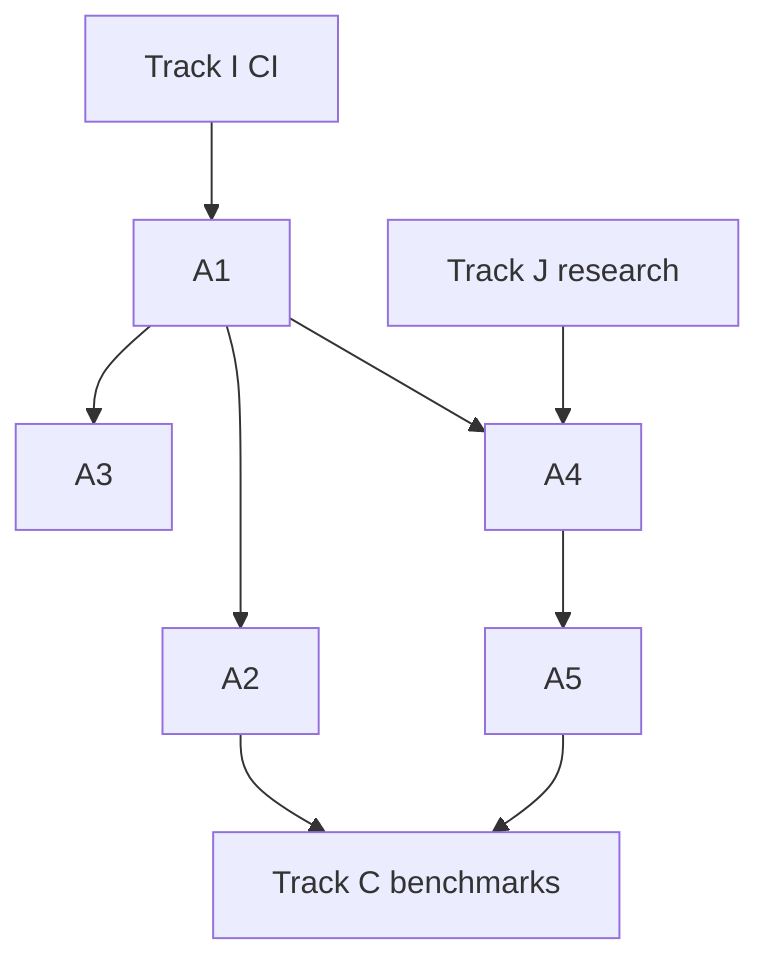

# 05 — Track A: Hybrid Optimizer

Engineering epics for the classical-first hybrid optimization core. **Keystone: A1 local repair window extractor.**

---

## Epic overview

| ID | Epic | Status | Effort | Depends on |
|----|------|--------|--------|------------|
| A1 | Local repair window extractor | `done` | L | I1 |
| A2 | Diversity / alternates headline metric | `not-started` | M | A1 |
| A3 | `/optimize` routing + allocation live | `done` | L | A1 |
| A4 | QAOA robustness + envelope expansion | `not-started` | M | A1, J1 |
| A5 | Reproducible real-QPU opt-in path | `not-started` | M | A4, I1 |

Effort: S = 1–2 weeks, M = 2–4 weeks, L = 4–8 weeks

---

## A1 — Local repair window extractor (KEYSTONE)

### Problem

[backend/app/pipeline.py](../backend/app/pipeline.py) uses `strategy="whole_problem_smoke"` — the full job is reused as the QAOA candidate. Real instances exceed QAOA limits (≤12 binary vars). The product premise ("QAOA only on a bounded micro-window") is not implemented for generic schedules.

### Approach

1. **Study vertical implementations** — generalize patterns from:
   - [backend/app/hospital/repair_window.py](../backend/app/hospital/repair_window.py)
   - [backend/app/airline/repair_window.py](../backend/app/airline/repair_window.py)
   - [backend/app/ev_fleet/repair_window.py](../backend/app/ev_fleet/repair_window.py)

2. **Define extraction algorithm for canonical schedules:**
   - Input: `CanonicalProblem`, `SolverRunResult` (classical assignment)
   - Identify **disruption neighborhood**: tasks on critical path, tasks sharing resources with blocked windows, tasks within N days of constraint violation margin
   - Bound window to satisfy `estimate_scheduling_qubo_size(problem_window) <= limits` by construction
   - Output: `LocalRepairWindow` with subset `task_ids` and extracted sub-problem

3. **Replace smoke path** in `detect_local_repair_window()`:
   - If full job eligible → allow whole-job (research mode only)
   - Else extract window → if window eligible → proceed
   - Else → return `None` with diagnostic `no_local_window`

4. **Merge logic:** Apply hybrid result only to window tasks; pin non-window tasks to classical assignment ([backend/app/pipeline.py](../backend/app/pipeline.py) `merge_local_repair` — may need extension).

### Files to touch

| File | Change |
|------|--------|
| [backend/app/pipeline.py](../backend/app/pipeline.py) | New extractor; remove `whole_problem_smoke` as default |
| New: `backend/app/repair_window/scheduling.py` | Extraction logic |
| [backend/app/qubo/scheduling.py](../backend/app/qubo/scheduling.py) | Build QUBO on sub-problem |
| [backend/tests/test_hospital_repair_window.py](../backend/tests/test_hospital_repair_window.py) | Pattern reference for tests |
| New: `backend/tests/test_scheduling_repair_window.py` | Unit tests for extractor |

### Acceptance criteria

- [x] Given a 20-task schedule with one blocked resource day, extractor returns ≤8 tasks
- [x] Extracted sub-problem `binary_variable_count <= QTANGL_QAOA_MAX_BINARY_VARIABLES`
- [x] QAOA attempted only on extracted window, not full job (when full job exceeds limits)
- [x] Non-window task assignments unchanged from classical result
- [x] Diagnostics include `localRepairWindow.strategy != whole_problem_smoke` for large jobs
- [x] Tests pass in CI

### Validation

Run [backend/examples/compare_schedule_solvers.py](../backend/examples/compare_schedule_solvers.py) on tiny + medium fixtures; document in [backend/README.md](../backend/README.md) benchmark table.

---

## A2 — Diversity / alternates headline metric

### Problem

Hospital hybrid already computes `distinctness`, `fairness_delta`, and surfaces multiple candidates ([backend/app/hospital/solver_hybrid.py](../backend/app/hospital/solver_hybrid.py)). Airline and EV fleet have similar scoreboards but diversity is not a unified product metric.

### Approach

1. Define canonical metrics in [backend/app/models/results.py](../backend/app/models/results.py):
   - `distinctFeasiblePlans` (count)
   - `diversityScore` (0–1, pairwise plan distance)
   - `fairnessDelta` (where applicable)

2. Promote to all vertical scoreboards and `/optimize` response `metrics`

3. Update web scoreboard components:
   - [web/components/hospital/](../web/components/hospital/)
   - [web/components/airline/](../web/components/airline/)
   - [web/components/ev-fleet/](../web/components/ev-fleet/)

4. Marketing copy: "Hybrid surfaced N distinct feasible alternates within X% of optimum"

### Files to touch

| File | Change |
|------|--------|
| [backend/app/hospital/pipeline.py](../backend/app/hospital/pipeline.py) | Extract shared scoreboard builder |
| [backend/app/airline/pipeline.py](../backend/app/airline/pipeline.py) | Add diversity columns |
| [backend/app/ev_fleet/pipeline.py](../backend/app/ev_fleet/pipeline.py) | Add diversity columns |
| [backend/app/presentation.py](../backend/app/presentation.py) | Include in `/optimize` response |
| [web/lib/docs/glossary.ts](../web/lib/docs/glossary.ts) | Define terms |

### Acceptance criteria

- [x] All three vertical scoreboards expose `distinctPlans` consistently
- [x] `/optimize` diagnostics report alternate count when hybrid runs
- [x] Demo UI shows side-by-side plans with diversity explanation
- [x] Documented falsifiable metric in [07-track-C-validation.md](./07-track-C-validation.md)

---

## A3 — `/optimize` routing + allocation live

### Problem

[backend/app/pipeline.py](../backend/app/pipeline.py) raises `NotImplementedError` for non-schedule types. Parsers exist but are not wired.

### Approach

1. **Routing:** Wire [backend/app/parsers/routing.py](../backend/app/parsers/routing.py) → classical VRP/heuristic (reuse EV fleet routing patterns) → optional hybrid on assignment sub-window

2. **Allocation:** Wire [backend/app/parsers/allocation.py](../backend/app/parsers/allocation.py) → CP-SAT staffing (extend hospital penalty model)

3. Extend [backend/app/models/canonical.py](../backend/app/models/canonical.py) with routing/allocation fields

4. Update [backend/app/api/optimize.py](../backend/app/api/optimize.py) — remove 501 for new types

5. Docs: [web/app/docs/reference/optimize/page.tsx](../web/app/docs/reference/optimize/page.tsx)

### Acceptance criteria

- [x] `POST /optimize` with `type: routing` returns feasible plan
- [x] `POST /optimize` with `type: allocation` returns feasible plan
- [x] Same classical-first + repair window pattern applies *(routing: local reorder on longest route; allocation: CP-SAT)*
- [x] E2E or API tests added

---

## A4 — QAOA robustness + envelope expansion

### Problem

QAOA fails on 5-task schedule (memory/transpilation). Limits are conservative (12 vars). Track J research informs tuning.

### Approach

1. Warm-start from classical assignment (see entropicalabs/openqaoa patterns in learn library)
2. Tune: `reps`, `maxiter`, `shots`, `simulator_method` via env vars
3. Add fallback chain: QAOA → simulated annealing on same QUBO → classical
4. Expand limits only with benchmark evidence (Track C gate)

### Files to touch

| File | Change |
|------|--------|
| [backend/app/solvers/qaoa.py](../backend/app/solvers/qaoa.py) | Warm-start, fallback chain |
| [backend/app/adapters/base.py](../backend/app/adapters/base.py) | Solver adapter interface |
| [14-track-J-solver-research.md](./14-track-J-solver-research.md) | Research inputs |

### Acceptance criteria

- [ ] 5-task schedule: QAOA completes OR fails gracefully with fallback within 30s
- [ ] Documented env tuning guide in backend README
- [ ] No production regression when `QTANGL_ENABLE_QAOA=false`

---

## A5 — Reproducible real-QPU opt-in path

### Problem

Production demos use fixture replay. Investors/engineers will ask for one real cloud-QPU execution.

### Approach

1. Extend [backend/app/adapters/base.py](../backend/app/adapters/base.py) with `IBMRuntimeAdapter`, `FixtureAdapter`, `AerAdapter`

2. Promote [backend/scripts/capture_qpu_trace.py](../backend/scripts/capture_qpu_trace.py) logic into runtime opt-in path

3. Env: `QISKIT_IBM_TOKEN`, `QTANGL_QUANTUM_BACKEND=fixture|aer|ibm`

4. Automatic fallback: IBM fail → Aer → fixture with diagnostic note

5. Capture trace for fixture refresh after successful real run

### Acceptance criteria

- [ ] One documented real-QPU run on hospital micro-window (≤3 qubits effective)
- [ ] `useFixture: false` + IBM credentials produces live result OR explicit fallback diagnostic
- [ ] Trace JSON committed to `backend/app/hospital/fixtures/qpu_trace.json` with calibration metadata
- [ ] Runbook in backend README

---

## Dependencies diagram

---

## Related backlog

- Epic details: [backlog/epics.md](./backlog/epics.md) — A1–A5
- Action items: [backlog/action-items.md](./backlog/action-items.md) — Track A section
