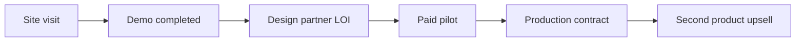

# 09 — Track E: Go-To-Market

Two-product GTM motion, design partners, partnerships, and DevRel/content engine.

---

## Epic overview

| ID | Epic | Status | Effort | Depends on |
|----|------|--------|--------|------------|
| E1 | PQC design-partner program | `not-started` | M | B6, G3 |
| E2 | Hospital optimization design partners | `not-started` | M | A1, H2 |
| E3 | Demo recording + sales assets | `not-started` | S | — |
| E4 | Pricing & packaging v1 | `not-started` | S | 17-financial-model |
| E5 | Partnerships & channel | `not-started` | M | B1 |
| E6 | DevRel / content / community | `not-started` | M | C1 |

---

## E1 — PQC design-partner program

### ICP (Ideal Customer Profile)

| Attribute | Target |
|-----------|--------|
| Industry | Bank, insurer, healthcare payer, gov contractor, SaaS (FedRAMP path) |
| Size | 500–10,000 employees |
| Trigger | Board mandate for PQC migration by 2027/2030 |
| Buyer | CISO, compliance lead, VP Engineering |

### Motion

1. **Outbound:** [demos/pqc_migration/outreach/cold_email.md](../demos/pqc_migration/outreach/cold_email.md)
2. **Demo:** Live scan on their domain OR upload PEM bundle ([demos/pqc_migration/script.md](../demos/pqc_migration/script.md))
3. **Pilot:** 90-day assessment + monitor tier (see B6)
4. **Close:** Annual monitor subscription

### Target list

Build from:
- CMMC-required gov contractors (scenario: `gov-contractor-cmmc`)
- Regional banks (scenario: `bank-tls-inventory`)
- Healthcare insurers (scenario: `healthcare-insurer-hndl`)

### Success metrics

- 20 outbound conversations / month
- 5 demos / month
- 2 pilots signed / quarter
- 1 case study / quarter

---

## E2 — Hospital optimization design partners

### ICP

| Attribute | Target |
|-----------|--------|
| Facility | 300–600 bed US hospital |
| Trigger | High agency OT spend; frequent call-out swaps |
| Buyer | Nurse manager, CNO, workforce analytics |

### Motion

1. **Outbound:** [demos/hospital_restaffing/outreach/](../demos/hospital_restaffing/outreach/)
2. **Demo:** Call-out scenario `callout-cath-acls` — scoreboard Manual vs Classical vs Hybrid
3. **Pilot:** 60-day roster integration (de-identified or BAA-covered PHI)
4. **Close:** Per-bed or per-swap pricing (see E4)

### Target list

[demos/hospital_restaffing/outreach/target_hospitals.csv](../demos/hospital_restaffing/outreach/target_hospitals.csv)

### Honest demo script points

- Show when hybrid **ties** classical — that's the point
- Highlight audit pack + QUBO snapshot for compliance
- Never claim quantum speedup

---

## E3 — Demo recording + sales assets

### Required recordings (from [demos/Demo_Use_Cases.md](../demos/Demo_Use_Cases.md))

| Priority | Demo | Duration | Key screen moments |
|----------|------|----------|-------------------|
| 1 | Hospital call-out | 3–5 min | Scoreboard, audit drawer, timeline |
| 2 | PQC scan + handshake | 3–5 min | Asset inventory, Mosca risk, PQ TLS proof |
| 3 | Airline MX hold | 4–6 min | Cascade view, FAR 117 compliance |
| 4 | EV fleet TOU | 4–6 min | Peak kW chart, $/day savings |

### Collateral

| Asset | Location |
|-------|----------|
| Leave-behind (hospital) | [demos/hospital_restaffing/outreach/leave_behind.md](../demos/hospital_restaffing/outreach/leave_behind.md) |
| Leave-behind (airline) | [demos/airline_recovery/outreach/leave_behind.md](../demos/airline_recovery/outreach/leave_behind.md) |
| PQC outreach README | [demos/pqc_migration/outreach/README.md](../demos/pqc_migration/outreach/README.md) |

---

## E4 — Pricing & packaging v1

See [17-financial-model.md](./17-financial-model.md) for unit economics.

### Packaging matrix

| Package | Product | Price band | Buyer |
|---------|---------|------------|-------|
| **Q-Day Assessment** | PQC | $25K–$50K | CISO |
| **Q-Day Monitor** | PQC | $75K–$150K/yr | CISO |
| **Swap Pilot** | Hospital | $50K–$100K / 60 days | CNO |
| **OCC Pilot** | Airline | $100K–$200K / 90 days | VP Ops |
| **API Developer** | Optimize | $500–$5K/mo | Engineering |

### Bundling

**"Both sides of Q-Day" bundle:** 15% discount on PQC Monitor + Optimization pilot for same org.

---

## E5 — Partnerships & channel

### Technology partners

| Partner | Type | Value |
|---------|------|-------|
| **IBM Quantum / Qiskit** | QPU + credibility | Real QPU runs, co-marketing |
| **AWS Braket** | QPU + cloud | Enterprise cloud buyers |
| **Open Quantum Safe (OQS)** | PQC standards | Handshake proof, liboqs alignment |
| **IonQ** | QPU | Alternative QPU narrative |

### Channel partners

| Partner | Type | Value |
|---------|------|-------|
| **Compliance auditors** | Referral | PQC scan as audit input |
| **System integrators** | Implementation | Hospital/airline integration |
| **Cloud marketplaces** | Distribution | AWS/Azure marketplace listing (Track D+) |

### Actions

- [ ] OQS community contribution (handshake trace, scanner improvements)
- [ ] IBM Quantum startup program application
- [ ] 2 auditor intro meetings (PQC referral path)

---

## E6 — DevRel / content / community

### Assets to leverage

| Asset | Location | Use |
|-------|----------|-----|
| Learn library (~90 repos) | [web/content/library/](../web/content/library/) | Inbound SEO, credibility |
| Blog | [web/app/blog/](../web/app/blog/) | Vertical use case posts |
| Compare guide | `/learn/topics/quantum-optimization-compared` | Developer trust |
| Docs platform | [web/app/docs/](../web/app/docs/) | Self-serve evaluation |

### Content calendar (minimum)

| Month | Piece |
|-------|-------|
| 1 | "When classical wins: honest hybrid benchmarks" |
| 2 | "Hospital swap decisions need audit trails, not black boxes" |
| 3 | "PQC inventory in 10 minutes: live demo walkthrough" |
| 4 | "Local repair windows: why micro-problems are the quantum sweet spot" |

### Community

- Submit Qtangl to [web/content/library/readmes/qosf-os-quantum-software.md](../web/content/library/readmes/qosf-os-quantum-software.md) ecosystem lists
- Open-source: consider MIT license on SDK; keep backend proprietary

---

## Funnel metrics

Track in CRM (HubSpot/Pipedrive — lightweight to start).

---

## Related docs

- Business ops: [10-track-F-business-ops.md](./10-track-F-business-ops.md)
- Product onboarding: [12-track-H-product-and-onboarding.md](./12-track-H-product-and-onboarding.md)
- Use cases: [demos/Demo_Use_Cases.md](../demos/Demo_Use_Cases.md)
