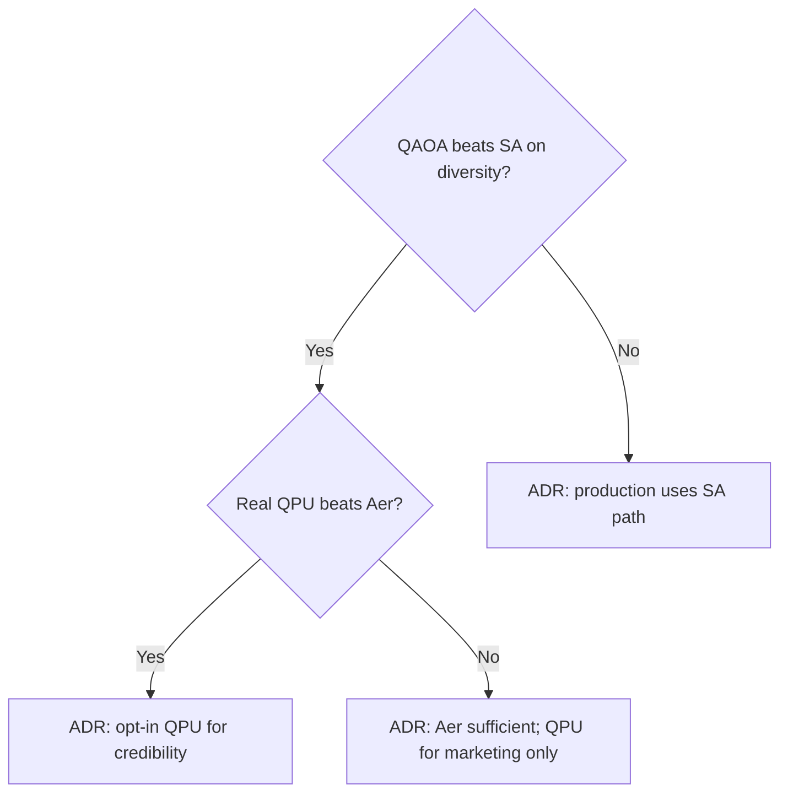

# 14 — Track J: Solver Research (Core-Tech Expansion)

Research agenda distinct from engineering epics — where quantum, quantum-inspired, and classical techniques actually help, published honestly.

---

## Epic overview

| ID | Epic | Status | Effort | Depends on |
|----|------|--------|--------|------------|
| J1 | Research evaluation framework | `not-started` | M | I2 |
| J2 | QAOA improvements (warm-start, tuning) | `not-started` | M | A1 |
| J3 | Quantum annealing path (D-Wave) | `not-started` | M | J1 |
| J4 | Quantum-inspired solvers | `not-started` | M | J1 |
| J5 | Library mining pipeline (~90 repos) | `not-started` | M | J1 |
| J6 | Publish honest results | `not-started` | S | C1, J2–J4 |

---

## Research question (north star)

> **On bounded local repair windows, does any quantum or quantum-inspired technique surface more distinct feasible alternates within ε of the CP-SAT optimum — and is a real QPU required, or is quantum-inspired sufficient?**

This feeds [backlog/assumptions-and-open-questions.md](./backlog/assumptions-and-open-questions.md) assumption **A-003**.

---

## J1 — Research evaluation framework

### Approach

1. **Benchmark harness extension:** [backend/benchmarks/](../backend/benchmarks/) — add `solver` parameter: `cp-sat` | `qaoa-aer` | `simulated-annealing` | `dwave-hybrid` | `tabu`

2. **Standard report per run:**
   ```json
   {
     "instance": "BM-003",
     "solver": "qaoa-aer",
     "feasible": true,
     "objective": 42.1,
     "classicalObjective": 41.8,
     "distinctAlternates": 3,
     "wallTimeSeconds": 4.2,
     "quboVars": 8
   }
   ```

3. **Instance library:** Start from demo scenarios + synthetic windows of size 4–16 vars

4. **Decision log:** ADR per solver family adopted or rejected

### Files

- New: `backend/research/eval_harness.py`
- New: `backend/research/instances/`
- Template: [templates/adr-template.md](./templates/adr-template.md)

### Acceptance criteria

- [ ] Harness runs 3 solver types on same instance JSON
- [ ] Results committed to `backend/benchmarks/results/research/`

---

## J2 — QAOA improvements

### Techniques to evaluate

| Technique | Source (learn library) | Integration point |
|-----------|------------------------|-------------------|
| Warm-start from CP-SAT | entropicalabs/openqaoa | [backend/app/solvers/qaoa.py](../backend/app/solvers/qaoa.py) |
| Adaptive reps/optimizer | qiskit-optimization docs | Env tuning |
| Matrix product state | Already used (`matrix_product_state`) | Compare vs `statevector` |
| Error mitigation | unitaryfund/mitiq | Research only initially |

### Experiments

1. Warm-start initial parameters from classical assignment
2. Sweep `reps` ∈ {1,2,3}, `maxiter` ∈ {8,12,24}
3. Compare success metric (Track C2) vs baseline QAOA

### Acceptance criteria

- [ ] Warm-start experiment logged with pass/fail vs cold start
- [ ] Recommendation ADR: adopt or reject warm-start for production

---

## J3 — Quantum annealing (D-Wave)

### Rationale

Hospital micro-window QUBO (≤8 vars) may suit quantum annealing / hybrid decomposition better than gate-model QAOA.

### Reference repos (library)

- dwavesystems/dwave-ocean-sdk
- dwavesystems/dwave-hybrid (decomposition patterns)
- dwavesystems/dwave-neal (classical SA on QUBO)

### Approach

1. Export same QUBO from [backend/app/hospital/solver_hybrid.py](../backend/app/hospital/solver_hybrid.py) `_build_candidate_qubo`
2. Submit to Neal (simulated annealing) — no hardware cost
3. Optional: D-Wave Leap trial for hardware comparison
4. Compare alternate diversity vs QAOA fixture path

### Acceptance criteria

- [ ] Neal solver integrated in research harness
- [ ] One comparison table: CP-SAT vs QAOA vs Neal on BM-003

---

## J4 — Quantum-inspired solvers

### Candidates

| Solver | Library | Use case |
|--------|---------|----------|
| Simulated annealing | neal / custom | Micro-window QUBO |
| Tabu search | OR-Tools | Scheduling repair |
| Fujitsu DA (digital annealer) | API (if access) | Larger QUBO |
| QUBO vertical | jtiosue/qubovert | QUBO analysis |

### Hypothesis

Quantum-inspired may match QAOA alternate diversity **without** QPU cost or simulator fragility — better production economics.

### Acceptance criteria

- [ ] SA + tabu in research harness
- [ ] ADR: production hybrid path uses QAOA vs quantum-inspired based on evidence

---

## J5 — Library mining pipeline

### Asset

~90 repos indexed in [web/content/library/index.json](../web/content/library/index.json)

### Process

1. **Tag repos** by technique: QAOA, annealing, error mitigation, VRP, scheduling, QUBO
2. **Priority shortlist** (10 repos):

| Repo | Why |
|------|-----|
| entropicalabs/openqaoa | Warm-start QAOA |
| dwavesystems/dwave-hybrid | Decomposition |
| dwavesystems/dwave-neal | SA baseline |
| unitaryfund/mitiq | Error mitigation |
| jtiosue/qubovert | QUBO tooling |
| Qiskit/qiskit-optimization | Already used — max-cut, VRP apps |
| qiskit/qiskit-optimization vehicle_routing | EV fleet reference |
| open-quantum-safe/liboqs | PQC cross-over |
| qiskit/qiskit-finance | Portfolio QUBO patterns |
| mstechly/quantum-tsp-tutorials | Educational benchmarks |

3. **Per repo:** 1-page note in `roadmap/research/notes/<repo>.md` — applicable technique, integration effort, experiment idea

4. **Quarterly review:** Add 5 new repos from library catalog

### Acceptance criteria

- [ ] 10 priority repo notes written
- [ ] At least 2 techniques integrated into eval harness

---

## J6 — Publish honest results

### Required publications

| Artifact | Audience | Gate |
|----------|----------|------|
| Benchmark table (README) | Engineers | C1 |
| Blog: "When classical wins" | Buyers | C1 |
| Whitepaper: repair window method | Investors/academic | A1 + C1 |
| arXiv (optional) | Research | J2–J4 complete |

### Honesty rules

- Publish negative results (QAOA loses on instance X)
- Include wall time and feasibility, not just objective
- Distinguish fixture replay vs live quantum in all charts

---

## Open decision tree



Document outcome in ADR-006 (proposed).

---

## Related docs

- Track A engineering: [05-track-A-hybrid-optimizer.md](./05-track-A-hybrid-optimizer.md)
- Validation: [07-track-C-validation.md](./07-track-C-validation.md)
- Assumptions: [backlog/assumptions-and-open-questions.md](./backlog/assumptions-and-open-questions.md)
