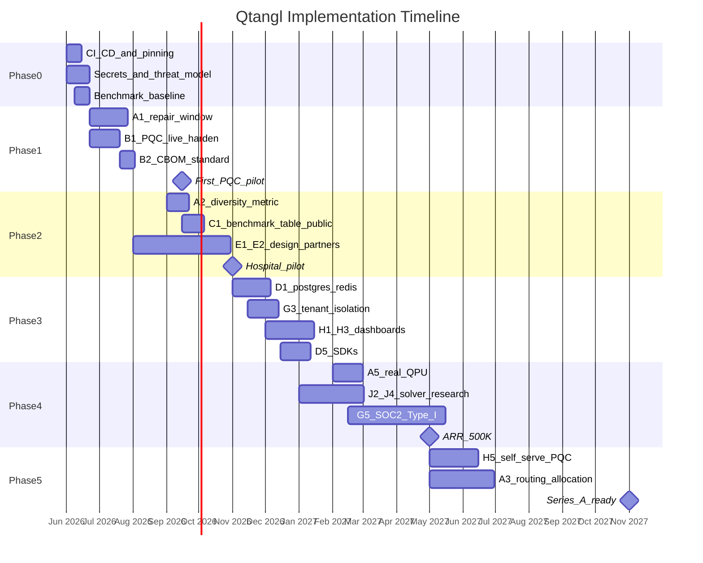

# 15 — Timeline & Milestones

Phased implementation plan with gates, aligned to [web/lib/docs/roadmap.ts](../web/lib/docs/roadmap.ts) Now/Next/Later bands.

**Start date assumption:** 2026-06-01 (adjust as needed)

---

## Phase overview

| Phase | Name | Duration | Theme |
|-------|------|----------|-------|
| **0** | Foundation | Weeks 1–4 | CI, secrets, benchmark baseline |
| **1** | Keystone + PQC harden | Weeks 5–12 | A1 repair window + B1–B2 + first PQC pilot |
| **2** | Credibility + pilots | Weeks 13–24 | Diversity metric, benchmarks public, 2–3 paying pilots |
| **3** | Enterprise MVP | Weeks 25–36 | Persistence, tenancy, dashboards, SDK |
| **4** | Scale + research | Weeks 37–52 | Real QPU, solver research publish, SOC2 Type I |
| **5** | Growth | Months 13–18 | Self-serve PQC, Series A prep, vertical expansion |

---

## Gantt (high level)

---

## Phase 0 — Foundation (Weeks 1–4)

### Goals

Establish engineering baseline before feature velocity.

### Deliverables

| ID | Deliverable | Track |
|----|-------------|-------|
| I1 | GitHub Actions CI (pytest + web build) | I |
| I2 | Pinned requirements.lock | I |
| G1 | Secrets hygiene + gitleaks | G |
| G2 | Threat model v1 | G |
| C1-partial | Run harnesses; draft benchmark JSON | C |

### Gate to Phase 1

- [ ] CI green on main
- [ ] No secrets in git history (gitleaks pass)
- [ ] Threat model reviewed
- [ ] At least 3 benchmark instances have local results

---

## Phase 1 — Keystone + PQC Harden (Weeks 5–12)

### Goals

Implement A1 (repair window) and harden PQC for first revenue.

### Deliverables

| ID | Deliverable | Track |
|----|-------------|-------|
| A1 | Local repair window extractor live | A |
| B1 | Live PQC scan production-hardened | B |
| B2 | CBOM export validated | B |
| B5 | Compliance-mapped report packs | B |
| E3 | PQC + hospital demo recordings | E |

### Milestone: First PQC pilot signed (~Week 12)

### Gate to Phase 2

- [ ] A1 merged with tests
- [ ] Live PQC scan on customer domain in staging
- [ ] ≥1 signed pilot SOW (PQC)
- [ ] Demo recordings published

---

## Phase 2 — Credibility + Pilots (Weeks 13–24)

### Goals

Public benchmarks, diversity metric, 2–3 paying pilots, hospital pilot started.

### Deliverables

| ID | Deliverable | Track |
|----|-------------|-------|
| A2 | Diversity metric all verticals | A |
| C1 | Benchmark table public (no Pending rows) | C |
| C2 | Falsifiable success metric documented | C |
| E1 | 2 PQC paying customers | E |
| E2 | 1 hospital pilot active | E |
| J1 | Research eval harness | J |

### Milestone: $250K ARR run-rate (~Week 24)

### Gate to Phase 3

- [ ] Benchmark blog published
- [ ] Hospital pilot on real or de-identified roster
- [ ] BAA signed if PHI used
- [ ] Research harness runs 3 solver types

---

## Phase 3 — Enterprise MVP (Weeks 25–36)

### Goals

Multi-tenant production infrastructure and customer dashboards.

### Deliverables

| ID | Deliverable | Track |
|----|-------------|-------|
| D1 | Postgres + Redis | D |
| D2 | Async workers | D |
| G3 | Per-tenant API keys | G |
| H1 | Tenant accounts | H |
| H3 | Dashboards MVP | H |
| D4–D5 | OpenAPI + Python/TS SDKs | D |
| B3 | Scheduled PQC re-scans | B |

### Milestone: 3 production tenants (~Week 36)

### Gate to Phase 4

- [ ] Two API instances share state correctly
- [ ] SDK quickstart works against staging
- [ ] SOC2 readiness assessment started

---

## Phase 4 — Scale + Research (Weeks 37–52)

### Goals

Real QPU credibility, published research, SOC2 Type I, $500K ARR.

### Deliverables

| ID | Deliverable | Track |
|----|-------------|-------|
| A5 | Documented real-QPU run | A |
| A4 | QAOA robustness improvements | A |
| J2–J4 | Solver comparison published | J |
| G5 | SOC2 Type I report | G |
| G7 | Qtangl self-scan clean | G |
| B4 | Remediation workflow | B |

### Milestone: $500K ARR + SOC2 Type I (~Week 52)

### Gate to Phase 5

- [ ] Whitepaper published
- [ ] SOC2 Type I complete
- [ ] Real QPU trace in fixtures with runbook

---

## Phase 5 — Growth (Months 13–18)

### Goals

Self-serve PQC, routing/allocation GA, Series A narrative.

### Deliverables

| ID | Deliverable | Track |
|----|-------------|-------|
| H5 | Self-serve PQC signup | H |
| A3 | `/optimize` routing + allocation | A |
| E5 | 1 technology partnership (IBM/OQS) | E |
| F1 | Series A deck with metrics | F |
| G6 | CMMC report mapping GA | G |

### Milestone: Series A ready (~Month 18)

- [ ] $1M ARR run-rate or clear path
- [ ] 2 case studies published
- [ ] Multi-tenant SaaS operational

---

## Mapping to public roadmap bands

| Public band ([roadmap.ts](../web/lib/docs/roadmap.ts)) | Internal phase |
|--------------------------------------------------------|----------------|
| **Now** | Phase 0–1 (schedule GA, hospital pilot, PQC pilot, docs GA) |
| **Next** | Phase 2–3 (routing, allocation, local repair, SDKs) |
| **Later** | Phase 4–5 (OpenAPI, tracing, SOC2, Postman) |

Update public bands each quarter from this doc.

---

## Definition of done (per phase)

Each phase gate requires:
1. All phase deliverables acceptance criteria met
2. Epic statuses updated in [backlog/epics.md](./backlog/epics.md)
3. Risk register reviewed
4. KPI snapshot captured in [16-metrics-and-kpis.md](./16-metrics-and-kpis.md)
5. Weekly review notes archived

---

## Related docs

- Strategy: [03-strategy-and-priorities.md](./03-strategy-and-priorities.md)
- Metrics: [16-metrics-and-kpis.md](./16-metrics-and-kpis.md)
- Financial: [17-financial-model.md](./17-financial-model.md)
