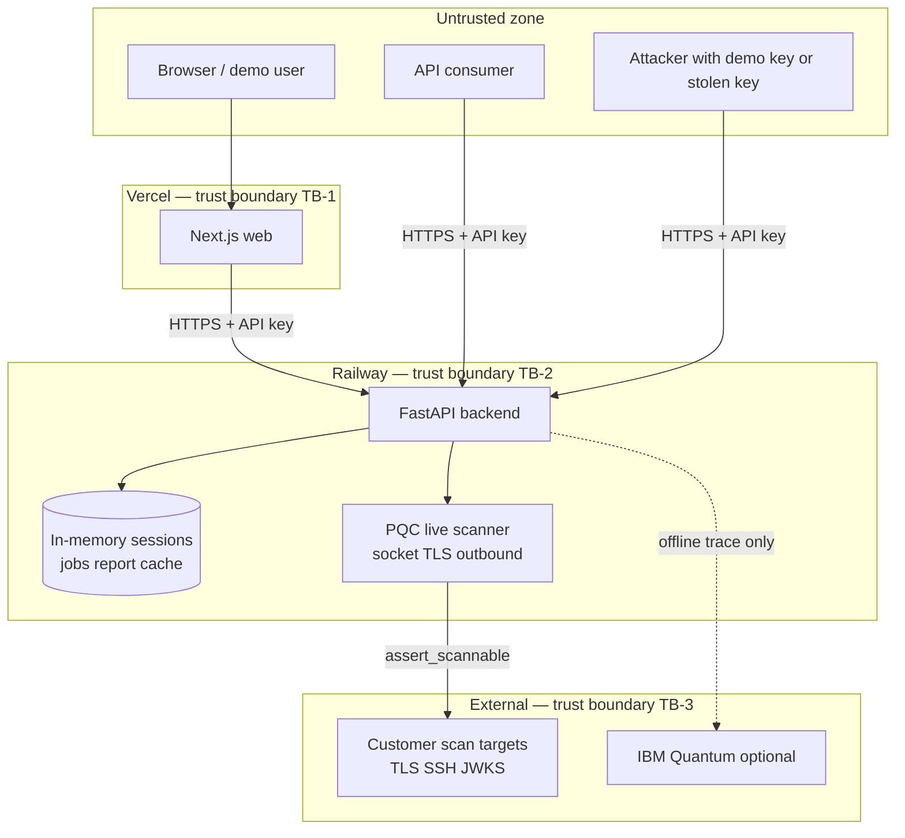

# Threat Model v1

**Status:** Active — reviewed 2026-05-30 (G2)  
**Owner:** Security track  
**Next review:** 2026-08-30 or before first regulated-data pilot  
**Related:** [11-track-G-security-trust-compliance.md](../11-track-G-security-trust-compliance.md), [secrets-runbook.md](./secrets-runbook.md), [04-architecture-blueprint.md](../04-architecture-blueprint.md)

---

## 1. Purpose

Document threats to the Qtangl FastAPI backend and map them to **existing controls**, **gaps**, and **tracking epics**. This model gates regulated-data pilots (see compliance checklist in Track G).

**Out of scope:** Customer internal networks, physical datacenter security, employee endpoint compromise, CDN-edge DDoS (Vercel), IBM Quantum cloud security.

---

## 2. System context & trust boundaries

| Boundary | Crosses | Controls today |
|----------|---------|----------------|
| **TB-1** Web → user | HTML/JS to browser | Vercel TLS; no secrets in client bundle for prod API key |
| **TB-2** Client → API | JSON, file uploads | `require_api_key`, rate limit, CORS |
| **TB-3** API → internet targets | Outbound scans | `assert_scannable`, port allowlist, timeout, max endpoints |
| **TB-4** API → memory store | Session/report data | 24h TTL; **no tenant isolation yet** |

---

## 3. Assets

| ID | Asset | Sensitivity | Storage today |
|----|-------|-------------|---------------|
| A-01 | API keys / pilot tokens | Critical | Env var (`QTANGL_API_KEY`); single shared key |
| A-02 | PQC scan results, CBOM, reports | High | In-memory `_report_cache`, async jobs |
| A-03 | Hospital rosters (PHI) | Critical | Upload sessions (`hospital-*` UUID) |
| A-04 | Airline crew / EV fleet uploads | High | Upload sessions (`airline-*`, `ev-fleet-*`) |
| A-05 | PEM / crypto inventory uploads | High | Upload sessions (`pqc-*`) |
| A-06 | QUBO snapshots / audit packs | High | API response bodies |
| A-07 | QPU traces / fixtures | Low | Bundled JSON in image |
| A-08 | Application logs | High | Railway stdout (unstructured) |

---

## 4. Threat actors

| Actor | Capability | Goal |
|-------|------------|------|
| **Anonymous** | Public internet | Probe `/health`, enumerate endpoints |
| **Demo user** | Shared `qtangl-demo-key` | Abuse rate limits, attempt SSRF via live scan |
| **Pilot customer** | Dedicated API key | Access own data; accidental cross-customer access if multi-tenant |
| **Malicious insider (customer)** | Valid key + uploads | Exfil via scan targets, poison uploads, harvest others' sessions |
| **Compromised key** | Stolen bearer token | Mass API abuse, PHI exfil from sessions/cache |

---

## 5. Threat inventory

Risk = **Impact** (if realized) × **Likelihood** (given current controls).  
**High** residual = needs implemented mitigation or tracked epic before scale.

| ID | Threat | Component | L | I | Residual | Status |
|----|--------|-----------|---|---|----------|--------|
| TH-001 | **SSRF / internal network scan** via live PQC target | `pqc/scanner.py` | M | H | **High** | Partial |
| TH-002 | **Cross-tenant data read** (scan results, sessions, reports) | All routers + memory | M | C | **High** | Open |
| TH-003 | **Malicious upload** (oversized PEM/CSV, parser abuse, zip bomb) | Upload endpoints | L | M | Medium | Partial |
| TH-004 | **API key brute force / abuse** | `auth.py` | M | M | Medium | Partial |
| TH-005 | **PHI / PII in application logs** | All verticals | M | C | **High** | Open |
| TH-006 | **Secrets committed to git** | Dev process | L | H | Low | Mitigated |
| TH-007 | **Stack trace / internal error leakage** to API clients | `main.py` handler | M | M | Medium | Partial |
| TH-008 | **Session ID enumeration** (upload → solve without auth on session) | `*/sessions.py` | L | M | Low | Partial |
| TH-009 | **Live scan abuse** (port scan reconnaissance at scale) | PQC async jobs | L | H | Medium | Partial |
| TH-010 | **CORS misconfiguration** allowing credentialed cross-origin abuse | `main.py` | L | M | Low | Mitigated |
| TH-011 | **Unauthorized access** (missing/invalid API key) | All protected routes | M | M | Low | Mitigated |

---

## 6. Control matrix

Maps **implemented controls** to threats. File paths are the source of truth.

| Control ID | Description | Location | Threats mitigated |
|------------|-------------|----------|-------------------|
| C-01 | Bearer / `x-api-key` validation on all business routes | [`backend/app/auth.py`](../../backend/app/auth.py) `require_api_key` | TH-011 |
| C-02 | Per-key sliding window rate limit (default 120/min) | [`backend/app/auth.py`](../../backend/app/auth.py) `_enforce_rate_limit` | TH-004, TH-009 |
| C-03 | Live scan feature flag (default **off**; prod sets `true` only for pilots) | `safety.py` `live_scan_enabled` | TH-001, TH-009 |
| C-04 | Host allowlist optional (`QTANGL_PQC_SCAN_ALLOWLIST`) | `safety.py` `_allowlist` | TH-001 |
| C-05 | Block private/loopback/link-local/metadata IPs after DNS resolve | `safety.py` `_is_blocked_ip`, `assert_scannable` | TH-001 |
| C-06 | Port allowlist (443, 8443, 22, …) | `safety.py` `DEFAULT_ALLOWED_PORTS` | TH-001, TH-009 |
| C-07 | Scan timeout (`QTANGL_PQC_SCAN_TIMEOUT`, default 8s) | `safety.py`, `scanner.py` | TH-009 |
| C-08 | Max endpoints per scan (`QTANGL_PQC_MAX_ENDPOINTS`, default 24) | `safety.py`, `scanner.py` | TH-009 |
| C-09 | Fixture mode default in API (`useFixture: true`) | [`backend/app/api/pqc.py`](../../backend/app/api/pqc.py) | TH-001, TH-009 |
| C-10 | Upload type validation (extension / content sniff) | `api/hospital.py`, `api/airline.py`, `api/ev_fleet.py`, `api/pqc.py` | TH-003 |
| C-11 | Upload session TTL 24h + UUID session IDs | `*/sessions.py` | TH-008, TH-002 (partial) |
| C-12 | CORS origin allowlist + Vercel preview regex | [`backend/app/main.py`](../../backend/app/main.py) | TH-010 |
| C-13 | `.env` gitignore + gitleaks CI + allowlist config | [`.gitignore`](../../.gitignore), [`.gitleaks.toml`](../../.gitleaks.toml), CI | TH-006 |
| C-14 | SSRF regression tests (loopback, metadata IP) | [`backend/tests/test_pqc_safety.py`](../../backend/tests/test_pqc_safety.py) | TH-001 |
| C-15 | Secrets runbook + rotation procedure | [secrets-runbook.md](./secrets-runbook.md) | TH-006 |

### Upload endpoints (attack surface)

| Route | Auth | Parser | Size limit | Session TTL |
|-------|------|--------|------------|-------------|
| `POST /hospital/upload-roster` | C-01 | CSV → `parse_uploaded_roster` | **None** | 24h |
| `POST /airline/upload-crew` | C-01 | CSV → `parse_uploaded_crew` | **None** | 24h |
| `POST /ev_fleet/upload-fleet` | C-01 | CSV | **None** | 24h |
| `POST /ev_fleet/upload-stops` | C-01 | CSV | **None** | 24h |
| `POST /pqc/upload-bundle` | C-01 | CSV / PEM | **None** | 24h |

### PQC live scan path

1. Client `POST /pqc/scan` with `useFixture: false` → `create_job` → `run_job_async`
2. `run_pqc_scan` → `scan_live()` → per-endpoint `assert_scannable` → outbound socket/TLS
3. Results in job + `_report_cache` (keyed by scan UUID, **not** tenant-scoped)

---

## 7. Gap analysis & epic mapping

All **High** residual threats must have an owner epic before enterprise or regulated pilots.

| Threat | Gap | Epic / action | Target |
|--------|-----|---------------|--------|
| **TH-001** | No network-isolated scan worker; DNS rebinding not explicitly tested; live scan defaults on in code | **B1** harden live scan; **D2** async workers in isolated network | Phase 1 |
| **TH-002** | Single shared API key; sessions/cache not scoped by tenant | **G3** + **D1** Postgres | Phase 3 |
| **TH-003** | No max upload bytes; PEM parsed in-process without resource caps | **H2** customer ingestion hardening | Phase 2–3 |
| **TH-004** | Rate limit is in-memory per instance; same key for all demo users | **G3** per-tenant keys + limits | Phase 3 |
| **TH-005** | No log redaction policy; roster fields may appear in errors | **G9** safe logging & PHI redaction | Phase 1 |
| **TH-006** | Manual token rotation (G1-001) | **G1** | Phase 0 |
| **TH-007** | Global handler returns `str(exc)` in JSON `detail` | **G9** | Phase 1 |
| **TH-009** | No scan quota per tenant; async job queue in-process | **B1**, **G3**, **D2** | Phase 1–3 |

**Low residual (monitor):** TH-008 (UUID entropy adequate), TH-010 (CORS defaults reasonable), TH-011 (auth on all routes except `/health`).

---

## 8. STRIDE summary (by component)

| Component | S | T | R | I | D | E |
|-----------|---|---|---|---|---|---|
| PQC scanner | — | Live scan integrity | — | SSRF exfil | Job flooding | Scan targets |
| Upload parsers | Poisoned CSV/PEM | — | — | Memory exhaustion | — | PHI in session store |
| Auth | Key theft | — | Single shared key | — | Rate limit bypass (multi-instance) | — |
| Memory store | — | — | — | Cross-tenant read | Session/cache wipe on restart | Session IDs |
| API responses | — | — | — | Error detail leak | — | — |

---

## 9. Pre-Series A penetration test scope

Recommended third-party test **after B1 + G9** (or dedicated single-tenant prod instance):

| In scope | Test cases |
|----------|------------|
| PQC live scanner | SSRF (RFC1918, localhost, metadata, DNS rebinding), port sweep, timeout bypass |
| Upload endpoints | Oversized files, malformed PEM/CSV, content-type mismatch |
| Authentication | Missing key, invalid key, rate limit, IDOR on `sessionId` / `scanId` |
| API errors | Trigger 500s; verify no stack traces or internal paths in response |
| CORS | Unauthorized origin with credentials |

| Out of scope (document separately) | Reason |
|-----------------------------------|--------|
| Vercel / Railway platform | Shared responsibility |
| IBM Quantum | Optional offline path |
| Social engineering | — |

Deliverable: written report + remediation tickets linked to threat IDs.

---

## 10. Review cadence

| Event | Action |
|-------|--------|
| New upload endpoint or outbound integration | Update §6–§7 before merge |
| Before first PHI pilot | Re-review TH-005, TH-002; confirm G6 checklist |
| Quarterly | Full model review; sync [risk-register.md](../backlog/risk-register.md) |
| After security incident | Hotfix review within 48h |

---

## 11. Change log

| Date | Version | Change |
|------|---------|--------|
| 2026-05-30 | v1.0 | G2 complete: full inventory, control matrix, epic mapping, pen test scope |
| 2026-06-07 | v1.1 | K16 transparency log: global hash-only log, public root privacy, rate limits on `/pqc/transparency/*` and `/pqc/verify` |

---

## 12. Transparency log (K16) — privacy & abuse

**Decision:** Single **global** append-only log storing **content hashes and signing metadata only** (no tenant PII, no scan targets). Public endpoints: `GET /pqc/transparency/root`, `/keys`, `/{contentHash}`.

| Risk | Control | Residual |
|------|---------|----------|
| Scan cadence / existence leakage via hash enumeration | Hashes are SHA-256 of canonical report JSON; not reversible to domain without report | Medium — rate limit public endpoints (`QTANGL_RATE_LIMIT_PER_MINUTE`) |
| Operator rewrites log | Append-only DB constraint + periodic **file witness** anchors (`QTANGL_TRANSPARENCY_ANCHOR_DIR`); external mirror planned (P3) | Medium until multi-witness |
| DoS on public verify/transparency | Same rate limiter as API; no auth required by design | Low |
| Retention vs deletion requests | Log rows exempt from tenant deletion (hashes only); documented in DPA § evidence log | Low |

**Retention exemption:** `evidence_log` stores no customer content — only `content_hash`, `key_fingerprint`, `alg`, `signed_at`, chain metadata. Exempt from 24h PEM deletion and subject to indefinite append-only retention per [17-legal-regulatory-and-compliance.md](../../quantum-readiness/17-legal-regulatory-and-compliance.md).
