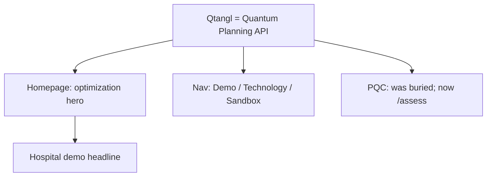
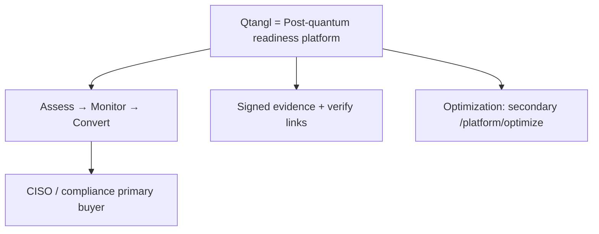

# 00 — Transformation Thesis

Why Qtangl must reposition now, what we are becoming, and the decision we are locking in.

---

## Executive summary

Qtangl has **two real products** but **one public identity problem**: the website, nav, and brand voice sell a **"Quantum Planning API"** (hybrid optimization) while the **defensible revenue path** is **post-quantum cryptography (PQC) readiness** — assess, monitor, convert.

**Decision:** Reposition the **company front door** to post-quantum readiness. Keep hybrid optimization as a **secondary, forward-looking expansion** story — not deleted, not co-equal on the homepage.

*Quantum is the threat on the PQC path, not the engine.*

---

## Why pivot now

### 1. Revenue asymmetry

| Dimension | PQC readiness | Hybrid optimization |
|-----------|---------------|---------------------|
| Backend maturity | `pilot` — live scan, CBOM, Mosca, handshake proof ([01-current-state](../optimization_OLD_FUTURE/01-current-state.md)) | `pilot` — demos work; keystone repair window still placeholder |
| Buyer urgency | Board mandates; NSM-10; CMMC; 2027–2035 deadlines | Operational pain; longer sales cycle |
| Performance caveat | None — inventory is honest today | Must say "classical wins" on many jobs |
| Gross margin (model) | ~97% Monitor tier ([17-financial-model](../optimization_OLD_FUTURE/17-financial-model.md)) | ~93% at scale; higher support COGS |
| Competitive moat | Signed evidence, scan diff, Mosca timeline, mid-market price | Crowded OR market; quantum hype penalty |

**Rule from existing strategy:** PQC revenue funds optimization R&D. Leading with optimization inverts that sequence in the market's mind.

### 2. Website–product mismatch

Current public positioning (from [web/lib/copy/home.ts](../../web/lib/copy/home.ts), [web/lib/copy/product.ts](../../web/lib/copy/product.ts)):

| Surface | Current message |
|---------|-----------------|
| Homepage hero | "Every possibility ranked. One future your team runs." |
| Nav subtitle | "Quantum Planning API" |
| Primary CTA | "Find Quantum" → `/demo` (optimization-first) |
| Headline demo | Hospital re-staffing in 4:11 |

PQC exists but was **buried** (legacy `/demo/pqc`, now **`/assess`**), alongside `/pqc`, `/dashboard`, `/verify`, 11+ doc pages — **none in primary nav** at the time of this thesis.

A CISO searching for Q-Day inventory lands on superposition/collapse language and hospital staffing demos. **We lose before the demo.**

### 3. Market window

Drivers from [02-market-and-competition](../optimization_OLD_FUTURE/02-market-and-competition.md):

- NIST ML-KEM/ML-DSA finalized (2024)
- NSM-10 federal mandate
- Harvest-now-decrypt-later (HNDL) — data encrypted today is at risk
- CMMC 2.0, FedRAMP, EU CRA pushing crypto inventory

Mid-market orgs ($5–25M PQC program budgets) need **fast inventory + remediation workflow + audit evidence** — not a $5M Big 4 engagement.

---

## The decision: lead with readiness, keep optimization

We reject three extremes:

| Option | Verdict | Why |
|--------|---------|-----|
| **Status quo** — optimization homepage | ❌ | Misaligns brand with revenue path; confuses PQC buyers |
| **Full delete-pivot** — remove optimization | ❌ | Destroys working demos, optionality, and "quantum-native" fundraising narrative pre-revenue |
| **Equal umbrella** — two products, equal weight | ❌ | Half-measures confuse everyone; neither buyer feels served |

**Chosen path:** **Lead-with-readiness pivot**

- **Identity:** Post-quantum readiness platform — the system of record for Assess → Monitor → Convert
- **Optimization:** Clearly secondary — "quantum advantage when your stack is defended"
- **Brand:** Retire "Quantum Planning API" as **company** headline; scope superposition/collapse lexicon to optimization pages only

---

## Before / after identity

### Before (today)

| Attribute | Value |
|-----------|-------|
| Tagline | "Every possibility ranked. One future your team runs." |
| Primary buyer | Ops / platform engineering |
| Lead product (perception) | Hybrid scheduling API |
| PQC role | Side demo, "both sides of Q-Day" footnote |

### After (target)

| Attribute | Value |
|-----------|-------|
| Tagline (proposed) | "Get ready for Q-Day." / "Assess. Monitor. Convert." |
| Primary buyer | CISO, compliance lead, VP Engineering (crypto) |
| Lead product (perception) | Q-Day readiness scanner + Monitor subscription |
| Optimization role | Expansion: "quantum advantage after defense" |

---

## What we are building (the system)

Not a vulnerability scanner. A **crypto-agility operating system**:

1. **Assess** — Baseline inventory (TLS, JWKS, SSH, email), Mosca HNDL risk, readiness score, CBOM + signed PDF
2. **Monitor** — Scheduled re-scans, drift diff, alerts on new quantum-vulnerable assets
3. **Convert** — Prioritized remediation backlog, guided migration playbooks, re-scan proof, partner-delivered hardening
4. **Evidence** — Verify links, auditor packs, framework mapping (NIST, CMMC, HIPAA)

Detail: [02-customer-journey.md](./02-customer-journey.md), [03-solution-architecture.md](./03-solution-architecture.md).

---

## Cost of not pivoting

| Risk | Impact | Timeline |
|------|--------|----------|
| PQC buyers bounce on optimization homepage | Lost design partners; extended time-to-first-revenue | Immediate |
| SEO ranks for "quantum scheduling" not "PQC inventory" | Wrong inbound; wasted sales cycles | 3–6 months |
| Brand = "quantum hype vendor" | Due diligence penalty; auditor distrust | Ongoing |
| Assessment-only consulting trap | One-time $35K projects, no Monitor ARR | Per deal |
| Competitors (SandboxAQ, PQShield) own "readiness" | Qtangl seen as optimizer with a scanner feature | 12–18 months |

---

## Guardrails (honesty as strategy)

**Do:**

- Say "quantum is the **threat**, not the engine" on PQC surfaces
- Lead with evidence: signed reports, verify links, CBOM, Mosca timeline
- Scope optimization quantum metaphor to `/demo/hospital`, `/technology`, `/sandbox` only
- Publish when classical wins on optimization — unchanged from [03-strategy](../optimization_OLD_FUTURE/03-strategy-and-priorities.md)

**Don't:**

- Claim Qtangl performs cryptographic migration or HSM replacement (we orchestrate and verify)
- Sell optimization to buyers who only need PQC
- Imply live QPU in production demos (fixture replay — existing rule)
- Promise quantum speedup without benchmark row

---

## Success criteria (transformation level)

| Horizon | Must be true |
|---------|--------------|
| **6 weeks** | Homepage + nav repositioned; `/assess` `/monitor` `/convert` pages live; PQC in primary nav |
| **12 weeks** | First paying Monitor customer acquired via readiness-first funnel; case study draft |
| **6 months** | ≥$100K PQC ARR; readiness content hub indexed; 2 auditor/MSSP partner intros |
| **12 months** | Monitor is default upsell from Assessment; optimization cross-sell documented in ≥1 account |

Metrics: [10-metrics-and-risks.md](./10-metrics-and-risks.md).

---

## Related docs

- Positioning: [01-positioning-and-brand.md](./01-positioning-and-brand.md)
- Customer journey: [02-customer-journey.md](./02-customer-journey.md)
- Execution: [08-execution-plan.md](./08-execution-plan.md)
- Original two-product bet: [00-executive-summary](../optimization_OLD_FUTURE/00-executive-summary.md)
