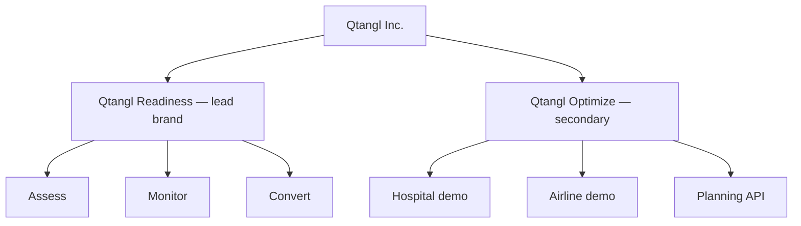

# 01 — Positioning & Brand

Messaging hierarchy, voice, taglines, and competitive framing for the readiness-first Qtangl.

---

## Positioning statement

**For** CISOs and compliance leaders at regulated mid-market organizations (500–10,000 employees)

**Who** face board mandates to inventory quantum-vulnerable cryptography before 2030

**Qtangl** is a post-quantum readiness platform

**That** delivers baseline assessment in minutes, continuous drift monitoring, and a prioritized conversion workflow with auditor-ready evidence

**Unlike** Big 4 consulting (slow, expensive), open-source scanners (no workflow), or pure PQ-TLS vendors (no inventory + compliance crosswalk)

**We** combine fast live scanning, Mosca HNDL scoring, signed verify links, and remediation tracking at mid-market price — with hybrid optimization as the expansion path once defense is proven.

---

## Messaging hierarchy

Use this order on every readiness surface (homepage, `/assess`, sales deck, cold email):

| Level | Message | Proof |
|-------|---------|-------|
| **1 — Outcome** | Know your quantum crypto exposure and prove you're fixing it | Readiness score, signed PDF, `/verify` link |
| **2 — Urgency** | HNDL means data encrypted today is already at risk | Mosca inequality, deadline tiers |
| **3 — Method** | Live scan → prioritized backlog → re-scan proof | Demo in minutes, CBOM export |
| **4 — Ongoing** | Crypto drifts; one scan is not enough | Diff alerts, Monitor tier |
| **5 — Expansion** | After defense, unlock quantum advantage in operations | Optimization demos (secondary) |

**Never lead with level 5 on readiness pages.**

---

## Tagline change

### Retire as company headline

| Current | Location |
|---------|----------|
| "Quantum Planning API" | [web/lib/copy/nav.ts](../../web/lib/copy/nav.ts) `navbarCopy.subtitle` |
| "Every possibility ranked. One future your team runs." | [web/lib/copy/product.ts](../../web/lib/copy/product.ts) `siteMetadata.tagline` |
| "Find Quantum" | [web/lib/copy/home.ts](../../web/lib/copy/home.ts) `homeHero.primaryCta` |

### Proposed company taglines (pick one in Phase 0)

| Option | Tone | Best for |
|--------|------|----------|
| **"Get ready for Q-Day."** | Direct, urgent | CISO, board |
| **"Assess. Monitor. Convert."** | Journey-native | Product, website |
| **"Your post-quantum readiness platform."** | Category-defining | SEO, analysts |
| **"Prove your stack survives Q-Day."** | Evidence-led | Compliance, audit |

**Recommended primary:** **"Assess. Monitor. Convert."** with subhead **"Post-quantum readiness with evidence your auditors can verify."**

**Optimization pages retain:** "Every possibility ranked. One future your team runs." — scoped to `/technology`, `/demo/hospital`, etc.

---

## Voice & lexicon

### Readiness lexicon (new — `web/lib/copy/readiness.ts` to create)

| Term | Meaning | Use on |
|------|---------|--------|
| **Readiness** | Composite score + band for PQC migration progress | Homepage, dashboard |
| **Exposure** | Count/severity of quantum-vulnerable assets | Reports, sales |
| **Drift** | Crypto posture change between scans | Monitor tier |
| **Evidence** | Signed report + verify link + CBOM | Audit, trust |
| **Convert** | Execute remediation with re-scan proof | Convert tier |
| **Agility** | Ability to swap algorithms without breakage | Enterprise narrative |
| **HNDL** | Harvest-now-decrypt-later risk | Executive briefings |
| **Q-Day** | Cryptographically relevant quantum computer | Education hub |

### Optimization lexicon (existing — scope down)

Keep [web/lib/copy/voice.ts](../../web/lib/copy/voice.ts) `quantumLexicon` (superposition, collapse, amplitude, etc.) **only** on:

- `/technology`
- `/demo/hospital`, `/demo/airline`, `/demo/ev-fleet`
- `/sandbox`
- `/docs/guides/schedule`, routing, allocation
- Blog posts tagged `optimization`

**Rule:** If the page mentions TLS, CBOM, Mosca, or CMMC → use readiness lexicon only.

### Copy guardrails (extend existing)

From `copyGuardrails` in voice.ts — add readiness rules:

| Rule | Detail |
|------|--------|
| Headlines | ≤12 words; outcome-first ("Inventory in minutes", not "Quantum scanner") |
| Honesty | "Inventory aid, not formal audit" — mirror [report.py honesty_notes](../../backend/app/pqc/report.py) |
| No fear-mongering | "Quantum-vulnerable ≠ broken today" |
| Evidence | Every CTA pairs with a proof artifact (PDF, verify link, CBOM) |

---

## Value proposition by tier

| Tier | One-liner | Buyer pain |
|------|-----------|------------|
| **Assess** | "Your Q-Day baseline in one session." | Board question; spreadsheet took weeks |
| **Monitor** | "Catch crypto drift before your auditor does." | New endpoints, cert expirations, regressions |
| **Convert** | "Prioritized migration with proof it worked." | Don't know what to fix first or how |
| **Enterprise** | "Multi-domain readiness with CMMC/HIPAA packs." | FedRAMP/CMMC contract risk |
| **Optimize** (expansion) | "Quantum-aware planning after your stack is defended." | Ops optimization (different buyer) |

---

## Competitive framing

From [02-market-and-competition](../optimization_OLD_FUTURE/02-market-and-competition.md), repositioned:

| Competitor | Their pitch | Qtangl wins when |
|------------|-------------|------------------|
| **SandboxAQ** | Broad PQ portfolio, enterprise brand | Buyer wants transparent mid-market pricing + verify links + faster time-to-inventory |
| **QuSecure / PQShield** | PQ TLS, HSM | Buyer needs full inventory (JWKS, SSH, email) + remediation workflow, not just TLS |
| **IBM / Cloudflare PQ** | Infra-level PQ | Buyer needs CBOM + Mosca + compliance mapping, not just enabling hybrid TLS |
| **Big 4 consulting** | Trust, relationships | Buyer needs inventory in **minutes**, not 6-week spreadsheet projects |
| **liboqs / OQS** | Free, NIST-aligned | Buyer needs productized scan + report + drift + signed evidence workflow |

### Objection handling (readiness-first)

| Objection | Response |
|-----------|----------|
| "We already have a crypto inventory tool" | Qtangl adds **signed verify links**, **scan diff**, and **Mosca timeline** — auditor-ready evidence, not another spreadsheet |
| "Quantum is years away" | HNDL risk for data encrypted today; Mosca inequality shows whether migration runway exceeds shelf life |
| "Are you a quantum computing company?" | We're a **readiness platform**. Quantum is the threat we help you defend against; our scanner proves hybrid PQ TLS works |
| "Can you migrate our stack?" | We **orchestrate and verify** migration via Convert tier + partners; you get re-scan proof in Qtangl |

---

## Brand architecture

**Product naming on website:**

| Current | Target |
|---------|--------|
| "Quantum Planning API" (nav) | "Q-Day Readiness" or "Qtangl" (nav subtitle TBD) |
| `/pqc` page "Both sides of Q-Day" | Keep phrase; lead with readiness half first |
| `/demo` index | Reorder: PQC first, optimization second |

---

## Proof points (use in sales + website)

| Proof | Source | Status |
|-------|--------|--------|
| Live TLS + CT + JWKS + SSH scan | [backend/app/pqc/scanner.py](../../backend/app/pqc/scanner.py) | `pilot` |
| CycloneDX CBOM export | [backend/app/pqc/report.py](../../backend/app/pqc/report.py) | `done` |
| Mosca HNDL assessment | [backend/app/pqc/risk.py](../../backend/app/pqc/risk.py) | `done` |
| PQ TLS handshake proof | [backend/app/pqc/handshake.py](../../backend/app/pqc/handshake.py) | `done` |
| Signed report + `/verify` | [web/app/verify/page.tsx](../../web/app/verify/page.tsx) | `pilot` |
| Scan diff / drift | [backend/app/monitoring/diff.py](../../backend/app/monitoring/diff.py) | `in-progress` |
| Remediation workflow | [backend/app/remediation/service.py](../../backend/app/remediation/service.py) | `in-progress` |
| Compliance packs (bank, CMMC, healthcare) | [backend/app/pqc/compliance_packs.py](../../backend/app/pqc/compliance_packs.py) | `done` |

---

## Visual & design notes

- **Readiness surfaces:** Emphasize trust (signatures, verify badges, readiness score gauges). De-emphasize quantum particle animations from optimization hero.
- **Color semantics:** Readiness = evidence/trust; Optimization = workflow/motion (existing monochrome system in [web/lib/copy/product.ts](../../web/lib/copy/product.ts) `aboutContent` cards).
- **Hero demo:** Replace hospital headline demo with PQC scan → PDF → verify flow on homepage.

Detail: [04-website-transformation.md](./04-website-transformation.md).

---

## Related docs

- Thesis: [00-transformation-thesis.md](./00-transformation-thesis.md)
- Journey: [02-customer-journey.md](./02-customer-journey.md)
- Website spec: [04-website-transformation.md](./04-website-transformation.md)
- GTM: [06-gtm-and-pricing.md](./06-gtm-and-pricing.md)
