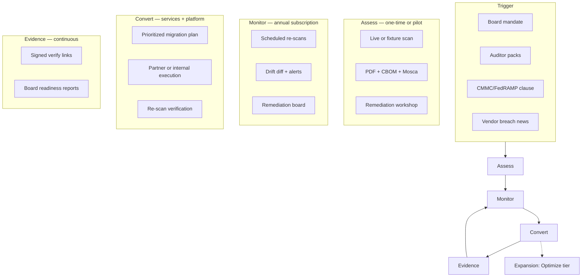

# 02 — Customer Journey

The system that takes organizations from quantum crypto uncertainty to verified post-quantum readiness — and where Qtangl creates recurring value.

---

## Journey overview

**Core insight:** The vulnerability list is the **hook**. Monitor + Evidence is the **product**. Convert is the **high-value sticky tier**.

---

## Personas

### Primary: CISO / VP Security

| Attribute | Detail |
|-----------|--------|
| **Title** | CISO, VP Information Security, Head of Cyber |
| **Industry** | Regional bank, insurer, healthcare payer, gov contractor |
| **Trigger** | Board asks "how much RSA/ECDSA before 2030?" |
| **Pain** | No centralized crypto inventory; spreadsheets miss JWKS, SSH, email STARTTLS |
| **Success metric** | Readiness score trending up; audit passed; board satisfied |
| **Qtangl entry** | `/demo/pqc` → Assessment SOW → Monitor |
| **Objection** | "We have consultants" → speed + drift + verify links |

### Secondary: Compliance / GRC lead

| Attribute | Detail |
|-----------|--------|
| **Title** | Compliance Manager, GRC Director, CMMC Officer |
| **Trigger** | Framework audit (CMMC, PCI-DSS 4.0, HIPAA) |
| **Pain** | Needs evidence of migration **planning**, not just findings |
| **Success metric** | Framework-mapped report in audit pack |
| **Qtangl entry** | Scenario pack (`gov-contractor-cmmc`, `healthcare-insurer-hndl`) |
| **Objection** | "Not a formal attestation" → honest positioning + verify chain |

### Technical: VP Engineering / Platform lead

| Attribute | Detail |
|-----------|--------|
| **Title** | VP Engineering, Head of Platform, Crypto engineering lead |
| **Trigger** | Assigned to execute PQC migration program |
| **Pain** | Prioritization, ownership, sprint planning across teams |
| **Success metric** | Remediation backlog closed; re-scan confirms fix |
| **Qtangl entry** | CBOM → Jira integration → remediation status API |
| **Objection** | "We can script scans" → diff, Mosca, compliance crosswalk, signed reports |

### Economic buyer: CFO / Board (influenced)

| Attribute | Detail |
|-----------|--------|
| **Concern** | Contract risk ($8–15M estimated in [demo_specs](../../demos/pqc_migration/demo_specs.md)); program budget ($5–25M) |
| **Qtangl value** | Exposure range in executive summary; 90-day decision list in board report |
| **Artifact** | `report_to_board()` payload from [report.py](../../backend/app/pqc/report.py) |

---

## Crypto-agility maturity model

Use in sales discovery and dashboard UX. Customer self-identifies stage; Qtangl upsells next stage.

| Stage | Name | Characteristics | Qtangl tier |
|-------|------|-----------------|-------------|
| **0** | Unaware | No crypto inventory; ad hoc cert management | Content / free mini-assess |
| **1** | Inventory | First scan complete; findings in spreadsheet | **Assess** |
| **2** | Prioritized | Backlog ranked by Mosca/deadline; owners assigned | Assess + workshop |
| **3** | Monitored | Re-scans scheduled; drift detected | **Monitor** |
| **4** | Converting | Active migration sprints; re-scan proof per item | **Convert** |
| **5** | Agile | Hybrid PQ live; downgrade detection; crypto agility score ≥80 | **Enterprise** |
| **6** | Optimizing | Post-quantum ops secure; exploring quantum advantage in planning | **Optimize** (expansion) |

**Sales rule:** Never sell Stage 6 to a Stage 0 buyer. Always propose **next stage + one**.

---

## Stage 1 — Assess

### Customer experience

1. Authorizes domain or uploads PEM bundle
2. Runs Q-Day scan (fixture rehearsal → live scan)
3. Receives within one session:
   - Executive PDF with readiness band
   - CycloneDX CBOM
   - Mosca HNDL assessment
   - PQ TLS handshake proof appendix
   - Prioritized remediation backlog (CSV)
4. Attends remediation workshop (Week 2 per [pqc-pilot-sow](../optimization_OLD_FUTURE/templates/pqc-pilot-sow.md))
5. Executive readout (Week 4)

### Qtangl capabilities (built vs needed)

| Capability | Status | File / route |
|------------|--------|--------------|
| Live TLS/CT/SSH/JWKS/SMTP scan | `pilot` | [scanner.py](../../backend/app/pqc/scanner.py) |
| Fixture scenarios (bank, CMMC, healthcare) | `done` | [fixtures/scenarios/](../../backend/app/pqc/fixtures/scenarios/) |
| PDF + CBOM + CSV export | `done` | [report.py](../../backend/app/pqc/report.py) |
| Signed report + verify | `pilot` | [verify/page.tsx](../../web/app/verify/page.tsx) |
| Demo UI | `pilot` | [demo/pqc/page.tsx](../../web/app/demo/pqc/page.tsx) |
| Self-serve Assess checkout | `coming-soon` | [access/page.tsx](../../web/app/access/page.tsx) — rewrite needed |
| Assessment landing page `/assess` | `coming-soon` | New page (Track K2) |

### Deliverable acceptance (from B6)

- [ ] Customer runs live or authorized scan
- [ ] Receives CBOM + PDF within one working session
- [ ] Identifies ≥1 critical remediation item not in prior inventory
- [ ] Willing to provide case study quote within 90 days

### Upsell moment

End every assessment readout with:

1. **Drift demo** — show what changed between two fixture scans
2. **Readiness projection** — `simulate_post_migration_readiness()` from [remediation/service.py](../../backend/app/remediation/service.py)
3. **Monitor proposal** — "Crypto drifts monthly; one scan is a snapshot"

---

## Stage 2 — Monitor

### Customer experience

1. Configures target domain(s), scan frequency (weekly/monthly), alert threshold
2. Receives automated re-scans without manual trigger
3. Dashboard shows:
   - Readiness score trend
   - Diff summary (new Q-vulnerable assets, degraded algorithms, expiring certs)
   - Remediation completion %
4. Alerts via Slack/webhook/email on critical drift
5. Exports updated CBOM for audit cycles

### Qtangl capabilities

| Capability | Status | File |
|------------|--------|------|
| Scan diff engine | `in-progress` | [monitoring/diff.py](../../backend/app/monitoring/diff.py) |
| Scheduled re-scans | `in-progress` | Track B3 |
| Remediation status persistence | `in-progress` | [remediation/service.py](../../backend/app/remediation/service.py) |
| Dashboard diff UI | `in-progress` | [ScanDiffPanel.tsx](../../web/components/pqc/ScanDiffPanel.tsx) |
| Webhook v2 on scan complete | `pilot` | [webhooks.py](../../backend/app/notifications/webhooks.py) |
| Monitor landing `/monitor` | `coming-soon` | Track K2 |
| Stripe self-serve Monitor | `in-progress` | [partnerships.md](../../demos/pqc_migration/partnerships.md) `/access` |

### Retention drivers

- Crypto **decays** — new endpoints, cert rotations, shadow APIs
- Compliance is **recurring** — every audit cycle needs fresh evidence
- Switching cost — remediation history and audit trail live in Qtangl
- Multi-year program — deadlines 2027–2035

---

## Stage 3 — Convert

### Customer experience

1. Selects remediation items from prioritized backlog
2. Assigns owners, sprints, target dates (in Qtangl or synced to Jira)
3. Follows per-asset playbooks (e.g. "Deploy TLS 1.3 hybrid KEX X25519MLKEM768") from [standards.py](../../backend/app/pqc/standards.py)
4. Partner or internal team executes migration
5. Re-scan confirms fix; verify link attached to ticket
6. Readiness score climbs; board report updated

### What Qtangl does vs partners

| Qtangl owns | Partner / customer owns |
|-------------|-------------------------|
| Prioritization + playbooks | HSM provisioning |
| Remediation tracking + velocity metrics | Certificate re-issuance at CA |
| Re-scan verification | Load balancer config changes |
| Signed evidence for audit | Code signing pipeline migration |
| Migration roadmap + what-if simulation | Network change windows |

**Convert tier is NOT "we replace your crypto team."** It is **orchestration + proof**.

### Partner model

From [partnerships.md](../../demos/pqc_migration/partnerships.md):

| Partner type | Role in Convert |
|--------------|-----------------|
| Regional MSSP | White-label Monitor; hands-on migration |
| Big 4 / boutique audit | Verify link in audit packs; referral |
| Cloud PKI (AWS ACM, Azure KV) | Import + scheduled pull |
| SIEM (Splunk, Sentinel) | Webhook field mapping |

---

## Stage 4 — Evidence (cross-cutting)

Runs through all stages. This is the **moat**.

| Artifact | Audience | Route |
|----------|----------|-------|
| Signed PDF report | CISO, board | `GET /pqc/report/{id}?format=pdf` |
| Verify link | Auditor | `/verify?scanId=…` |
| CBOM (CycloneDX) | Engineering, GRC | `format=cbom` |
| Board summary | Board | `report_to_board()` |
| Auditor pack | Assurance | `report_to_auditor()` |
| Executive one-pager | CFO | `report_to_executive()` |

---

## Journey touchpoints by channel

| Channel | Assess | Monitor | Convert |
|---------|--------|---------|---------|
| **Website** | `/assess`, `/demo/pqc` | `/monitor`, `/dashboard` | `/convert`, `/pricing` |
| **Email outbound** | [cold_email.md](../../demos/pqc_migration/outreach/cold_email.md) | Monitor drip after assess | Partner intro |
| **Sales call** | Live scan on their domain | Diff demo | Remediation workshop |
| **Self-serve** | Free mini-scan (lead magnet) | Stripe Monitor checkout | Contact sales |
| **Partner** | MSSP white-label assess | MSSP Monitor rev-share | MSSP migration SOW |

---

## Expansion path — Optimize (Stage 6)

**When:** Customer at Stage 4–5; different buyer (CNO, VP Ops) may enter.

**Pitch:** "Your crypto is defended. Now extract quantum-aware value from disruption planning."

**Bundle:** "Both sides of Q-Day" — 15% discount on Monitor + Optimization pilot ([09-track-E](../optimization_OLD_FUTURE/09-track-E-gtm.md)).

**Guardrail:** Do not mention optimization in Assess/Monitor sales until customer confirms PQC program underway.

---

## Related docs

- Solution architecture: [03-solution-architecture.md](./03-solution-architecture.md)
- GTM & pricing: [06-gtm-and-pricing.md](./06-gtm-and-pricing.md)
- Website journey pages: [04-website-transformation.md](./04-website-transformation.md)
- Pilot SOW: [pqc-pilot-sow.md](../optimization_OLD_FUTURE/templates/pqc-pilot-sow.md)
