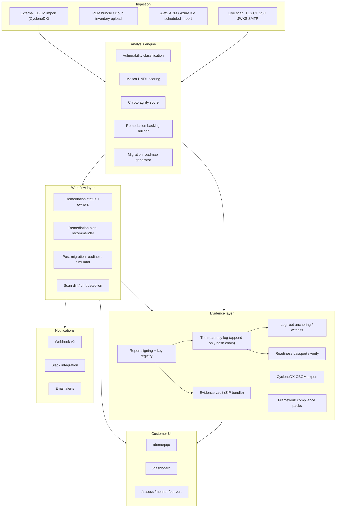
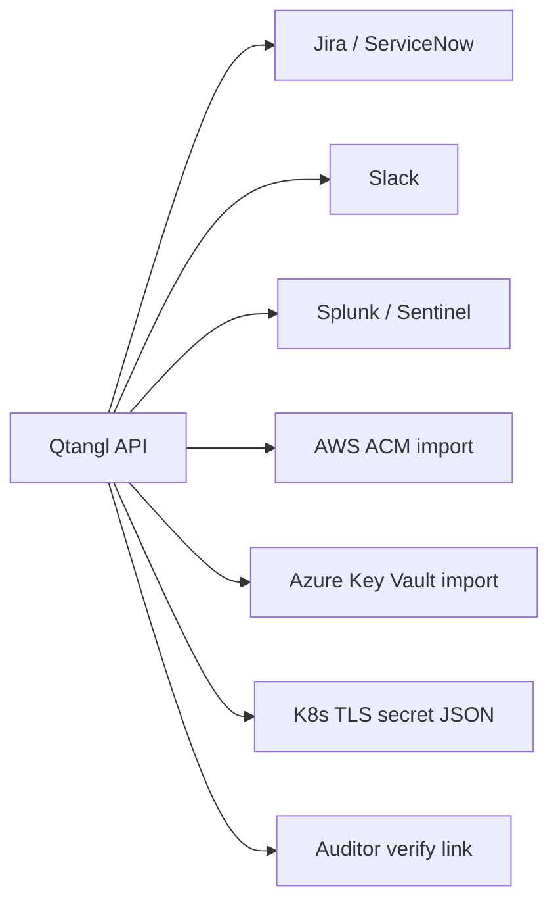

# 03 — Solution Architecture

The Qtangl readiness platform: what exists today, what we must build, and how Assess → Monitor → Convert works as a system.

---

## Platform diagram



---

## Capability map: built vs gaps

### Core scan & analysis — largely built (`pilot`)

| Component | Status | Path |
|-----------|--------|------|
| Live TLS handshake + cert parse | `pilot` | [backend/app/pqc/scanner.py](../../backend/app/pqc/scanner.py) |
| CT subdomain enumeration | `pilot` | scanner.py |
| SSH host key banner | `pilot` | scanner.py |
| JWKS / OIDC discovery | `pilot` | scanner.py |
| SMTP STARTTLS | `pilot` | scanner.py |
| SSRF guards | `done` | [backend/app/pqc/safety.py](../../backend/app/pqc/safety.py) |
| Async scan jobs | `pilot` | [backend/app/pqc/jobs.py](../../backend/app/pqc/jobs.py) |
| Vulnerability engine | `done` | [backend/app/pqc/vulnerability.py](../../backend/app/pqc/vulnerability.py) |
| Mosca assessment | `done` | [backend/app/pqc/risk.py](../../backend/app/pqc/risk.py) |
| Per-asset remediation actions | `done` | [backend/app/pqc/standards.py](../../backend/app/pqc/standards.py) |
| PQ TLS handshake proof | `done` | [backend/app/pqc/handshake.py](../../backend/app/pqc/handshake.py) |

### Reporting & evidence — largely built (`done` / `pilot`)

| Component | Status | Path |
|-----------|--------|------|
| PDF / JSON / CSV / CBOM export | `done` | [backend/app/pqc/report.py](../../backend/app/pqc/report.py) |
| Report signing | `done` | [backend/app/pqc/signing.py](../../backend/app/pqc/signing.py) |
| Signing key registry | `done` | [backend/app/pqc/key_registry.py](../../backend/app/pqc/key_registry.py) |
| Transparency log (append-only) | `done` | [backend/app/pqc/transparency.py](../../backend/app/pqc/transparency.py) |
| Log-root anchoring | `done` | [backend/app/pqc/anchoring.py](../../backend/app/pqc/anchoring.py) |
| Evidence vault (ZIP bundle) | `done` | [backend/app/pqc/report_bundle.py](../../backend/app/pqc/report_bundle.py) |
| Compliance packs (bank, CMMC, healthcare) | `done` | [backend/app/pqc/compliance_packs.py](../../backend/app/pqc/compliance_packs.py) |
| Board / auditor / executive exports | `done` | report.py `report_to_*` |
| Readiness passport (`/verify`) | `done` | [web/app/verify/VerifyPageClient.tsx](../../web/app/verify/VerifyPageClient.tsx) |
| Offline verify CLI | `done` | [backend/scripts/qtangl_verify.py](../../backend/scripts/qtangl_verify.py) |
| Trust page (live transparency) | `done` | [web/app/trust/page.tsx](../../web/app/trust/page.tsx) |
| PyPI `qtangl-verify` package | `done` | [backend/verifier/](../../backend/verifier/) |
| Readiness Index (public API) | `done` | [backend/app/data/index_pipeline.py](../../backend/app/data/index_pipeline.py) |
| Peer comparison (dashboard) | `done` | [web/components/pqc/PeerComparisonPanel.tsx](../../web/components/pqc/PeerComparisonPanel.tsx) |
| Cohort drift intelligence | `done` | [backend/app/monitoring/drift_intel.py](../../backend/app/monitoring/drift_intel.py) |

### Ingestion & CBOM aggregation — in progress

| Component | Status | Path | Gap |
|-----------|--------|------|-----|
| CBOM export (Qtangl → CycloneDX) | `done` | [backend/app/pqc/cbom.py](../../backend/app/pqc/cbom.py) | — |
| CBOM validation schema | `done` | cbom.py `validate_cbom` | — |
| External CBOM import API | `done` | [backend/app/api/pqc.py](../../backend/app/api/pqc.py) | `POST /pqc/cbom/ingest` |
| CBOM normalize + merge with scan | `done` | [backend/app/cbom/](../../backend/app/cbom/) | Dedupe + source tags |
| Multi-source inventory UI | `done` | DashboardClient.tsx | Import count widget |
| Cloud inventory upload | `pilot` | `parse_cloud_inventory` via upload-bundle | — |
| AWS/Azure/GCP scheduled pull | `done` | [backend/app/integrations/cloud.py](../../backend/app/integrations/cloud.py) | Tenant-configured |
| Kubernetes cert-manager pull | `done` | [backend/app/coverage/k8s_pull.py](../../backend/app/coverage/k8s_pull.py) | Dashboard panel |
| Keyfactor / DigiCert CLM pull | `done` | [backend/app/integrations/pull.py](../../backend/app/integrations/pull.py) | Scheduled via worker |

### Monitor & drift — in progress

| Component | Status | Path | Gap |
|-----------|--------|------|-----|
| Scan bundle comparison | `in-progress` | [backend/app/monitoring/diff.py](../../backend/app/monitoring/diff.py) | Wire to scheduled jobs |
| Scheduled re-scans | `done` | Track B3 | Cron/worker trigger |
| Diff UI panel | `done` | [web/components/pqc/ScanDiffPanel.tsx](../../web/components/pqc/ScanDiffPanel.tsx) | Dashboard prominence |
| Webhook on scan complete | `pilot` | [backend/app/notifications/webhooks.py](../../backend/app/notifications/webhooks.py) | SIEM mapping doc |
| Alert threshold config | `coming-soon` | Tenant settings | UI + API |

### Convert & remediation — in progress

| Component | Status | Path | Gap |
|-----------|--------|------|-----|
| Remediation status CRUD | `in-progress` | [backend/app/remediation/service.py](../../backend/app/remediation/service.py) | Target dates, Jira sync |
| Plan recommender (owner, sprint, playbook) | `done` | remediation/service.py | Surface in UI |
| Post-migration simulator | `done` | remediation/service.py | "What-if" UI widget |
| Remediation backlog UI | `in-progress` | [RemediationBacklog.tsx](../../web/components/pqc/RemediationBacklog.tsx) | Status editing for pilots |
| Velocity metrics | `done` | remediation/service.py | Dashboard widget |
| Partner workflow handoff | `coming-soon` | — | MSSP portal spec |

### Platform & tenancy — partial

| Component | Status | Path | Gap |
|-----------|--------|------|-----|
| Postgres persistence | `done` | Track D1 | Full PQC artifact retention |
| Tenant auth & isolation | `done` | Track G3 | Self-serve signup |
| Tenant dashboard | `done` | [web/app/dashboard/page.tsx](../../web/app/dashboard/page.tsx) | Readiness-first layout |
| Rate limits per tenant | `in-progress` | [backend/app/api/pqc.py](../../backend/app/api/pqc.py) | Production tuning |
| Stripe Monitor checkout | `coming-soon` | `/access` | Readiness packaging |

---

## The Convert tier — detailed definition

### Scope (in)

| Item | Description |
|------|-------------|
| **Migration program management** | Remediation backlog as system of record; owner, sprint, status, notes |
| **Prioritized playbooks** | Per-asset actions from standards.py (TLS hybrid, JWKS rotation, SSH keys) |
| **What-if planning** | Project readiness score after selected remediations |
| **Re-scan verification** | Automated confirm-fix loop; attach verify link to ticket |
| **Executive reporting** | Monthly readiness delta for board |
| **Partner orchestration** | Introduce MSSP/SI; Qtangl remains evidence layer |

### Scope (out) — explicit in SOW

| Item | Why out |
|------|---------|
| Penetration testing | Different discipline; partner referral |
| HSM inventory / provisioning | Hardware scope; partner |
| Formal CMMC/HIPAA attestation | Qtangl provides evidence input, not attestation |
| Hands-on cert re-issuance | Customer or MSSP executes; Qtangl verifies |

### Convert pricing hypothesis

| Model | Price band | Notes |
|-------|------------|-------|
| **Convert Add-on** | +$50K–$100K/yr on Monitor | Qtangl program management + workshops |
| **Partner-delivered** | Monitor + partner SOW | Qtangl rev-share on Monitor; partner owns labor |
| **Enterprise bundle** | $150K–$250K/yr | Multi-domain + Convert + CMMC mapping |

---

## Integration architecture



| Integration | Status | Implementation |
|-------------|--------|----------------|
| CycloneDX CBOM export | `done` | Standard tool import |
| CycloneDX CBOM import | `coming-soon` | `POST /pqc/cbom/import` — IBM CBOMkit, partner exports |
| Webhook v2 | `pilot` | [webhooks.py](../../backend/app/notifications/webhooks.py) |
| Cloud inventory upload | `pilot` | `parse_cloud_inventory` via upload-bundle |
| Jira ticket sync | `coming-soon` | Remediation status → Jira bi-directional |
| ServiceNow GRC | `coming-soon` | CBOM + control mapping export |
| AWS/Azure scheduled pull | `coming-soon` | `cloudImportPayload` in partnerships.md |

---

## UI component map

| Component | Purpose | File |
|-----------|---------|------|
| QDayCommandCenter | Scan orchestration + scoreboard | [QDayCommandCenter.tsx](../../web/components/pqc/QDayCommandCenter.tsx) |
| InventoryHeatmap | Asset visualization | [InventoryHeatmap.tsx](../../web/components/pqc/InventoryHeatmap.tsx) |
| SeverityDonut | Vulnerability breakdown | [SeverityDonut.tsx](../../web/components/pqc/SeverityDonut.tsx) |
| RemediationBacklog | Backlog + status | [RemediationBacklog.tsx](../../web/components/pqc/RemediationBacklog.tsx) |
| ScanDiffPanel | Drift between scans | [ScanDiffPanel.tsx](../../web/components/pqc/ScanDiffPanel.tsx) |
| ScanLog | Scan timeline | [ScanLog.tsx](../../web/components/pqc/ScanLog.tsx) |
| ReportDrawer | PDF/CBOM download | [ReportDrawer.tsx](../../web/components/pqc/ReportDrawer.tsx) |
| DashboardClient | Tenant dashboard shell | [DashboardClient.tsx](../../web/components/dashboard/DashboardClient.tsx) |

### Target dashboard layout (readiness-first)

```
┌─────────────────────────────────────────────────────────┐
│ Readiness score (band) │ Mosca summary │ Completion %   │
├─────────────────────────────────────────────────────────┤
│ ScanDiffPanel (drift since last scan)                   │
├──────────────────────┬──────────────────────────────────┤
│ InventoryHeatmap     │ RemediationBacklog (top 10)      │
├──────────────────────┴──────────────────────────────────┤
│ Scheduled scans │ Alerts │ Export CBOM │ Verify link    │
└─────────────────────────────────────────────────────────┘
```

---

## Data model (remediation workflow)

Key entities for Convert tier:

| Entity | Fields | Store |
|--------|--------|-------|
| Scan | scanId, tenantId, targetDomain, readinessScore, generatedAt | Postgres |
| Asset | host, port, kind, algorithm, vulnerability status | Scan bundle |
| RemediationItem | id, assetId, priority, action, pqcAlgorithm, deadline, effortDays | Report + Postgres status overlay |
| RemediationStatus | remediationId, status, owner, notes, updatedAt | Postgres [RemediationStatusRow](../../backend/app/db/models.py) |
| ScanDiff | readinessDelta, newQuantumVulnerable, degradedAlgorithms | Computed |

Status values: `open` | `in_progress` | `done` | `accepted_risk`

---

## API surface (customer-facing)

Core routes for journey:

| Journey stage | API | Doc |
|---------------|-----|-----|
| Assess | `POST /pqc/scan` | [docs/reference/pqc/scan](../../web/app/docs/reference/pqc/scan/page.tsx) |
| Assess | `GET /pqc/report/{id}` | report reference |
| Monitor | `GET /pqc/scan/{id}/diff` | diff endpoint (Track B3) |
| Convert | `PUT /pqc/remediation/{id}/status` | remediation API |
| Evidence | `GET /verify?scanId=` | public passport |
| Evidence | `GET /pqc/transparency/root` | log root + witness |
| Evidence | `GET /pqc/report/{id}?format=evidence` | evidence vault ZIP |
| Ingestion | `POST /pqc/cbom/import` | external CBOM merge (K17) |

---

## Security & trust boundaries

From [threat-model.md](../optimization_OLD_FUTURE/security/threat-model.md):

- Live scan gated by `QTANGL_PQC_ENABLE_LIVE_SCAN` + tenant authorization
- SSRF guards on all scan targets
- PEM uploads deleted within 24 hours (SOW)
- Scan artifacts retained 12 months
- Signed reports — key rotation via Track G1

---

## Related docs

- Customer journey: [02-customer-journey.md](./02-customer-journey.md)
- Track B product epics: [06-track-B-pqc-product.md](../optimization_OLD_FUTURE/06-track-B-pqc-product.md)
- Website/dashboard spec: [04-website-transformation.md](./04-website-transformation.md)
- Scaling: [07-scaling.md](./07-scaling.md)
