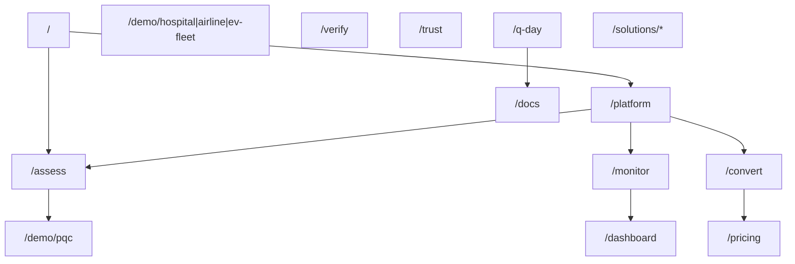

# 04 — Website Transformation

Concrete specification to reposition qtangl.com from "Quantum Planning API" to post-quantum readiness platform. **Spec only** — implementation follows Track K2 epics.

---

## Before / after summary

| Dimension | Before | After |
|-----------|--------|-------|
| Homepage hero | "Every possibility ranked…" (optimization) | "Assess. Monitor. Convert." (readiness) |
| Nav subtitle | Quantum Planning API | Q-Day Readiness (or Qtangl) |
| Primary CTA | Find Quantum → `/demo` | Run assessment → `/demo/pqc` |
| Headline demo | Hospital 4:11 | PQC scan → PDF → verify |
| Nav order | Demo, Technology, Docs | Platform, Assess, Demo, Docs, Pricing |
| `/demo` index | Hospital first | PQC first |
| Meta title | Qtangl \| Quantum Planning API | Qtangl \| Post-Quantum Readiness Platform |
| Optimization | Homepage hero | Secondary: `/platform/optimize` |

---

## Information architecture (target)



### Primary navigation (target)

| Order | Label | Href | Notes |
|-------|-------|------|-------|
| 1 | Platform | `/platform` | Journey overview: Assess → Monitor → Convert |
| 2 | Assess | `/assess` | Tier landing + CTA to demo |
| 3 | Demo | `/demo/pqc` | Default demo route (not `/demo` index) |
| 4 | Docs | `/docs` | PQC guides first in docs index |
| 5 | Pricing | `/pricing` | Tier matrix |
| 6 | Access | `/access` | Pilot / Monitor signup |

**Demote:** Technology → footer or `/platform/optimize`  
**Add to footer:** Optimize demos, Learn, Blog, Trust, Verify

### Files to change for nav

| File | Change |
|------|--------|
| [web/lib/copy/nav.ts](../../web/lib/copy/nav.ts) | Replace `nav` array; update `navbarCopy.subtitle`, `primaryCtaLabel` |
| [web/components/layout/Header.tsx](../../web/components/layout/Header.tsx) | Verify mobile menu uses nav copy |
| [web/components/layout/Footer.tsx](../../web/components/layout/Footer.tsx) | Add readiness links; move optimization to secondary column |

---

## Homepage rewrite (section-by-section)

**File:** [web/app/page.tsx](../../web/app/page.tsx)  
**Copy modules:** New [web/lib/copy/readiness-home.ts](../../web/lib/copy/readiness-home.ts) (create); retire optimization hero from primary import.

### Section 1 — Hero

| Element | Current ([home.ts](../../web/lib/copy/home.ts)) | Target |
|---------|-----------------------------------------------|--------|
| Eyebrow | "Quantum Planning API" | "Post-quantum readiness" |
| Title | "Every possibility ranked. One future your team runs." | "Assess. Monitor. Convert." |
| Subhead | Superposition/collapse language | "Inventory quantum-vulnerable crypto in minutes. Monitor drift until Q-Day. Prove remediation with PQ-signed evidence your auditors can verify independently." |
| Primary CTA | Find Quantum → `/demo` | Run Q-Day scan → `/demo/pqc` |
| Secondary CTA | Request access → `/access` | Verify a sample report → `/verify` (show log inclusion) |
| Visual | Quantum state animation | Readiness score gauge + scan progress mock |

### Section 2 — Headline demo (replace hospital)

| Element | Current | Target |
|---------|---------|--------|
| Eyebrow | "Headline demo" | "Headline demo" |
| Title | "Hospital re-staffing in 4:11" | "Q-Day inventory in 8 minutes" |
| Description | Nurse call-out pipeline | Domain scan → CBOM + PDF → verify + transparency log seq |
| Stats | Hard violations, Overtime, Runtime | Q-vulnerable endpoints, Readiness score, Coverage confidence |
| CTA | Open hospital demo | Open Q-Day scanner |

### Section 3 — Journey (replace quantum workflow)

Replace `quantumWorkflowPoints` from [web/lib/constants.ts](../../web/lib/constants.ts) with three readiness stages:

| Stage | Title | Description |
|-------|-------|-------------|
| Assess | Baseline in one session | Live scan, Mosca HNDL, CBOM, signed PDF |
| Monitor | Catch drift early | Scheduled re-scans, diff alerts, remediation board |
| Convert | Prove the fix | Prioritized playbooks, re-scan verification, auditor packs |

### Section 4 — Use cases (replace hospital/airline/ev)

Replace `useCases` with vertical **readiness** scenarios:

| Eyebrow | Title | Outcome | Demo href |
|---------|-------|---------|-----------|
| Banking | TLS inventory | NSM-10 + PCI-DSS mapping | `/demo/pqc?scenario=bank-tls-inventory` |
| Gov contractor | CMMC crypto controls | CNSA 2.0 deadline tiers | `/demo/pqc?scenario=gov-contractor-cmmc` |
| Healthcare | HNDL exposure | HIPAA + NIST IR 8547 | `/demo/pqc?scenario=healthcare-insurer-hndl` |

Footer link: "Explore optimization demos →" → `/platform/optimize`

### Section 5 — API preview

Replace scheduling JSON example with PQC scan request/response snippet from [web/lib/copy/api-examples.ts](../../web/lib/copy/api-examples.ts) or new readiness examples.

Eyebrow: "Evidence" not "Measurement"

Add **evidence proof strip** below API preview:

| Badge | Copy | Link |
|-------|------|------|
| PQ-signed | ML-DSA-65 primary, Ed25519 fallback | `/trust` |
| Transparency log | Append-only hash chain; public root | `/pqc/transparency/root` (API) |
| Offline verify | `qtangl_verify.py` + open spec | [docs/verify-spec.md](../../docs/verify-spec.md) |
| Readiness Passport | Shareable evidence bundle for auditors | `/verify` sample |

### Section 6 — CTA

Update [web/components/marketing/CTA.tsx](../../web/components/marketing/CTA.tsx) copy source:

- Title: "Ready for your first Q-Day assessment?"
- Primary: `/access` or `/demo/pqc`
- Secondary: `/docs/guides/pqc-demo`

---

## New pages to create

| Route | Purpose | Key components | Copy module |
|-------|---------|----------------|-------------|
| `/platform` | Journey overview + architecture diagram (evidence layer callout) | PageHero, journey cards, evidence proof strip | `readiness-platform.ts` |
| `/assess` | Assess tier landing | Scenario picker, sample CBOM download, pricing teaser | `readiness-assess.ts` |
| `/monitor` | Monitor tier landing | Diff demo embed, alert mock, scheduling UI screenshot | `readiness-monitor.ts` |
| `/convert` | Convert tier landing | Remediation backlog mock, partner logos, workshop outline | `readiness-convert.ts` |
| `/pricing` | Tier matrix | Pricing table Assess/Monitor/Convert/Enterprise | `readiness-pricing.ts` |
| `/platform/optimize` | Optimization secondary hub | Links to hospital/airline/ev demos, technology page | Move from homepage |
| `/q-day` | Education hub (see [05-content-and-seo.md](./05-content-and-seo.md)) | Resource grid, Mosca explainer, deadline timeline | `readiness-qday-hub.ts` |
| `/solutions/banking` | Vertical landing | bank-tls-inventory scenario | `readiness-solutions.ts` |
| `/solutions/government` | Vertical landing | gov-contractor-cmmc | same |
| `/solutions/healthcare` | Vertical landing | healthcare-insurer-hndl | same |

### Existing pages to update

| Route | Change |
|-------|--------|
| [web/app/pqc/page.tsx](../../web/app/pqc/page.tsx) | Redirect to `/platform` or merge; currently "Both sides" — reorder CTAs (PQC first) |
| [web/app/trust/page.tsx](../../web/app/trust/page.tsx) | Transparency log, key registry, verify spec link, dogfood verify |
| [web/app/demo/page.tsx](../../web/app/demo/page.tsx) | Reorder cards: PQC first; add readiness intro |
| [web/app/access/page.tsx](../../web/app/access/page.tsx) | Rewrite [access.ts](../../web/lib/copy/access.ts) for PQC pilot interest options |
| [web/app/about/page.tsx](../../web/app/about/page.tsx) | Mission → readiness-first; optimization as expansion |
| [web/app/docs/page.tsx](../../web/app/docs/page.tsx) | Feature PQC guide at top |
| [web/lib/docs/roadmap.ts](../../web/lib/docs/roadmap.ts) | Reorder Now band: Q-Day scanner first |

---

## Copy modules — exact change list

### Create new files

| File | Contents |
|------|----------|
| `web/lib/copy/readiness.ts` | Readiness lexicon (Exposure, Drift, Evidence, Convert, Agility, HNDL) |
| `web/lib/copy/readiness-home.ts` | Homepage hero, headline demo, journey sections |
| `web/lib/copy/readiness-platform.ts` | `/platform` page copy |
| `web/lib/copy/readiness-assess.ts` | `/assess` landing |
| `web/lib/copy/readiness-monitor.ts` | `/monitor` landing |
| `web/lib/copy/readiness-convert.ts` | `/convert` landing |
| `web/lib/copy/readiness-pricing.ts` | `/pricing` tier copy |
| `web/lib/copy/readiness-solutions.ts` | Vertical solution pages |

### Modify existing files

| File | Changes |
|------|---------|
| [web/lib/copy/product.ts](../../web/lib/copy/product.ts) | `siteMetadata.title`, `description`, `tagline`, `oneLiner`; add `readinessMetadata` export; keep `optimizationMetadata` for sub-pages |
| [web/lib/copy/nav.ts](../../web/lib/copy/nav.ts) | New nav array; `navbarCopy.subtitle` → "Q-Day Readiness"; CTA → "Run assessment" |
| [web/lib/copy/home.ts](../../web/lib/copy/home.ts) | Deprecate for homepage OR repurpose for `/platform/optimize` only |
| [web/lib/copy/access.ts](../../web/lib/copy/access.ts) | PQC-first audience, timeline, form options (Assess/Monitor/Enterprise) |
| [web/lib/copy/voice.ts](../../web/lib/copy/voice.ts) | Add `readinessGuardrails`; document scope rules for `quantumLexicon` |
| [web/lib/constants.ts](../../web/lib/constants.ts) | Add `readinessJourneyPoints`, `readinessUseCases`; keep `useCases` for optimize hub |

### Sample target metadata

```typescript
// web/lib/copy/product.ts — readinessMetadata (proposed)
export const readinessMetadata = {
  title: "Qtangl | Post-Quantum Readiness Platform",
  description:
    "Assess quantum-vulnerable cryptography, monitor crypto drift, and convert your stack with signed evidence auditors can verify.",
  tagline: "Assess. Monitor. Convert.",
  oneLiner: "Post-quantum readiness with evidence your auditors can verify.",
} as const;
```

---

## Access page rewrite spec

Current [access.ts](../../web/lib/copy/access.ts) targets "scheduling, routing, staffing."

**Target form interest options:**

- Q-Day assessment (one-time)
- Q-Day Monitor (annual)
- Enterprise /p program
- MSSP / partner inquiry
- Optimization pilot (secondary)

**Target default next steps after submit:**

1. Open Q-Day scanner → `/demo/pqc`
2. Read PQC API guide → `/docs/guides/pqc-demo`
3. Download sample CBOM → link to [sample-cbom](../../demos/pqc_migration/data/sample-cbom-bank-tls-inventory.json)

---

## SEO & redirects

### Target keywords (primary)

| Keyword cluster | Landing page |
|-----------------|--------------|
| post-quantum cryptography readiness | `/` `/platform` |
| PQC inventory / crypto inventory | `/assess` |
| Q-Day readiness | `/q-day` |
| quantum vulnerable TLS | `/demo/pqc` |
| CMMC PQC / NSM-10 compliance | `/solutions/government` |
| harvest now decrypt later | `/q-day/hndl` (content) |

### Meta / structured data

| Page | `buildPageMetadata` title |
|------|---------------------------|
| `/` | Post-Quantum Readiness Platform |
| `/assess` | Q-Day Assessment |
| `/monitor` | Crypto Drift Monitoring |
| `/convert` | PQC Migration Program |
| `/pricing` | Pricing |

Update [web/lib/seo.ts](../../web/lib/seo.ts) `buildOrganizationJsonLd` description to readiness tagline.

### Redirects (next.config or middleware)

| From | To | Type |
|------|-----|------|
| `/pqc` | `/platform` | 301 |
| `/demo` | `/demo/pqc` | 302 (temporary until demo index updated) |

**Do not redirect** optimization demos — keep URLs for existing links.

### Sitemap priority (proposed)

| Path | Priority |
|------|----------|
| `/`, `/platform`, `/assess`, `/demo/pqc` | 1.0 |
| `/monitor`, `/convert`, `/pricing`, `/q-day` | 0.9 |
| `/solutions/*` | 0.8 |
| `/demo/hospital`, `/technology` | 0.5 |

---

## Optimization page disposition

**Keep live — do not delete:**

| Route | New role |
|-------|----------|
| `/demo/hospital` | Linked from `/platform/optimize` |
| `/demo/airline` | Same |
| `/demo/ev-fleet` | Same |
| `/technology` | Optimization deep-dive; add banner "Looking for PQC? → /platform" |
| `/sandbox` | Developer scheduling sandbox |
| `/api` | Planning API reference |
| `/docs/guides/schedule` etc. | Unchanged |

**Add cross-link banner component** on all optimization pages:

> "Qtangl Readiness — assess your crypto before Q-Day. [Explore platform →](/platform)"

---

## Implementation checklist (Track K2)

- [ ] **K2-001** Create `readiness*.ts` copy modules
- [ ] **K2-002** Rewrite homepage sections in `page.tsx`
- [ ] **K2-003** Update `nav.ts`, Header, Footer
- [ ] **K2-004** Create `/platform`, `/assess`, `/monitor`, `/convert`, `/pricing` pages
- [ ] **K2-005** Rewrite `access.ts` + access page
- [ ] **K2-006** Reorder `/demo` index; default nav Demo → `/demo/pqc`
- [ ] **K2-007** Update `siteMetadata`, SEO, JsonLd
- [ ] **K2-008** Add optimization cross-link banner component
- [ ] **K2-009** Configure redirects `/pqc` → `/platform`
- [ ] **K2-010** Update public docs roadmap bands in `roadmap.ts`
- [ ] **K2-011** Playwright e2e: homepage CTA → `/demo/pqc`; nav links resolve

---

## Related docs

- Brand: [01-positioning-and-brand.md](./01-positioning-and-brand.md)
- Content: [05-content-and-seo.md](./05-content-and-seo.md)
- Epics: [09-epics-and-backlog.md](./09-epics-and-backlog.md)
