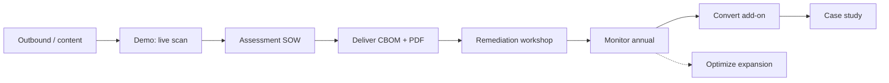

# 06 — GTM & Pricing

Repositioned go-to-market: ICP, packaging, pricing, sales motion, partner model, and self-serve funnel — reconciled with Track E and the financial model.

---

## ICP (Ideal Customer Profile)

### Primary — PQC readiness buyer

| Attribute | Target |
|-----------|--------|
| **Industry** | Regional bank, insurer, healthcare payer, gov contractor, SaaS on FedRAMP path |
| **Size** | 500–10,000 employees |
| **Geo** | US + EU regulated orgs (initial) |
| **Trigger** | Board mandate for PQC by 2027/2030; CMMC audit; contract clause |
| **Buyer** | CISO, compliance lead, VP Engineering (crypto) |
| **Budget** | $25K–$250K/yr line item for PQC program tooling |
| **Disqualifiers** | Fortune 50 needing FedRAMP High today; orgs with zero external TLS |

### Secondary — partner buyer

| Type | Value |
|------|-------|
| Regional MSSP | White-label Monitor for client base |
| Boutique audit firm | Verify link in audit packs; referral fee |
| System integrator | Convert tier delivery partner |

### Expansion — optimization buyer (do not lead with)

| Attribute | Target |
|-----------|--------|
| **Buyer** | CNO, VP Ops, workforce analytics |
| **Trigger** | After Stage 4+ readiness OR separate ops pain |
| **Product** | Hospital/airline/EV demos, `/optimize` API |

---

## Packaging matrix

| Package | Journey stage | Product | Price band | Buyer | Billing |
|---------|---------------|---------|------------|-------|---------|
| **Q-Day Assessment** | Assess (Stage 1) | One-time scan + report + workshop | $25K–$50K | CISO | 50/50 SOW |
| **Q-Day Monitor** | Monitor (Stage 3) | Scheduled scans + diff + alerts + remediation board | $75K–$150K/yr | CISO | Annual |
| **Q-Day Convert** | Convert (Stage 4) | Monitor + program mgmt + workshops + partner orchestration | +$50K–$100K/yr on Monitor | CISO + VP Eng | Annual |
| **Q-Day Enterprise** | Stage 5 | Multi-domain, CMMC/HIPAA packs, dedicated support | $150K–$250K/yr | CISO + GRC | Annual |
| **Optimize Pilot** | Stage 6 (expansion) | 60–90 day vertical pilot | $50K–$200K | Ops buyer | Pilot SOW |
| **API Developer** | N/A | `/optimize` API tier | $500–$5K/mo | Engineering | Monthly |

Reconciles with [17-financial-model.md](../optimization_OLD_FUTURE/17-financial-model.md) and [06-track-B](../optimization_OLD_FUTURE/06-track-B-pqc-product.md) pricing hypothesis.

---

## Unit economics (unchanged — readiness-first GTM)

### Assessment (one-time)

| Line | Amount |
|------|--------|
| Price (mid) | $35,000 |
| COGS | ~$670 |
| Gross margin | ~98% |

**GTM implication:** Assessment is a **land** motion, not the business. Every assess must pitch Monitor before delivery.

### Monitor (annual)

| Line | Amount |
|------|--------|
| Price (mid) | $100,000/yr |
| COGS | ~$2,780/yr |
| Gross margin | ~97% |

**GTM implication:** Default upsell target within 6 months of assess (per financial model ARR build-up).

---

## Sales motion (readiness-first funnel)



### Stage-by-stage playbook

| Stage | Activity | Collateral | Success metric |
|-------|----------|------------|------------------|
| **Prospect** | 10 outbound/week ([e1-week1-playbook](../../demos/pqc_migration/e1-week1-playbook.md)) | [cold_email.md](../../demos/pqc_migration/outreach/cold_email.md) | 2 replies/week |
| **Demo** | Live scan on their domain OR fixture scenario | [script.md](../../demos/pqc_migration/script.md) | Demo → LOI |
| **Pilot** | 90-day Assessment SOW | [pqc-pilot-sow.md](../optimization_OLD_FUTURE/templates/pqc-pilot-sow.md) | Signed SOW |
| **Deliver** | CBOM + PDF in first session | verify link demo | ≥1 net-new critical finding |
| **Expand** | Monitor proposal at Week 2 workshop | Diff demo + readiness projection | Monitor signed |
| **Retain** | Quarterly business review | Board report export | Renewal |
| **Convert** | Partner intro for migration | MSSP SOW template | Re-scan proof per item |

### Demo script priority (reordered)

**Demo #1 — Assessment + evidence** (was already #1 in e1-week1-playbook)

1. Fixture or live scan on `/demo/pqc`
2. Download PDF + CBOM
3. Open `/verify?scanId=…`

**Demo #2 — Monitor drift**

1. Second scan → Diff panel
2. Scheduled monitoring + webhook

**Demo #3 — Convert** (new)

1. Remediation backlog → assign owner → status change
2. What-if readiness projection
3. Partner handoff narrative

**Demo #4 — Optimization** (only if prospect asks or Stage 6)

1. Hospital scoreboard — honest classical vs hybrid

---

## Objection handling

From [e1-week1-playbook.md](../../demos/pqc_migration/e1-week1-playbook.md) — extended:

| Objection | Response |
|-----------|----------|
| "We already have a crypto inventory tool" | Qtangl adds signed verify links, scan diff, Mosca timeline — auditor-ready evidence |
| "Quantum is years away" | HNDL for data encrypted today; Mosca inequality |
| "Can we self-serve?" | Monitor checkout on `/access` or hello@qtangl.com |
| "Are you a quantum computing company?" | We're a readiness platform; quantum is the threat we defend against |
| "Can you migrate our stack?" | Convert tier orchestrates + verifies; partners execute; you get re-scan proof |
| "Too expensive vs open source" | Compare total cost: engineer time + audit prep + drift monitoring |
| "We need FedRAMP High now" | Honest lose — not there yet; SOC2 Type I path for mid-market |

---

## Partner & channel model

From [partnerships.md](../../demos/pqc_migration/partnerships.md):

### MSSP white-label

| Element | Detail |
|---------|--------|
| **Offer** | MSSP runs Monitor for clients under their brand |
| **Economics** | 20–30% rev-share on Monitor ARR |
| **Qtangl role** | Platform + verify infrastructure |
| **Enablement** | Sample CBOM, signed PDF, partner portal (Track K7) |

### Auditor referral

| Element | Detail |
|---------|--------|
| **Offer** | Verify link + evidence ZIP in audit packs |
| **Economics** | Referral fee or co-marketing |
| **Next step** | Send sample CBOM + signed PDF; 2 intro meetings (Track E5) |

### Cloud PKI integrations

| Vendor | GTM use |
|--------|---------|
| AWS ACM | "Import your ACM inventory" in Assess onboarding |
| Azure Key Vault | Same |
| Kubernetes | TLS secret upload for container-heavy buyers |

### SIEM / GRC

| Platform | Motion |
|----------|--------|
| Splunk / Sentinel | Webhook v2 field mapping doc |
| ServiceNow | CBOM + control mapping export (future) |

---

## Self-serve funnel

| Step | Surface | Status |
|------|---------|--------|
| 1. Discover | SEO → `/q-day`, `/assess` | Track K3 content |
| 2. Try | Free mini-assessment → `/demo/pqc?mode=mini` | Track K5 |
| 3. Convert | Email gate → full assess interest | Track K5 |
| 4. Buy Monitor | Stripe checkout on `/access` | Track H5 |
| 5. Provision | `POST /public/monitor-provision` | partnerships.md |
| 6. Onboard | Tenant dashboard tour | Track H1 |

**Manual path (design partners):** `POST /admin/tenants` + customized SOW ([pilot-playbook](../optimization_OLD_FUTURE/templates/pilot-playbook.md)).

---

## Bundling

**"Both sides of Q-Day" bundle** (from Track E — keep but demote):

- 15% discount on PQC Monitor + Optimization pilot for same org
- **Pitch timing:** Only after Monitor signed OR explicit ops buyer engagement
- **Risk if pitched early:** Confuses CISO; sounds like quantum hype

---

## Repositioned outbound templates

### Cold email (target refresh)

Update [cold_email.md](../../demos/pqc_migration/outreach/cold_email.md):

```
Subject: Q-Day inventory in minutes (not another spreadsheet)

Hi {{name}},

Boards are asking for RSA/ECDSA exposure before 2030 — spreadsheets miss JWKS, SSH keys, and email STARTTLS.

Qtangl assesses quantum-vulnerable crypto, scores Mosca HNDL risk, monitors drift, and exports signed CBOM + PDF your auditors can verify.

Try it: https://www.qtangl.com/demo/pqc

Happy to walk through a verify link on a 15-minute call.

— {{sender}}
```

### CRM segments

| Segment | Scenario | Landing |
|---------|----------|---------|
| Regional banks | bank-tls-inventory | `/solutions/banking` |
| CMMC contractors | gov-contractor-cmmc | `/solutions/government` |
| Healthcare payers | healthcare-insurer-hndl | `/solutions/healthcare` |

Log in [crm-log.md](../../demos/pqc_migration/outreach/crm-log.md).

---

## Revenue targets (from financial model)

| Quarter | PQC customers | ARR end |
|---------|---------------|---------|
| Q3 2026 | 1 monitor | $100K |
| Q4 2026 | 2 monitor | $200K |
| Q1 2027 | 3 monitor | $350K |

**Transformation KPI:** ≥50% of assessments convert to Monitor within 6 months.

---

## Related docs

- Journey: [02-customer-journey.md](./02-customer-journey.md)
- Pricing COGS: [17-financial-model.md](../optimization_OLD_FUTURE/17-financial-model.md)
- Track E GTM: [09-track-E-gtm.md](../optimization_OLD_FUTURE/09-track-E-gtm.md)
- Metrics: [10-metrics-and-risks.md](./10-metrics-and-risks.md)
