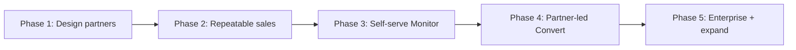
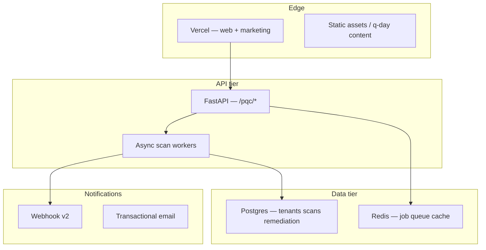

# 07 — Scaling

How Qtangl scales from design-partner pilots to self-serve SaaS, multi-tenant production, and partner-led conversion — while protecting margin.

---

## Scaling phases

| Phase | Customers | Motion | Team | ARR target |
|-------|-----------|--------|------|------------|
| **1** | 1–3 design partners | Manual SOW, white-glove | Founder + eng | $0–$100K |
| **2** | 3–8 Monitor | Repeatable demo → SOW | + part-time AE | $100K–$350K |
| **2** | 8–15 Monitor | Outbound + content inbound | + AE, + CS | $350K–$750K |
| **3** | 15–30 Monitor | Self-serve + manual enterprise | + support automation | $750K–$1.5M |
| **4** | 30+ with partners | MSSP channel delivers Convert | Partner manager | $1.5M+ |

---

## Phase 1 — Design partners (now → 3 months)

### Goal

Prove Assess → Monitor conversion with 1–3 paying customers and 1 case study.

### Operating model

| Element | Detail |
|---------|--------|
| **Sales** | Founder-led; 10 outbound/week |
| **Delivery** | Manual tenant provision; engineer on assess calls |
| **Support** | 2 hrs/mo included (financial model) |
| **Product** | Fixture + authorized live scan |

### Gates to Phase 2

- [ ] ≥1 signed Monitor contract
- [ ] ≥1 customer live scan on their domain
- [ ] Case study draft from [case-study-template.md](../../demos/pqc_migration/case-study-template.md)
- [ ] Website repositioned (Track K2)

---

## Phase 2 — Repeatable sales (3–9 months)

### Goal

Document repeatable demo → assess → monitor motion; reduce founder dependency.

### Operating model

| Element | Detail |
|---------|--------|
| **Sales** | AE handles demo + SOW; founder on enterprise |
| **Delivery** | Standardized 90-day assess playbook |
| **Support** | Documented runbooks; async Slack channel |
| **Marketing** | Q-Day hub live; 2 posts/month |

### Automation priorities

1. Tenant self-provision API (`/public/monitor-provision`)
2. Automated PDF/CBOM delivery email on scan complete
3. CRM integration (HubSpot) from access form
4. Onboarding email sequence (Assess → Monitor pitch Day 7)

### Gates to Phase 3

- [ ] ≥$200K ARR
- [ ] ≥50% assess → Monitor conversion
- [ ] SOC2 Type I in progress (Track G5)
- [ ] B3 scheduled scans production-stable

---

## Phase 3 — Self-serve Monitor (9–18 months)

### Goal

Stripe checkout on `/access`; customers onboard without sales call for Monitor tier.

### Technical requirements (Track D + H)

| Requirement | Track | Detail |
|-------------|-------|--------|
| Postgres job store | D1 | Scheduled scans persist |
| Async workers | D2 | Scan queue isolation |
| Per-tenant rate limits | B1, G3 | Production scan safety |
| Stripe billing | H5 | Monitor subscription |
| Self-serve signup | H5 | `/access` → tenant + API key |
| Observability | D3 | Scan failure alerts |

### Support automation (margin protection)

Financial model note: *"Primary COGS is human support at scale — automate remediation workflow to protect margin."*

| Automation | Impact |
|------------|--------|
| In-app remediation playbooks | Reduce "what do I fix?" tickets |
| Drift alert → suggested action | Reduce "why did score drop?" tickets |
| Self-serve verify link docs | Reduce auditor question tickets |
| Status page + scan timeline | Reduce "is it working?" tickets |

**Target:** Support COGS stays ≤3% of Monitor ARR at 30 customers.

### Gates to Phase 4

- [ ] ≥$500K ARR
- [ ] Self-serve Monitor ≥20% of new Monitor signups
- [ ] Gross margin ≥95% on Monitor
- [ ] B4 remediation workflow `ga`

---

## Phase 4 — Partner-led Convert (12–24 months)

### Goal

MSSPs and integrators deliver migration labor; Qtangl owns platform + evidence.

### Partner program structure

| Tier | Requirements | Benefits |
|------|--------------|----------|
| **Registered** | Complete enablement | Sample CBOM, co-branded deck |
| **Certified** | 1 delivered assess | Rev-share on Monitor; lead referral |
| **Premier** | 3 Monitor clients | White-label option; dedicated support |

### Partner portal (Track K7 — `coming-soon`)

- Client tenant management
- White-label report branding (Enterprise only)
- Rev-share dashboard
- Migration SOW templates

### Qtangl stays system of record

Partners execute cert rotation; **re-scan proof lives in Qtangl**. This prevents disintermediation.

---

## Phase 5 — Enterprise & expansion (18+ months)

### Enterprise features

| Feature | Detail |
|---------|--------|
| Multi-domain portfolio | [portfolio/service.py](../../backend/app/portfolio/service.py) |
| CMMC/HIPAA attestation packs | Track G6 |
| Dedicated CSM | Enterprise tier |
| FedRAMP pathway | When first gov $500K+ contract (defer per strategy) |

### Optimization cross-sell

**Rule:** Only after Monitor renewal OR explicit ops buyer.

Target: 10–20% of Monitor customers add Optimize pilot within 18 months.

---

## Technical scaling architecture

Horizontal scaling: Track D6 — multiple worker instances, health checks, scan isolation.

---

## Hiring plan (readiness-first)

Aligned with [17-financial-model.md](../optimization_OLD_FUTURE/17-financial-model.md) — do not hire optimization-only headcount until ≥$200K PQC ARR.

| Hire | Trigger | Role |
|------|---------|------|
| **Founder/eng** | Now | Product + delivery |
| **Second engineer** | Month 4 OR $100K ARR | B3/B4 + K2 website |
| **AE (part-time → FTE)** | $100K ARR | Demo → SOW |
| **CS / onboarding** | 10 Monitor customers | Support automation owner |
| **Partner manager** | 2 certified MSSPs | Channel scale |
| **Content / DevRel** | Q-Day hub launch | Inbound engine |

**Deferred until $200K+ PQC ARR:** Optimization-only engineer (Track A).

---

## Margin protection playbook

| Risk | Mitigation |
|------|------------|
| Support hours exceed model | Automate playbooks; tiered support (Enterprise only gets dedicated CSM) |
| Live scan compute spikes | Per-tenant rate limits; scan depth caps |
| Custom assess scope creep | Fixed SOW scope; change orders for extra domains |
| Partner delivery quality | Re-scan verification required; Qtangl signature on evidence |
| Free tier abuse | Mini-assess fixture-only; rate limit by email domain |

---

## Geographic expansion

| Phase | Geo | Notes |
|-------|-----|-------|
| Now | US | NSM-10, CMMC primary |
| Year 1 | EU | EU CRA content; GDPR data handling (Track G4) |
| Year 2 | UK, AU | Framework mapping extensions |

---

## Related docs

- Execution phases: [08-execution-plan.md](./08-execution-plan.md)
- Financial model: [17-financial-model.md](../optimization_OLD_FUTURE/17-financial-model.md)
- Enterprise scale: [08-track-D](../optimization_OLD_FUTURE/08-track-D-enterprise-scale.md)
- Metrics: [10-metrics-and-risks.md](./10-metrics-and-risks.md)
