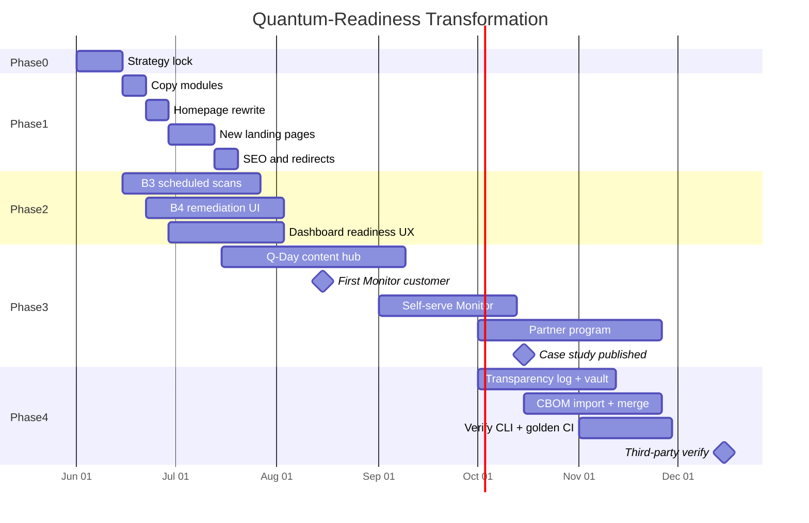
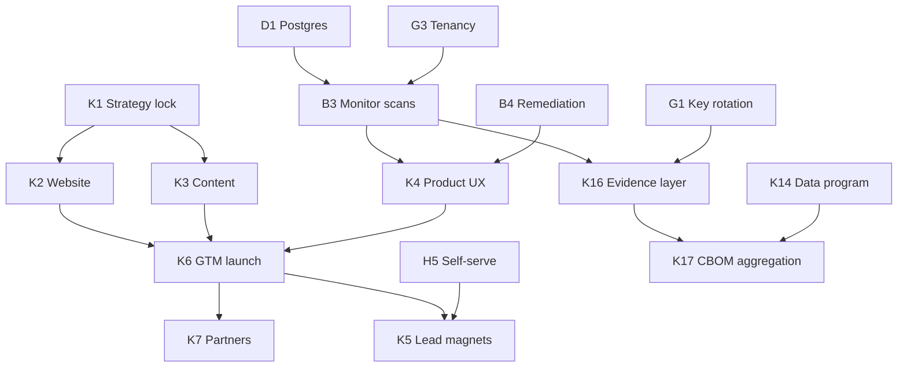

# 08 — Execution Plan

Phased plan to execute the quantum-readiness transformation — mapped onto existing tracks B, D, E, G, H and new Track K.

---

## Phase overview

| Phase | Weeks | Focus | Gate |
|-------|-------|-------|------|
| **Phase 0** | 0–2 | Strategy lock, brand, copy spec | Leadership sign-off on tagline + IA |
| **Phase 1** | 2–8 | Website repositioning | Homepage live; PQC in nav |
| **Phase 2** | 4–16 | Product journey polish | Dashboard readiness-first; B3/B4 beta |
| **Phase 3** | 8–24 | GTM scale | 2 Monitor customers; Q-Day hub indexed |
| **Phase 4** | 16–32 | Moat & aggregation | Transparency log live; CBOM import; verify moat |

Phases overlap intentionally — content and product run parallel to website.

---

## Phase 0 — Strategy lock (Weeks 0–2)

### Deliverables

| # | Deliverable | Owner | Acceptance |
|---|-------------|-------|------------|
| 0.1 | Approve tagline ("Assess. Monitor. Convert.") | Leadership | Documented in 01-positioning |
| 0.2 | Approve IA wireframe | Product | Nav + page list signed off |
| 0.3 | Create readiness copy modules spec | Marketing | Files listed in 04-website |
| 0.4 | Refresh cold email + CRM segments | GTM | Updated outreach/cold_email.md |
| 0.5 | ADR: readiness-first positioning | Eng lead | ADR in roadmap/adrs/ |

### Track mapping

| Track K epic | Main track |
|--------------|------------|
| K1 Strategy & brand lock | — |

---

## Phase 1 — Website repositioning (Weeks 2–8)

### Week-by-week

| Week | Tasks |
|------|-------|
| **2** | Create `readiness*.ts` copy modules; update `siteMetadata`, `nav.ts` |
| **3** | Rewrite homepage hero + headline demo + journey section |
| **4** | Ship `/platform`, `/assess`; update `/demo` index (PQC first) |
| **5** | Ship `/monitor`, `/convert`, `/pricing` |
| **6** | Rewrite `/access` for PQC interest; optimization cross-link banner |
| **7** | SEO: redirects, sitemap, JsonLd; update public docs roadmap.ts |
| **8** | E2E tests; soft launch; monitor analytics |

### Gate — Phase 1 complete

- [ ] Homepage hero is readiness-first
- [ ] Primary nav includes Platform, Assess, Demo (→ `/assess`), Pricing
- [ ] `/assess` is default assessment entry
- [ ] Optimization accessible via `/platform/optimize` + footer
- [ ] Zero broken links in Playwright smoke

### Track mapping

| Track K | Main track |
|---------|------------|
| K2 Website transformation | H3 (tenant dashboards — nav only) |
| K2 | E3 (sales assets — homepage as collateral) |

---

## Phase 2 — Product journey polish (Weeks 4–16)

### Workstreams

**A. Monitor (Track B3)**

| Task | File | Week |
|------|------|------|
| Scheduled scan cron | backend workers | 4–8 |
| Diff wired to report | monitoring/diff.py + API | 6–10 |
| Diff prominent on dashboard | ScanDiffPanel.tsx | 8–12 |
| Alert webhooks | webhooks.py | 10–14 |

**B. Convert (Track B4)**

| Task | File | Week |
|------|------|------|
| Remediation status UI | RemediationBacklog.tsx | 6–10 |
| What-if simulator widget | remediation/service.py | 8–12 |
| Export with remediation status | report.py | 10–14 |
| Target date + owner fields | DB migration | 12–16 |

**C. Dashboard readiness-first (Track K4)**

| Task | Week |
|------|------|
| Reorder dashboard: readiness score hero | 8 |
| Add remediation velocity widget | 10 |
| Add scheduled scan config UI | 12–16 |

### Gate — Phase 2 complete

- [ ] Scheduled scan runs without manual trigger (B3 acceptance)
- [ ] Diff report shows delta from previous scan
- [ ] Remediation items persist; status editable in UI
- [ ] Dashboard presents readiness-first layout

### Track mapping

| Track K | Main track |
|---------|------------|
| K4 Product journey UX | B3, B4, H3 |
| K4 | D1, D2 (persistence + workers) |

---

## Phase 3 — GTM scale (Weeks 8–24)

### Workstreams

**A. Content engine (Track K3)**

| Task | Week |
|------|------|
| Launch `/q-day` hub index | 8–10 |
| Publish 4 framework guides | 10–16 |
| Blog: 2 readiness posts/month | ongoing |
| Learn library PQC category | 12–16 |

**B. Sales repeatability (Track E1)**

| Task | Week |
|------|------|
| 10 outbound/week sustained | 8+ |
| 2 demos/week target | 8+ |
| First Monitor close | 8–12 |
| Case study published | 12–16 |

**C. Self-serve (Track H5)**

| Task | Week |
|------|------|
| Stripe Monitor checkout | 12–18 |
| Mini-assessment lead magnet | 10–14 |
| Automated onboarding email | 14–18 |

**D. Partners (Track E5 + K7)**

| Task | Week |
|------|------|
| 2 auditor intro meetings | 10–16 |
| 1 MSSP pilot rev-share SOW | 16–24 |
| Partner enablement kit | 16–20 |

### Gate — Phase 3 complete

- [ ] ≥$200K PQC ARR run-rate
- [ ] ≥2 Monitor customers
- [ ] ≥1 published case study
- [ ] Q-Day hub indexed (organic traffic measurable)
- [ ] ≥50% assess → Monitor conversion on cohort

### Track mapping

| Track K | Main track |
|---------|------------|
| K3 Content & SEO | E6 DevRel |
| K5 Lead magnets | H5 self-serve |
| K6 GTM execution | E1 design partners |
| K7 Partner program | E5 partnerships |

---

## Phase 4 — Moat & aggregation (Weeks ~16–32)

Build the verifiable evidence moat and multi-source CBOM aggregation — the differentiation layer competitors cannot easily replicate.

### Prerequisites

| ID | Prerequisite | Why |
|----|--------------|-----|
| **P1** | B3 scheduled scans live (Phase 2 gate) | Monitor cohort produces recurring signed reports |
| **P2** | ≥1 Monitor customer with signed reports | Real-world verify + log data for dogfood |
| **P3** | G1 signing key rotation runbook | Safe key lifecycle before log goes prod |

### Workstreams

**A. Evidence & trust layer (Track K16)**

| Task | File | Week |
|------|------|------|
| Transparency log append-on-sign | transparency.py + signing.py | 16–18 |
| Signing key registry in DB | key_registry.py + migration 004 | 16–20 |
| Log-root anchoring + witness files | anchoring.py | 18–22 |
| Evidence vault ZIP export | report_bundle.py + API | 18–24 |
| Verify passport + log inclusion UI | VerifyPageClient.tsx | 20–24 |
| `qtangl_verify` CLI | scripts/qtangl_verify.py | 22–26 |
| Backfill existing reports into log | backfill_transparency_log.py | 24–26 |

**B. CBOM aggregation & ingestion (Track K17)**

| Task | File | Week |
|------|------|------|
| CBOM import API + validation | cbom.py + pqc.py | 18–22 |
| Normalize + merge with scan inventory | report.py | 22–26 |
| Import UI on dashboard | ReportDrawer.tsx | 24–28 |
| Multi-source inventory widget | DashboardClient.tsx | 26–30 |
| Feed anonymized aggregates to K14 | 21-data-and-threat-intelligence.md | 28–32 |

**C. CI & test hardening**

| Task | File | Week |
|------|------|------|
| Transparency log unit tests | test_transparency_log.py | 16–18 |
| Golden verify + report hash snapshots | test_pqc_golden.py | 18–22 |
| CBOM import golden tests | test_pqc_cbom.py | 22–26 |
| PQC dogfood signs + logs weekly | pqc-dogfood.yml | 20+ |
| Hardening regression suite | test_pqc_hardening.py | ongoing |

### Gate — Phase 4 complete

- [ ] Transparency log enabled in production; every new signed report appended
- [ ] `/verify` shows signature validity + log inclusion proof
- [ ] Evidence vault ZIP downloadable from API and dashboard
- [ ] External CycloneDX CBOM import validates and merges with scan inventory
- [ ] `qtangl_verify` CLI + golden tests green in CI
- [ ] ≥1 third-party verify of a customer report (auditor or partner)

### Track mapping

| Track K | Main track |
|---------|------------|
| K16 Evidence & trust layer | G1 (key rotation), G7 (dogfood CI) |
| K17 CBOM aggregation | B3 (scan data), K14 (benchmarks) |

---

## Gantt chart



---

## Dependency graph



---

## Critical path

```
K1 strategy lock
  → K2 website repositioning (unblocks GTM)
  → E1 first design partner with readiness-first site
  → B3 Monitor (retention product)
  → K6 GTM scale
  → $200K ARR → hire second engineer
  → K16 evidence moat (transparency log + verify)
  → K17 CBOM aggregation (multi-source inventory)
```

Optimization tracks (A, J) **not on critical path** until ≥$200K PQC ARR per financial model rule.

---

## Rollback plan

If readiness repositioning hurts conversion unexpectedly:

| Signal | Response |
|--------|----------|
| Demo starts drop >30% for 4 weeks | A/B test homepage; keep `/assess` CTA prominent |
| Wrong inbound (developers not CISOs) | Tighten SEO keywords; add persona gate on access form |
| Optimization pipeline dies | Restore `/platform/optimize` homepage section (secondary column, not hero) |

**Do not rollback:** PQC product investment; signed evidence positioning.

---

## Related docs

- Epics & action items: [09-epics-and-backlog.md](./09-epics-and-backlog.md)
- Scaling: [07-scaling.md](./07-scaling.md)
- Main timeline: [15-timeline-and-milestones.md](../optimization_OLD_FUTURE/15-timeline-and-milestones.md)
