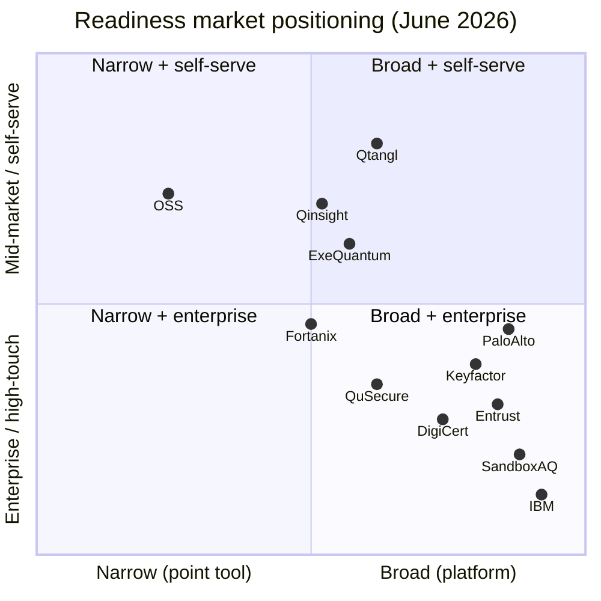

# 11 — Competitive Intelligence

Detailed competitor teardowns, analyst landscape, positioning map, and a repeatable win/loss framework for the post-quantum readiness market.

> **Last validated: 2026-06-06** against live sources (vendor sites/docs, AWS/Azure Marketplace, PKI Consortium PQCCM, NIST NCCoE, Microsoft Security blog, KuppingerCole).
>
> **Public mirror:** [https://www.qtangl.com/compare](https://www.qtangl.com/compare) — feature matrix, positioning map, per-vendor pages, and gated PDF guide.
>
> **Interactive (internal):** Cursor canvas `qtangl-competitive-landscape.canvas.tsx` (open beside chat in Cursor).

---

## Market category

We compete in **Post-Quantum Cryptography (PQC) readiness / crypto-agility / cryptographic posture management (CPM)**. As of 2026 the category is consolidating under the **CPM** label (validated by the Microsoft Security CPM-partner blog, Apr 2026; KuppingerCole crypto-agility Leadership Brief, May 2026; Gartner crypto-visibility guidance). The standard artifact is the **CycloneDX CBOM** — a spec **IBM authored** and open-sourced (CBOMkit).

Adjacent categories that buyers conflate with us:

| Adjacent category | Overlap | How we differ |
|-------------------|---------|---------------|
| Certificate lifecycle management (CLM) | Cert inventory | We add quantum-vulnerability classification + Mosca HNDL + remediation workflow |
| Attack surface management (ASM) | External discovery | We focus on crypto assets, not general vulns |
| GRC / compliance platforms | Framework mapping | We produce crypto-specific evidence + CBOM |
| Key management / HSM | Key material | We orchestrate + verify; we do not store keys |
| PQ-TLS / VPN vendors | Hybrid TLS | We assess + prove, not just enable |

**Category we want to own:** "Post-quantum readiness platform" — assess, monitor, convert, prove — delivered self-serve at mid-market.

---

## The structural divide: discovery method

The single most useful lens on this market (and the industry consensus per NIST NCCoE and the Applied Quantum PQC Migration Framework): **no single discovery method is complete**, so buyers are advised to combine 2–3. Every vendor is anchored to one primary method, each with characteristic blind spots.

| Discovery method | How it works | Representative vendors | Qtangl |
|------------------|--------------|------------------------|--------|
| **Agentless external scan** | Probe TLS, JWKS, SSH, email STARTTLS, CT logs, live traffic | **Qtangl**, Qinsight, ExeQuantum, QuSecure R3, Palo Alto | ✅ Core |
| **Host / endpoint agents** | Sensors or existing EDR (CrowdStrike, Tanium) read keystores/memory | Keyfactor (InfoSec Global), SandboxAQ | ❌ None |
| **Source-code / binary** | Static analysis of repos/binaries; reachability | IBM, Encryption Consulting, OSS (CryptoScan) | ❌ None |
| **Key / KMS-centric** | Read-only scan of KMS, HSM, key/secret stores | Fortanix, Entrust | 🟡 Cloud import (pilot) |
| **Certificate / CLM** | Certificate lifecycle inventory + issuance | DigiCert, AppViewX, Entrust, CyberArk/Venafi | 🟡 Reads certs |

**Implication:** Qtangl's agentless scan is the **fastest baseline** but misses internal hosts, application code, dormant keys, and OT/appliances. Position as a fast external baseline that **layers onto** incumbents' depth — never as full-estate coverage. This is also a partnership map (e.g., pair with a host/code vendor for completeness).

---

## Competitor teardowns

### Tier A — Direct PQC-readiness platforms

#### SandboxAQ — AQtive Guard

| Dimension | Assessment |
|-----------|------------|
| **Positioning** | Enterprise AQ (AI + Quantum) platform. Product is **AQtive Guard**: Cryptographic Posture Management (CPM) **+ AI Security Posture Management (AI-SPM)**, powered by "Large Quantitative Models" |
| **Discovery** | Agents/sensors — Filesystem Scanner, Java Tracer, Network Analyzer (deep, host-level) |
| **Strengths** | Brand (Alphabet spin-out), capital, enterprise sales, analyst presence; deep multi-source discovery + CBOM |
| **Weaknesses** | Expensive (~$250K AWS Marketplace listing); heavyweight; long cycles; opaque pricing; not mid-market friendly |
| **2026 move** | Expanding into **AI-SPM / non-human identities (NHI)** ahead of RSAC 2026 — drifting up-market and adjacent, which **opens our mid-market lane** |
| **Where we win** | Mid-market price; minutes-to-inventory; transparent signed/verifiable evidence; self-serve path |
| **Where we lose** | Fortune 100, multi-year enterprise programs, brand-led RFPs |
| **Trap to avoid** | Don't compete on breadth; compete on speed + verifiable evidence + price |

#### Keyfactor (+ InfoSec Global / AgileSec + CipherInsights)

| Dimension | Assessment |
|-----------|------------|
| **Positioning** | CLM leader that **acquired the leading crypto-discovery startups in 2025** — InfoSec Global (AgileSec) and CipherInsights — to become the consolidated discovery + CLM + remediation player. NIST NCCoE-validated |
| **Discovery** | Host agents (deploy lightweight sensors, or leverage **CrowdStrike Falcon / Tanium**) + network (CipherInsights) + CLM |
| **Strengths** | Installed CLM base, enterprise trust, large channel, deep host visibility (file systems, registries, memory), continuous monitoring + policy enforcement |
| **Weaknesses** | Agent-based = blind spots on legacy/OT/appliances without an agent; enterprise complexity; sales-led; not self-serve; expensive |
| **Where we win** | Speed, agentless external start, signed/verifiable evidence, mid-market packaging, demo-in-minutes |
| **Where we lose** | Accounts standardized on Keyfactor CLM; orgs needing deep endpoint-agent discovery across a large fleet |
| **Trap** | This is now **one** competitor, not three. If buyer has Keyfactor CLM, position as complementary agentless assessment + verifiable evidence layer |

> ⚠️ **Correction vs prior docs:** Earlier versions listed *InfoSec Global*, *Keyfactor*, and *Venafi* as three separate competitors. Keyfactor acquired InfoSec Global + CipherInsights (2025); Venafi is now **CyberArk Certificate Manager** (CyberArk acquired Venafi, 2024).

#### QuSecure — QuProtect R3

| Dimension | Assessment |
|-----------|------------|
| **Positioning** | Pioneered PQC crypto-agility **overlay**; **QuProtect R3 (Sept 2025) added a "Reconnaissance" discovery/inventory module** + "Resilience" active mitigation |
| **Discovery** | Network overlay + Reconnaissance (live inventory of "cryptographic debt", risk highlighting, remediation roadmap; deployable in ~1 week) |
| **Strengths** | Gov traction (Missile Defense Agency SHIELD contract, 2026); Accenture investment + channel (Dell, Cisco, Carahsoft); AWS Marketplace; now does discovery *and* mitigation |
| **Weaknesses** | Heavier deployment; enterprise/gov pricing; not self-serve |
| **Where we win** | Assessment + verifiable evidence first; lighter to start; mid-market; transparent pricing |
| **Where we lose** | Buyer ready to deploy a full PQ overlay network layer, or needing active mitigation today |

> ⚠️ **Correction vs prior docs:** Prior framing ("overlay vs assessment-first") is outdated — R3 now competes directly on Assess/inventory.

#### IBM Quantum Safe — *(net-new to this doc)*

| Dimension | Assessment |
|-----------|------------|
| **Positioning** | End-to-end **Discover → Observe → Remediate**: Explorer (static code/binary scan → CBOM), Advisor (runtime posture/compliance), Remediator (migration patterns), plus **Guardium Quantum Safe** |
| **Discovery** | Static source/object-code analysis (Explorer) + runtime TLS/cert/key observation (Advisor) |
| **Strengths** | **Authored the CBOM standard** (CycloneDX 1.6 extension), open-sourced CBOMkit; IBM scale, services, z16 quantum-safe system; deep code-level visibility we lack |
| **Weaknesses** | Static coverage limited to supported languages; misses runtime/config-loaded crypto without Advisor; enterprise complexity + compute; identifies but doesn't auto-fix |
| **Where we win** | Mid-market price/speed; agentless external coverage; self-serve; verifiable evidence |
| **Where we lose** | Large IBM accounts; code-heavy portfolios needing static analysis; "IBM owns CBOM" credibility plays |
| **Message** | Be **"CBOM-compatible, not CBOM-owner"** — we export the standard IBM created; we win on packaging and the external baseline |

#### Fortanix — Key Insight / PQC Central — *(net-new)*

| Dimension | Assessment |
|-----------|------------|
| **Positioning** | Data-security/Confidential-Computing vendor; **Key Insight** (crypto discovery + risk) with **PQC Central** (readiness score + roadmap), part of the Fortanix Armor platform |
| **Discovery** | Read-only scan of encryption **keys + data services** across on-prem + multicloud KMS/HSM (AWS KMS, Azure Key Vault, GCP, HashiCorp Vault, CyberArk); Confidential-Computing-protected |
| **Strengths** | Closest to our "fast, low-friction, read-only" pitch; quantum readiness score; ServiceNow/Jira roadmap export; no rip-and-replace |
| **Weaknesses** | **Key/KMS-centric**, not endpoint/protocol-centric; misses external TLS/JWKS/SSH posture; tied to Fortanix DSM for transition |
| **Where we win** | Endpoint/protocol inventory (TLS, JWKS, SSH, email), Mosca HNDL, signed verifiable evidence, mid-market |
| **Where we lose** | Buyer framing the problem as "where are my keys?" and already in Fortanix/KMS ecosystem |

#### Palo Alto Networks — Quantum-Safe Security — *(net-new)*

| Dimension | Assessment |
|-----------|------------|
| **Positioning** | Quantum-Safe Security app in Strata Cloud Manager — builds a **live CBOM from network telemetry** |
| **Discovery** | **NGFW / Prisma Access as distributed, agentless sensors** inspecting SSL/TLS, VPN, SSH sessions + device telemetry |
| **Strengths** | Philosophically closest to our agentless thesis — but they **already own the sensors** (installed firewall base); real-time inventory, risk categorization, remediation guidance |
| **Weaknesses** | Only sees what traverses PAN devices; an add-on within the PAN platform (lock-in); not a standalone evidence/verify product |
| **Where we win** | Accounts without pervasive PAN; signed/verifiable evidence; mid-market without a platform commitment; cloud cert import |
| **Where we lose** | Existing Palo Alto platform accounts ("just turn on the app") |

### Tier B — Pure-play "twins" (closest to Qtangl's scan + report model) — *(net-new)*

| Vendor | Overlap with Qtangl | Where we win |
|--------|---------------------|--------------|
| **Qinsight** | Agentless "authorized signal collection, no heavy rollout," **live CBOM**, CSV/PDF export, CNSA 2.0 / PCI / FIPS 203-205 mapping, risk scoring, CMDB/ticketing sync | Signed **public** verify; Mosca HNDL framing; sharper mid-market packaging |
| **ExeQuantum** | Discovery across **10 surfaces** (TLS, certs, email, SSH, **JWT fleets**, cloud KMS, source code, OT) → CycloneDX **1.7** CBOM + drift monitoring; also ships formally-verified PQC | Verifiable evidence; honest "baseline not migration" framing; transparency |
| **Encryption Consulting — CBOM Secure** | "System of record + continuous intelligence" CBOM across cloud/on-prem/HSM/DB/vaults/code; PQC roadmap | Self-serve + product-first (they're consulting-led); public verify links |

**These three are the most direct conceptual competitors and were absent from prior docs.** The core "fast inventory + CBOM + Mosca + report" is no longer rare — treat it as table stakes.

### Tier C — CLM / PKI incumbents bolting on PQC (coopetition)

| Vendor | PQC angle | Stance |
|--------|-----------|--------|
| **DigiCert** | Trust Lifecycle Manager (cert discovery → CBOM foundation), Device Trust Manager, PKILINT, private-CA ML-DSA/SLH-DSA | Partner for Convert (cert issuance); compete on full crypto inventory beyond certs |
| **AppViewX (AVX ONE)** | CLM automation + **PQC Assessment Tool → CBOM**; PQC-ready PKIaaS (ML-DSA/SLH-DSA, hybrid) | Compete on agentless breadth + verifiable evidence; partner on issuance |
| **Entrust** | Cryptographic Security Platform: PKI, key/cert lifecycle, **nShield HSM**, crypto-agility | Partner for HSM/key Convert handoff; compete on inventory + Mosca |
| **CyberArk / Venafi** | CyberArk Certificate Manager (ex-Venafi) — machine-identity/CLM leader adding PQC | Be the assessment + verifiable-evidence layer on top of their CLM |

For all four: PQC is a **feature bolt-on**, not the core. Play complementary assessment/evidence layer or compete on PQC-first narrative (Mosca, CBOM, verify).

### Tier D — Open source / free

| Tool | Notes |
|------|-------|
| **OQS / liboqs** | We build on this (handshake proof). Keep as credibility + upstream contribution, not competition |
| **IBM CBOMkit** | Open-source CBOM tooling (Linux Foundation) |
| **QRAMM toolkit** (CryptoScan, CryptoDeps — CSNP) | Free code scanning + CBOM + risk score + reachability analysis |
| Misc (`cbom-generator`, `PostQuant`, `acdi`) | Point scanners |

**Where we win:** productized workflow — orchestration, report, drift, compliance crosswalk, **signed/verifiable evidence** — not assemble-your-own tooling.

### Adjacent / partner (not direct competitors)

- **PQShield** — PQC IP cores, SDKs, firmware for OEMs/semiconductors ($63M+ raised). **Partner**, not competitor (their primitives, our posture layer).
- **Microsoft** — orchestrating a **CPM partner ecosystem** (Keyfactor, Forescout, Entrust, ISARA) into the Microsoft Security platform. Both a channel opportunity and an ecosystem threat.
- **ISARA (ISARA Advance)** — Azure-deployed CPM (discover within hours, quantify, prioritize, remediate); Microsoft partner.
- **Big 4 / boutique consulting** — see below.

### Big 4 / boutique consulting (Deloitte, PwC, etc.)

| Dimension | Assessment |
|-----------|------------|
| **Strengths** | Trust, relationships, board access, full-service migration labor |
| **Weaknesses** | 6–12 week spreadsheet inventories; expensive ($250K–$2M); no living tool; no drift |
| **Where we win** | Inventory in minutes; continuous monitoring; reusable signed evidence; 10x cheaper baseline |
| **Where we lose** | Buyer wants a body-shop to run the whole program with people |
| **Play** | Partner: consulting delivers labor, Qtangl is the platform + evidence layer ([15-partnerships-and-ecosystem.md](./15-partnerships-and-ecosystem.md)) |

---

## Feature comparison matrix

Legend: Yes / Partial / No / `?` (unverified). Validated 2026-06-06 from public positioning — confirm in win/loss before customer-facing use.

| Capability | Qtangl | SandboxAQ | Keyfactor (+ISG) | QuSecure R3 | IBM Q-Safe | Fortanix | Palo Alto | Qinsight | ExeQuantum |
|------------|--------|-----------|------------------|-------------|------------|----------|-----------|----------|------------|
| Agentless external scan | Yes | Partial | Partial | Yes | No | Partial | Yes | Yes | Yes |
| Host / endpoint discovery | No | Yes | Yes | Partial | Partial | Partial | Partial | Partial | Partial |
| Source-code / binary scan | No | Partial | Partial | No | Yes | No | No | No | Partial |
| Mosca HNDL scoring | Yes | Partial | Partial | Partial | Partial | Partial | Partial | Partial | Partial |
| CycloneDX CBOM | Yes | Yes | Yes | Partial | Yes (owns) | Partial | Yes | Yes | Yes |
| **Signed + public verify** | **Yes** | No | No | No | No | No | No | No | No |
| Drift / re-scan diff | Partial | Partial | Yes | Yes | Partial | Yes | Yes | Yes | Yes |
| Remediation workflow | Partial | Yes | Yes | Yes | Yes | Yes | Partial | Partial | Partial |
| Flips crypto (overlay/CLM/KMS) | No | Yes | Yes | Yes | Yes | Yes | Partial | No | Partial |
| **Mid-market self-serve** | **Yes** | No | No | No | No | No | No | Partial | Partial |
| **Transparent pricing** | **Yes** | No | No | No | No | No | No | `?` | `?` |

**Pattern:** We **lose on depth** (no agents/code scan, pilot maturity) and **win on packaging** (speed, public verifiable evidence, mid-market price, self-serve, honest framing).

---

## Positioning map

**Our whitespace:** Broad-enough platform (Assess → Monitor → Convert) delivered at mid-market, self-serve-capable price with **signed, publicly-verifiable evidence** — a quadrant the incumbents largely vacate. Public: `/compare`. Internal: Cursor canvas `qtangl-competitive-landscape.canvas.tsx`.

---

## Analyst & influencer landscape

| Analyst / body | Why it matters | Action |
|----------------|----------------|--------|
| Gartner (CPM / crypto-agility) | Buyers cite emerging category | Brief when ≥3 references; track Hype Cycle for crypto |
| Forrester | Enterprise validation | Brief post-SOC2 |
| KuppingerCole | Crypto-agility Leadership Brief (May 2026) defines the discipline | Track; pursue inclusion post-references |
| **PKI Consortium — PQC Capabilities Matrix (PQCCM)** | Public, authoritative feature grid (AppViewX, DigiCert, Entrust, Keyfactor listed) | **Get Qtangl listed** — free third-party credibility |
| NIST NCCoE (Migration to PQC project) | Reference-architecture credibility; validates vendors (AgileSec) | Align messaging; pursue participation; cite publicly |
| Microsoft Security (CPM partner ecosystem) | Defines a buyer shortlist (Keyfactor, Forescout, Entrust, ISARA) | Explore partner/marketplace path |
| NSA / CISA guidance | Gov buyer trust | Map content to CNSA 2.0, CISA timelines |
| PQC community (OQS, IACR, IETF) | Technical credibility | Contribute; speak at events |

**Pre-analyst gate:** Do not pay for analyst engagements pre-revenue. Earn references first; brief when 3+ customers + SOC2 Type I. **Free wins first:** PKI Consortium PQCCM listing + NIST NCCoE participation.

---

## Win/loss framework

### Capture after every closed deal (won or lost)

| Field | Detail |
|-------|--------|
| Outcome | Won / Lost / No-decision |
| Primary competitor | Named vendor or "status quo/spreadsheet" |
| Decision driver | Price / speed / evidence / brand / features / compliance / discovery depth |
| Champion | Title + persona |
| Deciding factor (one line) | Why we won/lost |
| Objection that mattered most | From [06-gtm-and-pricing.md](./06-gtm-and-pricing.md) list |
| Price point | ACV + tier |

### Quarterly synthesis

- Top 3 reasons we win → amplify in [01-positioning-and-brand.md](./01-positioning-and-brand.md)
- Top 3 reasons we lose → feed product backlog ([09-epics-and-backlog.md](./09-epics-and-backlog.md)) and battlecards ([sales-enablement/battlecards.md](./sales-enablement/battlecards.md))
- Competitor moves → update teardowns above

### Loss-reason taxonomy (track frequency)

| Code | Reason | Counter-play |
|------|--------|--------------|
| L-PRICE | Too expensive vs OSS/internal | ROI calculator; total-cost framing |
| L-BRAND | Chose incumbent brand | References, analyst proof, SOC2 |
| L-FEATURE | Missing capability | Backlog prioritization |
| L-DEPTH | Needed host/code/OT discovery depth | Honest scope; partner for depth; roadmap |
| L-TRUST | Security/maturity doubt | Trust center ([12-platform-security-and-trust.md](./12-platform-security-and-trust.md)) |
| L-TIMING | "Quantum is years away" | HNDL + Mosca education |
| L-CHAMPION | Lost internal champion | Multi-thread; exec sponsor |
| L-INERTIA | No decision / status quo | Free mini-assessment wedge |

---

## Competitive monitoring cadence

| Activity | Frequency | Owner | Sources |
|----------|-----------|-------|---------|
| Competitor site/pricing/news scan | Monthly | GTM | Vendor sites, AWS/Azure Marketplace, Crunchbase, The Quantum Insider |
| Feature-matrix validation | Quarterly | GTM + Product | PKI Consortium PQCCM, vendor docs, free trials, G2 / Gartner Peer Insights |
| Battlecard refresh | Quarterly | GTM + Product | This doc + win/loss |
| Analyst report review | As published | Founder | Gartner, Forrester, KuppingerCole, GigaOm |
| NIST/CNSA/CISA standards check | Monthly | Eng ([21-data-and-threat-intelligence.md](./21-data-and-threat-intelligence.md)) | NIST NCCoE, NSA CNSA 2.0, CISA |
| M&A / consolidation watch | Monthly | Founder | Keyfactor/ISG-style roll-ups; public-co earnings (IBM, PAN, CyberArk, Entrust, DigiCert) |
| Win/loss synthesis | Quarterly | GTM | CRM |

---

## Related docs

- Positioning: [01-positioning-and-brand.md](./01-positioning-and-brand.md)
- Battlecards: [sales-enablement/battlecards.md](./sales-enablement/battlecards.md)
- GTM: [06-gtm-and-pricing.md](./06-gtm-and-pricing.md)
- Partnerships (coopetition plays): [15-partnerships-and-ecosystem.md](./15-partnerships-and-ecosystem.md)
- Market sizing (original): [02-market-and-competition.md](../optimization_OLD_FUTURE/02-market-and-competition.md)
- Interactive landscape: Cursor canvas `qtangl-competitive-landscape.canvas.tsx`
