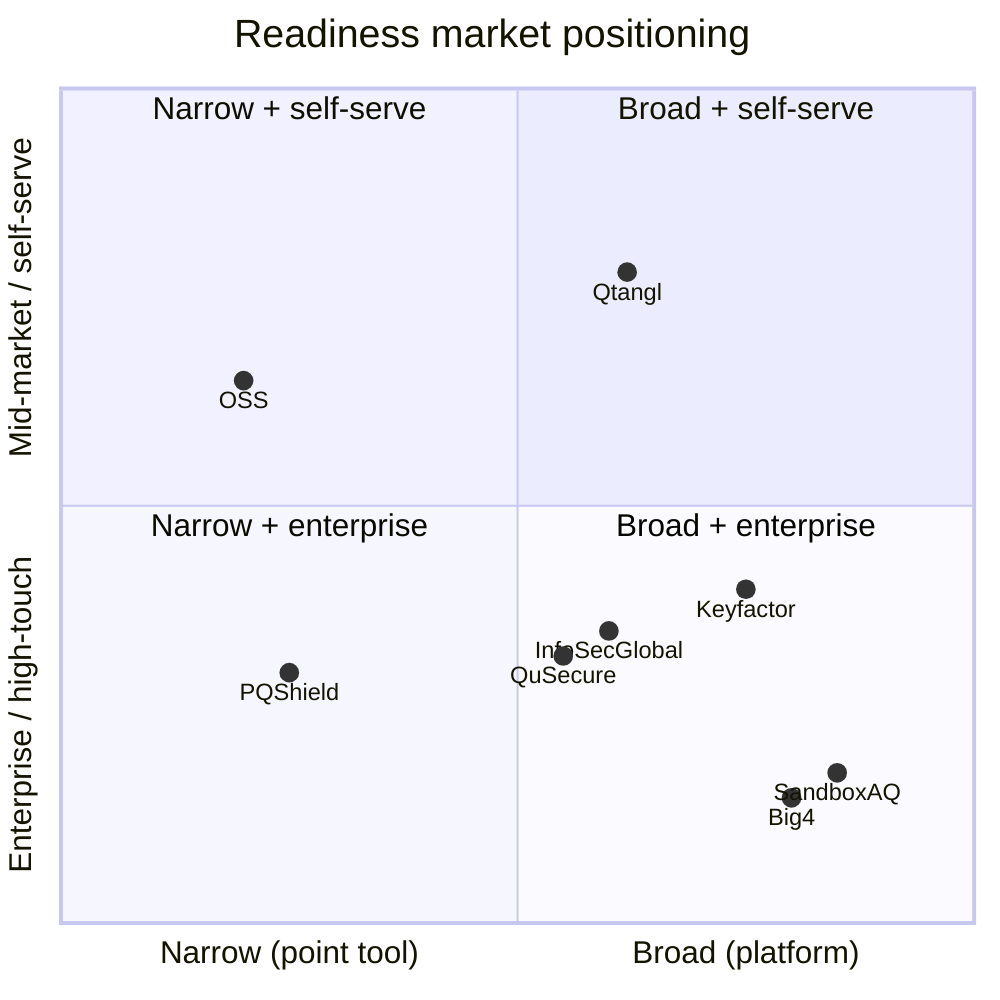

# 11 — Competitive Intelligence

Detailed competitor teardowns, analyst landscape, positioning map, and a repeatable win/loss framework for the post-quantum readiness market.

---

## Market category

We compete in **Post-Quantum Cryptography (PQC) readiness / crypto-agility / cryptographic posture management (CPM)**. Adjacent categories that buyers conflate with us:

| Adjacent category | Overlap | How we differ |
|-------------------|---------|---------------|
| Certificate lifecycle management (CLM) | Cert inventory | We add quantum-vulnerability classification + Mosca HNDL + remediation workflow |
| Attack surface management (ASM) | External discovery | We focus on crypto assets, not general vulns |
| GRC / compliance platforms | Framework mapping | We produce crypto-specific evidence + CBOM |
| Key management / HSM | Key material | We orchestrate + verify; we do not store keys |
| PQ-TLS / VPN vendors | Hybrid TLS | We assess + prove, not just enable |

**Category we want to own:** "Post-quantum readiness platform" — assess, monitor, convert, prove.

---

## Competitor teardowns

### SandboxAQ

| Dimension | Assessment |
|-----------|------------|
| **Positioning** | Enterprise AQ (AI + Quantum) platform; broad PQ portfolio incl. Security Suite (CPM) |
| **Strengths** | Brand (Alphabet spin-out), capital, enterprise sales motion, analyst presence |
| **Weaknesses** | Expensive; heavyweight; long sales cycles; opaque pricing; not mid-market friendly |
| **Where we win** | Mid-market price; minutes-to-inventory; transparent signed evidence; self-serve path |
| **Where we lose** | Fortune 100, multi-year enterprise programs, brand-led RFPs |
| **Trap to avoid** | Don't compete on breadth; compete on speed + evidence + price |

### PQShield

| Dimension | Assessment |
|-----------|------------|
| **Positioning** | PQC IP cores, SDKs, firmware; standards authorship credibility |
| **Strengths** | Deep cryptographic credibility; NIST involvement; hardware/firmware |
| **Weaknesses** | Developer/OEM focus, not CISO inventory + workflow; not a posture dashboard |
| **Where we win** | Buyer wants inventory + compliance crosswalk + remediation tracking, not crypto libraries |
| **Where we lose** | Chip/firmware vendors needing PQC implementations |
| **Relationship** | Potential **partner** (their primitives, our posture layer) not pure competitor |

### QuSecure

| Dimension | Assessment |
|-----------|------------|
| **Positioning** | PQ orchestration / overlay (QuProtect); gov + enterprise |
| **Strengths** | Gov traction; crypto-agility overlay narrative; channel |
| **Weaknesses** | Heavier deployment; overlay vs assessment-first; pricing |
| **Where we win** | Buyer wants assessment + evidence before committing to an overlay; mid-market |
| **Where we lose** | Buyer ready to deploy a full PQ overlay network layer |

### InfoSec Global (AgileSec)

| Dimension | Assessment |
|-----------|------------|
| **Positioning** | Cryptographic posture / agility management; discovery + policy |
| **Strengths** | Mature crypto discovery; agility management; enterprise |
| **Weaknesses** | Enterprise complexity; less self-serve; weaker public evidence/verify story |
| **Where we win** | Speed, signed verify links, mid-market packaging, demo-in-minutes |
| **Where we lose** | Large enterprise with deep endpoint-agent discovery requirements |

### Keyfactor / Venafi (CyberArk)

| Dimension | Assessment |
|-----------|------------|
| **Positioning** | Machine identity / certificate lifecycle leaders adding PQC readiness |
| **Strengths** | Installed base, CLM dominance, enterprise trust, large channel |
| **Weaknesses** | PQC is a feature bolt-on, not the core; heavyweight; expensive |
| **Where we win** | PQC-first narrative, Mosca HNDL, CBOM, mid-market, fast time-to-value |
| **Where we lose** | Accounts already standardized on their CLM; "just turn on the PQC module" |
| **Trap** | If buyer has Venafi/Keyfactor, position as **complementary assessment + evidence** layer, or as the system of record they lack |

### Big 4 / boutique consulting (Deloitte, PwC, etc.)

| Dimension | Assessment |
|-----------|------------|
| **Strengths** | Trust, relationships, board access, full-service migration labor |
| **Weaknesses** | 6–12 week spreadsheet inventories; expensive ($250K–$2M); no living tool; no drift |
| **Where we win** | Inventory in minutes; continuous monitoring; reusable signed evidence; 10x cheaper baseline |
| **Where we lose** | Buyer wants a body-shop to run the whole program with people |
| **Play** | Partner: consulting delivers labor, Qtangl is the platform + evidence layer ([15-partnerships-and-ecosystem.md](./15-partnerships-and-ecosystem.md)) |

### Open-source (liboqs / OQS, oqs-provider, CBOM tooling)

| Dimension | Assessment |
|-----------|------------|
| **Strengths** | Free, NIST-aligned, credible primitives |
| **Weaknesses** | Not a product: no scan orchestration, no report, no drift, no compliance crosswalk, no signed evidence |
| **Where we win** | Buyer wants productized workflow + evidence, not to assemble tooling |
| **Relationship** | We **build on** OQS (handshake proof); contribute upstream for credibility |

---

## Feature comparison matrix

Legend: Yes / Partial / No.

| Capability | Qtangl | SandboxAQ | PQShield | QuSecure | InfoSec Global | Keyfactor/Venafi | Big 4 | OSS |
|------------|--------|-----------|----------|----------|----------------|------------------|-------|-----|
| Fast external crypto inventory | Yes | Yes | No | Partial | Yes | Yes | Partial | Partial |
| Mosca HNDL scoring | Yes | Partial | No | Partial | Partial | No | Partial | No |
| CycloneDX CBOM export | Yes | Partial | Partial | No | Partial | Partial | No | Partial |
| Signed report + public verify | Yes | No | No | No | No | No | No | No |
| Drift / diff monitoring | Yes | Partial | No | Partial | Yes | Partial | No | No |
| Remediation workflow tracking | Yes | Partial | No | Partial | Yes | Partial | Yes (manual) | No |
| Compliance packs (CMMC/HIPAA/PCI) | Yes | Yes | No | Partial | Partial | Partial | Yes | No |
| PQ TLS handshake proof | Yes | Partial | Yes | Yes | No | Partial | No | Yes |
| Mid-market self-serve | Yes | No | No | No | No | No | No | n/a |
| Transparent pricing | Yes | No | No | No | No | No | No | n/a |

**Note:** Validate competitor cells during win/loss; mark unknowns rather than guess in customer-facing material.

---

## Positioning map

**Our whitespace:** Broad-enough platform (Assess → Monitor → Convert) delivered at mid-market, self-serve-capable price with signed evidence — a quadrant the incumbents largely vacate.

---

## Analyst & influencer landscape

| Analyst / body | Why it matters | Action |
|----------------|----------------|--------|
| Gartner (CPM / crypto-agility) | Buyers cite emerging category | Brief when ≥3 references; track Hype Cycle for crypto |
| Forrester | Enterprise validation | Brief post-SOC2 |
| NIST NCCoE (Migration to PQC project) | Reference architecture credibility | Align messaging; cite publicly |
| NSA / CISA guidance | Gov buyer trust | Map content to CNSA 2.0, CISA timelines |
| PQC community (OQS, IACR) | Technical credibility | Contribute; speak at events |

**Pre-analyst gate:** Do not pay for analyst engagements pre-revenue. Earn references first; brief when 3+ customers + SOC2 Type I.

---

## Win/loss framework

### Capture after every closed deal (won or lost)

| Field | Detail |
|-------|--------|
| Outcome | Won / Lost / No-decision |
| Primary competitor | Named vendor or "status quo/spreadsheet" |
| Decision driver | Price / speed / evidence / brand / features / compliance |
| Champion | Title + persona |
| Deciding factor (one line) | Why we won/lost |
| Objection that mattered most | From [06-gtm-and-pricing.md](./06-gtm-and-pricing.md) list |
| Price point | ACV + tier |

### Quarterly synthesis

- Top 3 reasons we win → amplify in [01-positioning-and-brand.md](./01-positioning-and-brand.md)
- Top 3 reasons we lose → feed product backlog ([09-epics-and-backlog.md](./09-epics-and-backlog.md)) and battlecards ([sales-enablement/battlecards.md](./sales-enablement/battlecards.md))
- Competitor moves → update teardowns above

### Loss-reason taxonomy (track frequency)

| Code | Reason | Counter-play |
|------|--------|--------------|
| L-PRICE | Too expensive vs OSS/internal | ROI calculator; total-cost framing |
| L-BRAND | Chose incumbent brand | References, analyst proof, SOC2 |
| L-FEATURE | Missing capability | Backlog prioritization |
| L-TRUST | Security/maturity doubt | Trust center ([12-platform-security-and-trust.md](./12-platform-security-and-trust.md)) |
| L-TIMING | "Quantum is years away" | HNDL + Mosca education |
| L-CHAMPION | Lost internal champion | Multi-thread; exec sponsor |
| L-INERTIA | No decision / status quo | Free mini-assessment wedge |

---

## Competitive monitoring cadence

| Activity | Frequency | Owner |
|----------|-----------|-------|
| Competitor site/pricing/news scan | Monthly | GTM |
| Battlecard refresh | Quarterly | GTM + Product |
| Analyst report review | As published | Founder |
| NIST/CNSA/CISA standards check | Monthly | Eng ([21-data-and-threat-intelligence.md](./21-data-and-threat-intelligence.md)) |
| Win/loss synthesis | Quarterly | GTM |

---

## Related docs

- Positioning: [01-positioning-and-brand.md](./01-positioning-and-brand.md)
- Battlecards: [sales-enablement/battlecards.md](./sales-enablement/battlecards.md)
- GTM: [06-gtm-and-pricing.md](./06-gtm-and-pricing.md)
- Market sizing (original): [02-market-and-competition.md](../optimization_OLD_FUTURE/02-market-and-competition.md)
