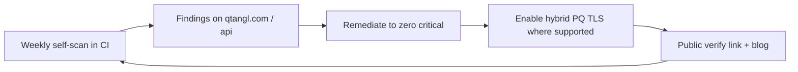

# 12 — Platform Security & Trust

We sell security **to** security teams. Our own posture is a product feature. This doc defines Qtangl's security program, trust center, certifications, and the "Qtangl secures Qtangl" dogfooding loop.

**Principle:** A CISO will not buy crypto-readiness from a vendor whose own crypto and security posture is weak. Trust is the deal-maker.

---

## Trust posture targets

| Layer | Now | 6 months | 12 months |
|-------|-----|----------|-----------|
| Secrets hygiene | `done` (gitleaks CI + pre-commit) | rotation policy | Secrets manager |
| Tenant isolation | `done` (G3) | Audit log per tenant | Row-level + tested |
| Threat model | `done` (G2) | Pen test scoped | Pen test executed |
| SOC 2 | `kickoff` | Type I observation started | Type I report; Type II window |
| ISO 27001 | `not-started` | Gap assessment | Stage 1 audit (if EU demand) |
| Dogfood PQC | `in-progress` (fixture + API; live CI pending prod secrets) | Daily live scans in CI | Hybrid PQ TLS on our endpoints |
| Vuln disclosure | `partial` (security.txt + `/trust/disclosure`) | Triage SLA published | Acknowledgments live |
| Trust center | `pilot` | Security overview + questionnaires | SOC 2 report under NDA |

Builds on [11-track-G-security-trust-compliance.md](../optimization_OLD_FUTURE/11-track-G-security-trust-compliance.md). This doc is the **readiness-go-to-market view** of that program.

---

## Public trust center (`/trust`)

Upgrade [web/app/trust/page.tsx](../../web/app/trust/page.tsx) into a buyer-grade trust center.

| Section | Content | Source |
|---------|---------|--------|
| Security overview | Architecture, data flows, encryption | This doc |
| Certifications | SOC 2 status, roadmap to ISO | G5 |
| Sub-processors | Railway, Vercel, Stripe, email, analytics | Table below |
| Data handling | Retention, deletion, residency | [data-retention-policy](../optimization_OLD_FUTURE/security/data-retention-policy.md) |
| Dogfooding | "We scan ourselves weekly" + verify link | G7 |
| Vulnerability disclosure | security.txt, policy, contact | G8 |
| Compliance mapping | What we satisfy vs what we help you satisfy | [17-legal-regulatory-and-compliance.md](./17-legal-regulatory-and-compliance.md) |
| Status / uptime | Link to status page | [19-engineering-operating-model.md](./19-engineering-operating-model.md) |
| Document requests | DPA, SOC2 report (NDA), pen test summary | Gated form |

**Goal:** Answer 80% of a security questionnaire before the buyer sends one.

---

## Security questionnaire readiness

Enterprise deals stall on questionnaires (CAIQ, SIG, custom). Pre-build answers.

| Artifact | Status | Owner |
|----------|--------|-------|
| CAIQ (Cloud Security Alliance) self-assessment | `draft` | Security lead |
| SIG Lite responses | `draft` | Security lead |
| Standard "security overview" PDF | `draft` | Founder |
| Data flow diagrams | `draft` | Eng |
| Pen test executive summary | `not-started` | After pen test |
| SOC 2 Type I report (under NDA) | `not-started` | After audit |

**Target:** Median questionnaire turnaround < 3 business days.

---

## Sub-processors register

| Sub-processor | Purpose | Data | DPA |
|---------------|---------|------|-----|
| Railway | API + Postgres + Redis hosting | Tenant config, scan results | Required |
| Vercel | Web hosting | Marketing, dashboard | Required |
| Stripe | Billing (Monitor self-serve) | Payment, contact | In place (Stripe DPA) |
| Email provider | Transactional + alerts | Contact email | Required |
| Analytics (PostHog/Plausible) | Product analytics | Usage, IP | Privacy-first config |
| Error tracking (Sentry, optional) | Diagnostics | Stack traces (scrub PII) | Required |

Keep this list **public** on the trust center and current — enterprises audit it.

---

## Dogfooding: "Qtangl secures Qtangl" (G7)

The strongest proof we can offer: we run our own product against ourselves and publish it.

### Loop

### Actions

- [ ] Weekly PQC scan of `qtangl.com`, `www.qtangl.com`, `api.qtangl.com` in CI
- [ ] Zero critical findings on owned infra OR a documented, dated remediation plan
- [ ] Enable hybrid PQ TLS (OQS provider) on API endpoint when hosting supports
- [ ] Public "We scanned ourselves" report with live `/verify` link
- [ ] Readiness score badge on `/trust` and footer

**Federal alignment:** See [federal-funding/checklist-and-tracker.md](./federal-funding/checklist-and-tracker.md) trust section and [trust-program-tracker.md](../../docs/compliance/trust-program-tracker.md).

**Marketing value:** "We hold ourselves to the standard we sell" — directly counters L-TRUST losses.

---

## Application security program

| Practice | Implementation | Status |
|----------|----------------|--------|
| SSRF protection on scanner | [backend/app/pqc/safety.py](../../backend/app/pqc/safety.py) `assert_scannable` | `done` |
| Scan rate limits / caps | `QTANGL_PQC_MAX_ENDPOINTS`, `QTANGL_PQC_SCAN_TIMEOUT` | `done` |
| Dependency scanning | pip-audit / npm audit in CI (blocking) | `done` |
| Secret scanning | gitleaks in CI + pre-commit | `done` |
| SAST | CodeQL on PRs | `in-progress` |
| Signed reports | Ed25519 [signing.py](../../backend/app/pqc/signing.py) | `done` |
| Input validation | Pydantic models, upload size/format limits | `pilot` |
| PII/PHI redaction in logs | G9 safe logging | `not-started` |
| Authn/z | Per-tenant API keys (G3) | `done` |

---

## Penetration testing

| Phase | Scope | Trigger |
|-------|-------|---------|
| Phase 1 | API + scanner SSRF + tenant isolation | Before first enterprise / regulated pilot |
| Phase 2 | Web app + auth + billing | Before self-serve GA |
| Annual | Full surface | Ongoing; required for SOC 2 Type II |

Deliverable: executive summary on trust center; full report under NDA. Track findings to closure in [10-metrics-and-risks.md](./10-metrics-and-risks.md).

---

## Vulnerability disclosure program (G8)

- Publish `https://qtangl.com/.well-known/security.txt` with `security@qtangl.com`
- 90-day coordinated disclosure policy
- Triage SLA: acknowledge < 2 business days; severity-based remediation targets
- Safe harbor language for good-faith researchers
- Bug bounty: defer to post-Series A; start with private disclosure

---

## Incident response (security)

See operational detail in [19-engineering-operating-model.md](./19-engineering-operating-model.md). Security-specific:

| Severity | Example | Notify customer |
|----------|---------|-----------------|
| Sev1 | Tenant data exposure, key compromise | < 24h + per contract/regulation |
| Sev2 | Auth bypass, scanner abused | As required |
| Sev3 | Limited-impact vuln | In release notes |

- Breach notification clauses in MSA/DPA ([17-legal-regulatory-and-compliance.md](./17-legal-regulatory-and-compliance.md))
- Post-incident review published internally; customer summary on request
- Maintain an incident log even for near-misses

---

## Data protection

| Data class | Handling | Retention |
|------------|----------|-----------|
| Scan results / CBOM | Encrypted at rest; tenant-scoped | 12 months default |
| Uploaded PEM bundles | Deleted within 24h of processing | 24h TTL |
| Customer config / keys | Hashed keys; secrets store | Life of contract + 90d |
| PII (contact) | Minimal; privacy policy governed | Per policy |
| Audit logs | Append-only; access-controlled | 12 months |

No PHI in PQC scans (crypto inventory only) — reinforce in SOW. Optimization PHI handled separately under BAA.

---

## Trust as a sales accelerator

| Buyer stage | Trust artifact | Effect |
|-------------|----------------|--------|
| Discovery | Trust center page | Reduces "are you secure?" friction |
| Evaluation | Security overview PDF, sub-processors | Passes initial vendor review |
| Procurement | SOC 2 (NDA), DPA, pen test summary | Unblocks legal/security sign-off |
| Renewal | Updated certs, clean self-scan | Reduces churn (KR-008, L-TRUST) |

---

## Acceptance criteria (Track K9 — security & trust GTM)

- [ ] Trust center answers top 20 questionnaire items publicly
- [ ] Sub-processors list published and current
- [ ] Weekly self-scan running; readiness badge live
- [ ] security.txt + disclosure policy published
- [ ] SOC 2 Type I observation started
- [ ] Security overview PDF available on request

---

## Related docs

- Security track (engineering): [11-track-G-security-trust-compliance.md](../optimization_OLD_FUTURE/11-track-G-security-trust-compliance.md)
- Legal/compliance: [17-legal-regulatory-and-compliance.md](./17-legal-regulatory-and-compliance.md)
- Engineering ops / incident: [19-engineering-operating-model.md](./19-engineering-operating-model.md)
- SOC 2 scope: [soc2-type1-scope.md](../optimization_OLD_FUTURE/security/soc2-type1-scope.md)
