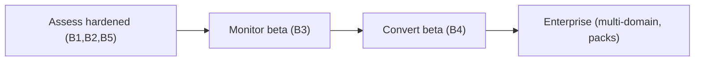

# 13 — Product Requirements

Index of detailed Product Requirements Documents (PRDs) for the readiness platform. Each PRD defines the problem, user stories, functional/non-functional requirements, UX, telemetry, and acceptance criteria for a product surface.

---

## PRD set

| PRD | Surface | Tier | File | Status |
|-----|---------|------|------|--------|
| Assess | Scan → report → CBOM | Assess | [prds/assess-prd.md](./prds/assess-prd.md) | draft |
| Monitor | Scheduled scans + drift + alerts | Monitor | [prds/monitor-prd.md](./prds/monitor-prd.md) | draft |
| Convert | Remediation workflow + verification | Convert | [prds/convert-prd.md](./prds/convert-prd.md) | draft |

Evidence (signing, verify, audit packs) is cross-cutting and specified within each PRD's "Evidence" section; the underlying capability is largely `done` ([report.py](../../backend/app/pqc/report.py), [signing.py](../../backend/app/pqc/signing.py)).

---

## PRD conventions

Every PRD follows this structure:

1. **Summary & goal** — one paragraph
2. **Personas & jobs-to-be-done** — who and why ([02-customer-journey.md](./02-customer-journey.md))
3. **User stories** — `As a [persona], I want [capability], so that [outcome]`
4. **Functional requirements** — `FR-n` numbered, must/should/could
5. **Non-functional requirements** — performance, security, accessibility
6. **UX flow** — steps + components ([03-solution-architecture.md](./03-solution-architecture.md))
7. **Data & API** — entities, endpoints
8. **Telemetry** — events to instrument ([10-metrics-and-risks.md](./10-metrics-and-risks.md))
9. **Acceptance criteria** — checkboxes
10. **Open questions** — to resolve before build

Requirement priority: **M** (must) / **S** (should) / **C** (could) / **W** (won't, this release) — MoSCoW.

---

## Requirement traceability

Each FR maps to an epic in [09-epics-and-backlog.md](./09-epics-and-backlog.md) and a backend/web file. Maintain this matrix as PRDs mature:

| PRD | Epic(s) | Primary code |
|-----|---------|-------------|
| Assess | B1, B2, B5, K2 | [scanner.py](../../backend/app/pqc/scanner.py), [report.py](../../backend/app/pqc/report.py) |
| Monitor | B3, K4 | [monitoring/diff.py](../../backend/app/monitoring/diff.py) |
| Convert | B4, K4 | [remediation/service.py](../../backend/app/remediation/service.py) |

---

## Release sequencing

---

## Related docs

- Solution architecture: [03-solution-architecture.md](./03-solution-architecture.md)
- Epics: [09-epics-and-backlog.md](./09-epics-and-backlog.md)
- Track B product: [06-track-B-pqc-product.md](../optimization_OLD_FUTURE/06-track-B-pqc-product.md)
