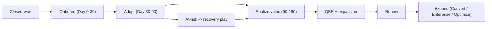

# 14 — Customer Success & Retention

Post-sale motion: onboarding, health scoring, QBRs, renewals, expansion, churn prevention, support tiers, and SLAs. This is where Monitor ARR is protected and Convert/Enterprise expansion is earned.

**Principle:** The assessment lands the logo; **customer success keeps it**. Net revenue retention (NRR) > 110% is the goal.

---

## Lifecycle overview

---

## Onboarding (Day 0–30)

### Goals

- First successful scan on customer's real domain
- Dashboard configured (targets, frequency, alert thresholds)
- Key stakeholders have logins and understand the readiness score
- First signed report delivered and verified

### Onboarding checklist

| Step | Owner | By day |
|------|-------|--------|
| Kickoff call + success criteria agreed | CS | 2 |
| Tenant provisioned + API keys issued | CS/Eng | 3 |
| Domain authorization + first live scan | CS + customer | 7 |
| Baseline report delivered + walkthrough | CS | 10 |
| Monitor schedule + alerts configured | CS | 14 |
| Stakeholder training (CISO, eng, compliance) | CS | 21 |
| 30-day check-in + adoption review | CS | 30 |

**Time-to-first-value target:** First signed report < 7 days from kickoff.

---

## Customer health score

Composite 0–100, computed monthly; drives proactive plays.

| Signal | Weight | Healthy |
|--------|--------|---------|
| Scan recency (scheduled scans on time) | 20% | Scans running on schedule |
| Login / dashboard activity | 15% | ≥1 active user / 2 weeks |
| Remediation progress (items closing) | 20% | Backlog trending down |
| Readiness score trend | 15% | Flat or improving |
| Alerts acknowledged | 10% | Not ignored |
| Stakeholder engagement (QBR attendance) | 10% | Attends |
| Support sentiment / NPS | 10% | Positive |

| Band | Score | Play |
|------|-------|------|
| Green | 75–100 | Expansion conversation |
| Yellow | 50–74 | Adoption nudge; re-train |
| Red | < 50 | Recovery play; exec escalation |

Health inputs come from product telemetry ([10-metrics-and-risks.md](./10-metrics-and-risks.md)) and `remediation_velocity` ([remediation/service.py](../../backend/app/remediation/service.py)).

---

## Support tiers & SLAs

| Tier | Audience | Channels | First response SLA | Hours |
|------|----------|----------|--------------------|-------|
| **Standard** | Assess / self-serve Monitor | Email, docs | 1 business day | Business hours |
| **Priority** | Monitor (sales-led) | Email, shared Slack | 4 business hours | Business hours |
| **Enterprise** | Enterprise / Convert | Slack, scheduled calls, named CSM | 2 business hours (Sev1: 1h) | Extended |

### Severity definitions

| Severity | Definition | Target resolution |
|----------|------------|-------------------|
| Sev1 | Scans down / data issue / security | 4h response, continuous until resolved |
| Sev2 | Degraded (alerts late, export fails) | 1 business day |
| Sev3 | Question / minor bug | 3 business days |

Operational SLOs (uptime) in [19-engineering-operating-model.md](./19-engineering-operating-model.md).

---

## Quarterly Business Review (QBR)

For Monitor+ accounts. Agenda:

1. **Readiness trend** — score over quarter; drift caught
2. **Remediation progress** — items closed, velocity, what-if for next quarter
3. **Evidence delivered** — reports, verify usage, audit support
4. **Risk & roadmap** — upcoming deadlines (NSM-10/CMMC), new endpoints
5. **Expansion** — Convert tier, additional domains, Enterprise packs
6. **Health & asks** — blockers, product feedback

Output: a one-page board-ready readiness summary (`report_to_board()`).

---

## Renewals

| Phase | Timing | Action |
|-------|--------|--------|
| Early signal | 120 days out | Health review; flag risk |
| Value recap | 90 days out | Quantify outcomes (findings, drift caught, audits supported) |
| Proposal | 60 days out | Renewal + expansion options |
| Close | 30 days out | Sign; multi-year incentive |
| Post | +7 days | Confirm; set next-year success plan |

**Multi-year incentive:** Discount for 2–3 year Monitor given multi-year migration horizon (deadlines 2027–2035).

---

## Expansion paths (NRR drivers)

| Path | Trigger | Motion |
|------|---------|--------|
| Add domains/business units | Multi-domain org | Per-domain pricing |
| Assess → Monitor | After assessment | Default upsell (≥50% target) |
| Monitor → Convert | Active migration | Workshop + partner intro |
| Convert → Enterprise | Multi-domain + compliance packs | CMMC/HIPAA mapping |
| Readiness → Optimize | Stage 5+, ops buyer present | "Both sides of Q-Day" bundle |

Expansion is owned by CS with AE support; do not pitch Optimize before readiness program is underway ([02-customer-journey.md](./02-customer-journey.md)).

---

## Churn prevention

| Churn signal | Root cause | Recovery play |
|--------------|------------|---------------|
| Scans not running | Adoption gap | Re-onboard; auto-schedule defaults |
| No logins | Champion left | Multi-thread; find new champion |
| Backlog stalled | No migration resources | Convert tier / partner intro |
| "Quantum not a priority now" | Urgency faded | HNDL + deadline reminder; board report |
| Price pushback at renewal | Value unclear | Outcome recap; Monitor Lite option |

**Save target:** Recover ≥50% of red-health accounts before renewal.

---

## Voice of customer

- Capture feedback every QBR → product backlog ([09-epics-and-backlog.md](./09-epics-and-backlog.md))
- NPS at 90 days and each renewal
- Feature requests tagged to PRDs ([13-product-requirements.md](./13-product-requirements.md))
- Reference/case-study candidates flagged from green accounts ([case-study-template.md](../../demos/pqc_migration/case-study-template.md))

---

## CS metrics

| Metric | Target |
|--------|--------|
| Time-to-first-value | < 7 days |
| Onboarding completion (30-day checklist) | 100% |
| Gross revenue retention | > 90% |
| Net revenue retention | > 110% |
| Logo churn (annual) | < 10% |
| QBR attendance (Monitor+) | > 80% |
| Red-account recovery | > 50% |
| NPS | > 40 |

---

## Tooling

| Stage | Tool |
|-------|------|
| Pre-scale | Spreadsheet health tracker + calendar |
| Post-10 customers | Lightweight CS tool / CRM module |
| Support | Shared inbox → ticketing (e.g. Help Scout) |
| Telemetry | PostHog/Plausible events |

---

## Related docs

- Journey: [02-customer-journey.md](./02-customer-journey.md)
- GTM/pricing: [06-gtm-and-pricing.md](./06-gtm-and-pricing.md)
- Scaling/support automation: [07-scaling.md](./07-scaling.md)
- Metrics: [10-metrics-and-risks.md](./10-metrics-and-risks.md)
