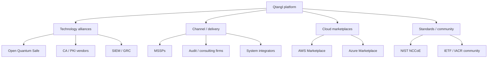

# 15 — Partnerships & Ecosystem

Technology alliances, channel/MSSP program, cloud marketplaces, integration ecosystem, and standards-body engagement. Partners extend reach (distribution) and capability (Convert delivery) without growing headcount.

**Principle:** Qtangl is the **platform and evidence layer**. Partners deliver labor (migration), distribution (channel), and credibility (standards) — we stay the system of record.

---

## Partnership portfolio

---

## Technology alliances

| Partner | Type | Value to Qtangl | Value to partner | Status |
|---------|------|-----------------|------------------|--------|
| **Open Quantum Safe (OQS)** | Standards / libs | Handshake proof, liboqs alignment, credibility | Adopter reference, upstream contributions | Active (handshake) |
| **CA / PKI (DigiCert, Sectigo, Let's Encrypt)** | Cert issuance | PQC-capable cert paths for Convert | Demand signal for PQ certs | Target |
| **Keyfactor / Venafi** | CLM | Integration vs overlap (be the assessment layer) | PQC posture insight | Evaluate (coopetition) |
| **HSM (Thales, Entrust)** | Key storage | Convert handoff for key material | Migration pull-through | Target |
| **SIEM (Splunk, Microsoft Sentinel)** | Detection | Webhook drift events into SIEM | PQC telemetry source | Target ([webhooks.py](../../backend/app/notifications/webhooks.py); field-mapping doc planned) |
| **GRC (ServiceNow, Archer)** | Compliance | CBOM + control mapping export | Crypto evidence feed | Target |

---

## Cloud PKI & inventory integrations

From [partnerships.md](../../demos/pqc_migration/partnerships.md):

| Vendor | Integration | Direction | Status |
|--------|-------------|-----------|--------|
| AWS ACM | JSON import + scheduled pull | Inbound inventory | `pilot` (upload) |
| Azure Key Vault | JSON import | Inbound | `pilot` (`parse_cloud_inventory`) |
| Kubernetes | TLS secret list JSON | Inbound | `pilot` (upload-bundle) |
| GCP Certificate Manager | JSON import | Inbound | Target |

These make Assess/Monitor cover internal certs, not just external endpoints — a key enterprise requirement.

---

## Channel & delivery partners

### MSSP program

| Element | Detail |
|---------|--------|
| **Offer** | White-label Monitor; deliver Convert migration labor |
| **Economics** | 20–30% rev-share on Monitor ARR; partner bills migration services |
| **Enablement** | Sample CBOM, signed PDF, demo script, partner portal (Track K7) |
| **Qtangl retains** | Platform, signed evidence, re-scan verification |

### Audit / consulting firms

| Element | Detail |
|---------|--------|
| **Offer** | Verify link + evidence ZIP in audit packs; Qtangl as inventory engine |
| **Economics** | Referral fee or co-marketing; consulting keeps advisory revenue |
| **Play** | Replace 6-week spreadsheet inventory with Qtangl; they focus on advisory |

### System integrators

| Element | Detail |
|---------|--------|
| **Offer** | SI delivers migration program; Qtangl is the tracking + proof platform |
| **Economics** | Platform license + SI services |
| **Target** | Gov/defense SIs for CMMC migrations |

### Partner tiers

| Tier | Requirement | Benefits |
|------|-------------|----------|
| Registered | Complete enablement | Sample kit, co-branded deck |
| Certified | 1 delivered assessment | Rev-share, lead referral, listing |
| Premier | 3 Monitor clients | White-label, dedicated support, MDF |

### Deal registration

- Partner registers opportunity → protected for N days
- Prevents channel conflict with direct sales
- Tracked in CRM; rules documented in partner agreement ([17-legal-regulatory-and-compliance.md](./17-legal-regulatory-and-compliance.md))

---

## Cloud marketplaces

| Marketplace | Benefit | Requirement | Timing |
|-------------|---------|-------------|--------|
| AWS Marketplace | Procurement via existing AWS spend (EDP burn-down) | Listing, metering, security review | Post-SOC2 |
| Azure Marketplace | Enterprise/gov procurement | Listing, co-sell | Post-SOC2 |
| Google Cloud Marketplace | GCP-native buyers | Listing | Later |

Marketplace listings shorten procurement for enterprise buyers and unlock co-sell motions. Defer until SOC 2 Type I and ≥2 references.

---

## Standards & community engagement

| Body | Engagement | Benefit |
|------|------------|---------|
| **NIST NCCoE (Migration to PQC)** | Align messaging; cite reference architecture | Buyer credibility |
| **OQS** | Contribute scanner traces, list as adopter | Technical trust |
| **IETF / IACR community** | Follow PQ TLS drafts; attend | Standards currency ([21-data-and-threat-intelligence.md](./21-data-and-threat-intelligence.md)) |
| **ISACs (FS-ISAC, H-ISAC)** | Vertical credibility (banking, healthcare) | Buyer access |

---

## Integration ecosystem (build order)

| Integration | Priority | Epic |
|-------------|----------|------|
| CBOM export | Done | B2 |
| Webhook v2 | High | B3 |
| Cloud inventory import | High | K (partner) |
| Jira/ServiceNow | Medium | B4/Convert |
| SIEM apps (Splunk/Sentinel) | Medium | K7 |
| Marketplace | Low (post-SOC2) | K7 |

---

## Partnership metrics

| Metric | Target (12 mo) |
|--------|----------------|
| Auditor intro meetings | 2+ |
| Signed MSSP rev-share SOWs | 1+ |
| Partner-sourced pipeline | 20% of new pipeline by month 18 |
| Cloud inventory integrations live | 2 (ACM + Key Vault) |
| OQS contributions | 1+ upstream |

---

## Related docs

- GTM/channel: [06-gtm-and-pricing.md](./06-gtm-and-pricing.md)
- Convert (partner delivery): [prds/convert-prd.md](./prds/convert-prd.md)
- Partnerships collateral: [partnerships.md](../../demos/pqc_migration/partnerships.md)
- Track E partnerships: [09-track-E-gtm.md](../optimization_OLD_FUTURE/09-track-E-gtm.md)
