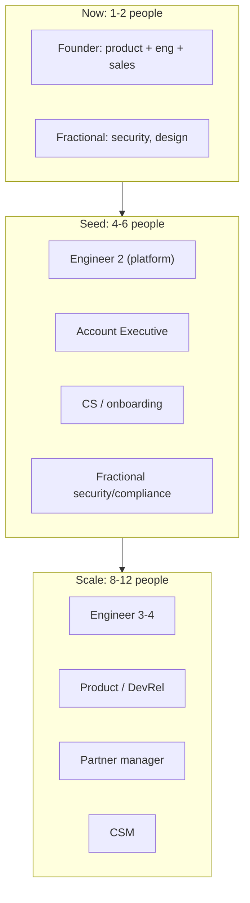

# 18 — Organization & Hiring

Org design evolution, role specifications, compensation philosophy, culture/values, hiring sequence, and advisors — sized to the readiness-first plan and the "PQC funds the platform" rule.

**Rule:** No optimization-only headcount until ≥$200K PQC ARR ([16-financial-model-and-fundraising.md](./16-financial-model-and-fundraising.md)).

---

## Org evolution

| Stage | Headcount | ARR | Focus |
|-------|-----------|-----|-------|
| Now | 1–2 | $0–$100K | Ship readiness; first pilots |
| Seed | 4–6 | $100K–$500K | Repeatable sales; Monitor; SOC2 |
| Scale | 8–12 | $500K–$1.5M | Self-serve; partners; enterprise |

---

## Hiring sequence

| # | Role | Trigger | Why first |
|---|------|---------|-----------|
| 1 | **Senior platform engineer** | Month 3–6 or $100K ARR | B3/B4 Monitor+Convert, D1 persistence, K2 site |
| 2 | **Fractional security/compliance lead** | Month 4–6 | SOC2, trust center, questionnaires ([12-platform-security-and-trust.md](./12-platform-security-and-trust.md)) |
| 3 | **Enterprise AE** | $100K ARR | Demo → SOW → Monitor close |
| 4 | **Customer Success / onboarding** | 10 Monitor customers | TTFV, retention, QBRs ([14-customer-success-and-retention.md](./14-customer-success-and-retention.md)) |
| 5 | **DevRel / technical content** | Q-Day hub launch | Inbound engine ([05-content-and-seo.md](./05-content-and-seo.md)) |
| 6 | **Partner manager** | 2 certified MSSPs | Channel scale ([15-partnerships-and-ecosystem.md](./15-partnerships-and-ecosystem.md)) |
| 7 | **Product manager** | $500K ARR | Own PRDs, roadmap |
| — | Optimization engineer | ≥$200K PQC ARR | Deferred per rule |

Until hire #1: founder-led eng on critical path (K2, B3); fractional SOC2; founder-led outbound.

---

## Role specifications (first hires)

### Senior platform engineer

| Field | Detail |
|-------|--------|
| Mission | Make Monitor + Convert production-grade, multi-tenant, observable |
| Responsibilities | Scheduled scans (B3), remediation workflow (B4), persistence (D1), API hardening, CI |
| Must-have | Python/FastAPI, Postgres, async workers, security-minded; SaaS multi-tenancy |
| Nice-to-have | Cryptography/TLS knowledge; Next.js |
| Success (90 days) | B3 scheduled scans in prod; diff alerts live |

### Fractional security/compliance lead

| Field | Detail |
|-------|--------|
| Mission | Achieve SOC 2 Type I; own trust center + questionnaires |
| Responsibilities | Controls, policies, Vanta/Drata, pen test mgmt, sub-processor governance |
| Must-have | SOC2 lead experience; SaaS security; questionnaire fluency |
| Success | Type I observation started; questionnaire turnaround < 3 days |

### Enterprise AE

| Field | Detail |
|-------|--------|
| Mission | Repeatable Assess → Monitor close in regulated mid-market |
| Responsibilities | Pipeline, demos, SOW, expansion handoff to CS |
| Must-have | Security/compliance SaaS sales; CISO selling; SOW discipline |
| Success | ≥1 Monitor close in first quarter; 3× pipeline coverage |

### Customer Success

| Field | Detail |
|-------|--------|
| Mission | Drive TTFV, retention, expansion |
| Responsibilities | Onboarding, health scores, QBRs, renewals |
| Must-have | Technical CS in security/infra SaaS |
| Success | NRR > 110%; onboarding checklist 100% |

---

## Compensation philosophy

| Principle | Detail |
|-----------|--------|
| Market-competitive cash | Benchmark to stage/region; transparent bands |
| Meaningful equity | Early hires get founder-adjacent equity; 4-yr/1-yr cliff |
| Role-based bands | Documented levels; avoid ad hoc offers |
| Sales comp | Base/variable (e.g. 50/50 OTE); quota tied to Monitor ARR + expansion |
| 409A + option plan | Before first equity grant |

(Set specific dollar bands with finance/counsel at hiring time; keep a private comp band sheet in the data room.)

---

## Culture & values

| Value | Meaning | In practice |
|-------|---------|-------------|
| **Honesty as moat** | We say what's true, including limits | "Inventory aid, not attestation"; publish when classical wins |
| **Evidence over hype** | Claims carry proof | Signed reports, benchmarks, verify links |
| **Customer security first** | We hold sensitive data | Dogfood; least privilege; trust center |
| **Speed with rigor** | Fast, not sloppy | DoD, tests, reviews |
| **Teach the market** | Educate buyers | Q-Day hub, transparent docs |

These extend the existing honesty stance in [03-strategy-and-priorities.md](../optimization_OLD_FUTURE/03-strategy-and-priorities.md).

---

## Advisors

| Type | Value | Target |
|------|-------|--------|
| Cryptography / PQC expert | Technical credibility, standards currency | Academic or OQS-adjacent |
| CISO advisor (regulated vertical) | ICP empathy, references, design partner intros | Banking or gov |
| GTM / SaaS sales advisor | Pricing, motion, hiring | Security SaaS operator |
| Compliance / legal advisor | SOC2, export, contracts | Fractional or board |

Compensate with modest advisor equity (e.g. 0.1–0.5%, 2-yr vest). Document in cap table.

---

## Contractors & fractional (pre-scale)

| Function | Model |
|----------|-------|
| Security/compliance (SOC2) | Fractional vCISO / consultant |
| Design / brand | Contract for [20-brand-identity-and-design-system.md](./20-brand-identity-and-design-system.md) |
| Content / SEO | Freelance writers under editorial guidelines |
| Legal | Outside counsel (corporate + export) |
| Accounting/bookkeeping | Fractional / firm |

---

## Onboarding (internal)

| Step | Day |
|------|-----|
| Access provisioning (least privilege) | 1 |
| Read roadmap (this folder) + AGENTS contract | 1–3 |
| Security training (handling customer data) | 1 |
| First PR / first customer shadow | 1–2 weeks |
| 30/60/90 goals set | 1 |

---

## Org KPIs

| Metric | Target |
|--------|--------|
| Time-to-hire (key roles) | < 60 days |
| Revenue per employee | Trend up; > $150K by scale |
| Voluntary attrition | < 10% |
| Offer acceptance rate | > 70% |

---

## Related docs

- Financial / use of funds: [16-financial-model-and-fundraising.md](./16-financial-model-and-fundraising.md)
- Business ops (original): [10-track-F-business-ops.md](../optimization_OLD_FUTURE/10-track-F-business-ops.md)
- Governance: [22-governance-and-operating-cadence.md](./22-governance-and-operating-cadence.md)
