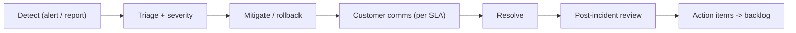

# 19 — Engineering Operating Model

CI/CD, testing, release management, environments, SRE/on-call, incident response, SLOs, and observability — the readiness-first view of how we build and run the platform reliably. Extends [13-track-I-engineering-operating-model.md](../optimization_OLD_FUTURE/13-track-I-engineering-operating-model.md).

**Principle:** Selling reliability and trust requires operating reliably. Uptime and incident discipline are sales assets.

---

## Engineering principles

| Principle | Detail |
|-----------|--------|
| Tests gate merges | No merge with failing backend/web tests |
| Reproducible builds | Pinned deps; lockfiles; `npm ci` |
| Secure by default | SSRF guards, least privilege, no secrets in repo |
| Observable | Structured logs, metrics, tracing per request |
| Definition of Done | Per-component DoD ([Track I7](../optimization_OLD_FUTURE/13-track-I-engineering-operating-model.md)) |

---

## CI/CD pipeline

```yaml
# .github/workflows/ci.yml (target)
on: [push, pull_request]
jobs:
  backend:
    - install from requirements.lock
    - pytest backend/tests/
    - ruff / mypy (optional gate)
  web:
    - npm ci (web/)
    - npm run lint && npm run build
    - playwright (main/nightly)
  security:
    - gitleaks
    - pip-audit / npm audit
    - CodeQL / Semgrep (SAST)
  pqc-dogfood:
    - weekly self-scan of qtangl.com (G7)
```

| Branch | Backend | Web |
|--------|---------|-----|
| `main` | Railway prod | Vercel prod |
| `develop` | Railway staging | Vercel preview |
| PR | — | Vercel preview |

Gates: backend tests pass, web build passes, gitleaks clean, no critical audit findings.

---

## Environments

| Env | Purpose | Data |
|-----|---------|------|
| local | Dev | In-memory / local Postgres |
| staging | Pre-prod QA, demos | Staging Postgres/Redis |
| production | Customers | Prod Postgres/Redis |

Env vars documented in [backend/README.md](../../backend/README.md); `.env.example` only; secrets in platform stores (G1).

---

## Testing strategy (readiness focus)

| Layer | Coverage target | Readiness-critical paths |
|-------|-----------------|--------------------------|
| Unit (pytest) | 100 → 200 tests | vulnerability classify, Mosca, diff, remediation |
| Integration (API) | All PQC routers | scan, report, diff, remediation, verify |
| Security regression | Always | SSRF rejections, tenant isolation, auth 401 |
| E2E (Playwright) | Core flows | homepage→demo/pqc, scan→report→verify, dashboard diff |
| Repro | Golden snapshots | report signing determinism, CBOM schema |

Must-pass before GA:

- [ ] `/pqc/scan` fixture + SSRF rejection
- [ ] `/pqc/report` all formats validate (incl. CBOM schema)
- [ ] `/verify` signature validation
- [ ] Scan diff deterministic
- [ ] Tenant isolation (G3)
- [ ] Auth invalid key → 401

---

## Release management

| Element | Practice |
|---------|----------|
| Model | GitHub Flow + semver tags (`v0.x.0`) |
| Branches | `feat/K2-homepage`, `fix/pqc-diff` (epic-ID prefixed) |
| Changelog | [web/app/docs/resources/changelog](../../web/app/docs/resources/changelog/page.tsx) updated per release |
| Release checklist | Tests green, migrations reviewed, changelog, rollback noted |
| Feature flags | Gate Monitor/Convert betas per tenant |

---

## Service levels (SLOs)

| Service | SLO | Error budget |
|---------|-----|--------------|
| API availability | 99.9% monthly | ~43 min/mo |
| Scan success rate | > 95% | — |
| Scheduled scan on-time | > 99% | — |
| Report generation | < 15 min live, < 5 min fixture | — |
| Alert latency | < 5 min post-scan | — |
| Verify endpoint | 99.95% (public trust) | — |

SLAs offered to customers (response/uptime commitments) in [14-customer-success-and-retention.md](./14-customer-success-and-retention.md); SLOs here are internal engineering targets.

---

## Observability

| Pillar | Implementation |
|--------|----------------|
| Logs | Structured JSON; `X-Request-Id`; PII/PHI redaction (G9) |
| Metrics | Scan counts, durations, success rate, queue depth, error rate |
| Tracing | Per-request trace IDs across API → worker |
| Dashboards | Scan health, scheduler reliability, tenant usage |
| Alerting | Scan failures, scheduler misses, error-rate spikes, cert-expiry for our own infra |

Maps to Track D3 (observability). Product telemetry events in [10-metrics-and-risks.md](./10-metrics-and-risks.md).

---

## SRE & on-call

| Element | Early-stage practice |
|---------|----------------------|
| On-call | Founder/eng rotation; pager via uptime monitor |
| Runbooks | Per-service: scan stuck, worker down, DB failover |
| Status page | Public (Better Uptime / Instatus) — trust signal |
| Capacity | Scale workers horizontally (Track D6); scan concurrency caps |
| Backups | Postgres automated backups; tested restore |

---

## Incident response



| Severity | Definition | Response |
|----------|------------|----------|
| Sev1 | Outage, data exposure, key compromise | Immediate; continuous; customer notify ≤24h |
| Sev2 | Degraded (alerts late, scans failing) | Same business day |
| Sev3 | Minor bug | Next release |

Security incidents also follow [12-platform-security-and-trust.md](./12-platform-security-and-trust.md); breach notification per [17-legal-regulatory-and-compliance.md](./17-legal-regulatory-and-compliance.md). Blameless PIRs; track actions to closure.

---

## Disaster recovery & business continuity

| Item | Target |
|------|--------|
| RPO (data loss tolerance) | ≤ 24h (backup cadence) |
| RTO (restore time) | ≤ 4h staging; ≤ 8h prod |
| Backup testing | Quarterly restore drill |
| Provider outage | Documented failover/runbook |
| Key management continuity | Signing key backup + rotation procedure (G1) |

---

## Definition of Done (readiness components)

| Component | DoD |
|-----------|-----|
| PQC API endpoint | OpenAPI, tests, auth, error responses, rate limit, SSRF review |
| Report/export | Schema validates, signing deterministic, snapshot test |
| Monitor feature | Scheduler reliability test, diff determinism, alert path |
| Web page | Lint + build pass, WCAG spot check, e2e |
| Epic | Acceptance criteria checked; status → done |

---

## Engineering KPIs

| Metric | 6 mo | 12 mo |
|--------|------|-------|
| CI pass rate on main | > 95% | > 98% |
| Backend test count | 100 | 200 |
| Deploy frequency | Weekly | Daily (web) / weekly (backend) |
| MTTR (prod) | < 8h | < 2h |
| Critical vulns open > 7 days | 0 | 0 |
| API availability | 99.5% | 99.9% |

---

## Related docs

- Engineering track (original): [13-track-I-engineering-operating-model.md](../optimization_OLD_FUTURE/13-track-I-engineering-operating-model.md)
- Enterprise scale: [08-track-D-enterprise-scale.md](../optimization_OLD_FUTURE/08-track-D-enterprise-scale.md)
- Security/trust: [12-platform-security-and-trust.md](./12-platform-security-and-trust.md)
- Metrics: [10-metrics-and-risks.md](./10-metrics-and-risks.md)
