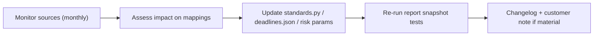
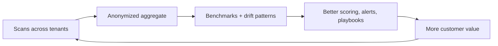

# 21 — Data & Threat Intelligence

How scan data, standards tracking, and benchmarking compound into a defensible data asset and a future "Readiness Index" data product — plus the process to stay current with the fast-moving PQC standards landscape.

**Principle:** Every scan makes the product smarter and the moat deeper — handled with strict privacy and customer-data boundaries.

---

## Data assets

| Asset | Source | Value |
|-------|--------|-------|
| Crypto asset classifications | Scans | Improve detection coverage + accuracy |
| Vulnerability mappings | [vulnerability.py](../../backend/app/pqc/vulnerability.py) | Keep current with standards |
| Mosca / risk parameters | [risk.py](../../backend/app/pqc/risk.py), [risk_assumptions.json](../../demos/pqc_migration/data/risk_assumptions.json) | Sharper HNDL scoring |
| Remediation playbooks | [standards.py](../../backend/app/pqc/standards.py) | Better, faster guidance |
| Anonymized posture benchmarks | Aggregated scans | "How do I compare?" — sales + product |
| Drift patterns | [monitoring/diff.py](../../backend/app/monitoring/diff.py) | Predict regressions; tune alerts |

---

## Data boundaries & governance

**Hard rules** (also legal — [17-legal-regulatory-and-compliance.md](./17-legal-regulatory-and-compliance.md), security — [12-platform-security-and-trust.md](./12-platform-security-and-trust.md)):

| Rule | Detail |
|------|--------|
| Customer owns their data | Per-tenant; never shared raw |
| Aggregate insights only | Benchmarks use anonymized, k-anonymized aggregates |
| No re-identification | Strip hostnames/identifiers from aggregates |
| Opt-in for benchmarking | Contractual consent for aggregate participation |
| Retention | Scan artifacts 12 months; PEM uploads 24h |
| Isolation | Row-level tenant scoping (G3) |

**Never** market a customer's specific findings without explicit permission.

---

## Threat & standards intelligence

PQC standards move quickly. Stale mappings = wrong advice = lost trust.

### Sources to monitor

| Source | What | Cadence |
|--------|------|---------|
| NIST (FIPS 203/204/205, IR 8547) | Algorithm standards, transition guidance | On publication |
| NSA CNSA 2.0 | Suite + timelines | On update |
| NSM-10 / CISA | Federal mandates, deadlines | Quarterly |
| NIST NCCoE Migration to PQC | Reference practices | Quarterly |
| IETF (TLS WG, hybrid KEX drafts) | PQ TLS evolution | Monthly |
| IACR / academic | Cryptanalysis, Q-Day estimates | Monthly |
| CA/Browser Forum | Cert policy shifts | As published |
| OQS releases | liboqs/provider changes | On release |

### Standards-tracking process

Owner: engineering, monthly ritual ([22-governance-and-operating-cadence.md](./22-governance-and-operating-cadence.md)). Material changes (e.g. new deadline, deprecated algorithm) trigger customer comms.

### Files kept current

| File | Contains |
|------|----------|
| [standards.py](../../backend/app/pqc/standards.py) | Framework defs, mappings, remediation actions |
| [standards.json](../../demos/pqc_migration/data/standards.json) | Framework metadata |
| [deadlines.json](../../demos/pqc_migration/data/deadlines.json) | Deadline tiers per framework |
| [risk_assumptions.json](../../demos/pqc_migration/data/risk_assumptions.json) | Mosca X/Y/Z defaults |

---

## Benchmarking & "Readiness Index" (future data product)

As scan volume grows, anonymized aggregates become a unique market dataset.

| Stage | Offering | Requirement |
|-------|----------|-------------|
| 1 | Internal benchmarks (tune product) | Any volume |
| 2 | "You vs peers" band in reports | k-anonymity threshold (e.g. ≥10 orgs/segment) |
| 3 | Published **Q-Day Readiness Index** report (annual, by vertical) | Consent + privacy review + PR |
| 4 | API/data feed for partners (anonymized trends) | Legal + pricing |

**Marketing value:** An annual industry readiness report = inbound + analyst credibility + thought leadership ([05-content-and-seo.md](./05-content-and-seo.md)).

---

## Detection quality program

| Activity | Goal |
|----------|------|
| False-positive/negative review | Improve classification accuracy |
| Coverage expansion | More asset kinds (e.g. VPN, DB TLS, mTLS, code signing) |
| Algorithm library updates | New PQC algorithms as standardized |
| Fixture vs live tolerance | Detect drift between demo and live ([07-track-C](../optimization_OLD_FUTURE/07-track-C-validation.md)) |
| Golden snapshots | Report/CBOM determinism in CI |

---

## Data-driven product loops

---

## Data KPIs

| Metric | Target |
|--------|--------|
| Classification accuracy (sampled) | > 95% |
| Standards-update lag (publish → mapping) | < 30 days |
| Benchmark segments at k-anonymity | Grow with volume |
| Snapshot test pass rate | 100% |
| Material standards changes communicated | 100% |

---

## Related docs

- Security/data boundaries: [12-platform-security-and-trust.md](./12-platform-security-and-trust.md)
- Legal/IP on aggregates: [17-legal-regulatory-and-compliance.md](./17-legal-regulatory-and-compliance.md)
- Content (Readiness Index): [05-content-and-seo.md](./05-content-and-seo.md)
- Validation: [07-track-C-validation.md](../optimization_OLD_FUTURE/07-track-C-validation.md)
