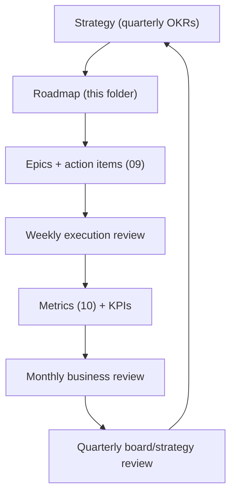

# 22 — Governance & Operating Cadence

How the transformation is run: decision rights (RACI), OKRs, meeting cadence, roadmap maintenance, and board/advisor governance. This keeps the multi-doc roadmap a living system, not a one-time artifact.

---

## Operating system overview

---

## Decision rights (RACI)

R = Responsible · A = Accountable · C = Consulted · I = Informed

| Decision | Founder/CEO | Eng lead | GTM/Sales | Security | Advisors |
|----------|-------------|----------|-----------|----------|----------|
| Positioning / tagline | A/R | C | C | I | C |
| Pricing / packaging changes >$ threshold | A/R | I | C | I | C |
| Roadmap priority / epic sequencing | A | R | C | C | I |
| Public benchmark/claims | A | R | C | C | C |
| Regulated pilot go/no-go | A | C | C | R | I |
| Security incident response | A | C | I | R | I |
| Hiring (key roles) | A/R | C | C | C | C |
| Fundraise terms | A/R | I | I | I | C |
| Architecture decisions (ADR) | A | R | I | C | C |

Escalation: any **gate** violation (security, honesty, regulated data) escalates to Founder + Security; no override on regulated-data gate.

---

## OKRs (quarterly)

Set 3–4 objectives/quarter; each with 2–4 measurable key results tied to [10-metrics-and-risks.md](./10-metrics-and-risks.md).

### Example — Q3 2026 (illustrative)

| Objective | Key results |
|-----------|-------------|
| **O1: Reposition the front door** | Homepage readiness-first live; PQC in primary nav; demo/pqc starts +50% |
| **O2: Land first recurring revenue** | 1 Monitor signed; 2 assessments delivered; ≥1 net-new critical finding each |
| **O3: Earn trust** | Trust center live; self-scan in CI; SOC2 Type I observation started |
| **O4: Build the funnel** | Q-Day hub live; 4 framework guides; 10 outbound/week sustained |

OKRs cascade to Track K epics ([09-epics-and-backlog.md](./09-epics-and-backlog.md)).

---

## Meeting cadence

| Cadence | Meeting | Inputs | Outputs |
|---------|---------|--------|---------|
| **Weekly** | Execution review | Epic status (09), action items, blockers | Updated statuses; unblock decisions |
| **Weekly** | Pipeline review | CRM, demos, SOWs | Forecast; next actions |
| **Bi-weekly** | Product/eng sync | PRDs (13), backlog | Sequencing; DoD checks |
| **Monthly** | Business review | KPIs (10/16), financial actuals | Reprioritization; risk updates |
| **Monthly** | Standards/threat-intel | Sources scan (21) | Mapping updates; customer notes |
| **Quarterly** | Strategy + OKR reset | OKRs, assumptions, win/loss (11) | New OKRs; roadmap edits |
| **Quarterly** | Board/advisor update | Metrics, runway, asks | Decisions; intros |

Use the existing [weekly-review-template.md](../optimization_OLD_FUTURE/templates/weekly-review-template.md), extended with the Track K section in [10-metrics-and-risks.md](./10-metrics-and-risks.md).

---

## Roadmap maintenance

This roadmap is a **living system**. Rules:

| Rule | Detail |
|------|--------|
| Source of truth | This folder (`roadmap/quantum-readiness/`) |
| Status discipline | Epic statuses updated weekly (09) |
| Doc ownership | Each doc has an owner (table below) |
| Change log | Material strategy changes noted in doc footer + monthly review |
| Public sync | Update [web/lib/docs/roadmap.ts](../../web/lib/docs/roadmap.ts) bands when product status shifts |
| ADRs | Significant decisions recorded as ADRs ([adr-template](../optimization_OLD_FUTURE/templates/adr-template.md)) |
| Review | Full roadmap re-read each quarter for drift |

### Doc ownership

| Doc(s) | Owner |
|--------|-------|
| 00–02 strategy/journey | Founder |
| 03, 13, prds/ product | Product/Eng |
| 04, 05, 20 web/content/brand | Marketing |
| 06, 11, sales-enablement/, vertical-playbooks/ | GTM |
| 07, 19 scaling/eng ops | Eng |
| 12, 17 security/legal | Security/Founder |
| 14, 15 CS/partners | CS/GTM |
| 16, 18, 22 finance/org/governance | Founder |
| 21 data/threat-intel | Eng |
| 08, 09, 10 execution/epics/metrics | Founder + leads |

---

## Gate governance

From [03-strategy-and-priorities.md](../optimization_OLD_FUTURE/03-strategy-and-priorities.md), enforced here:

| Gate | Rule | Owner |
|------|------|-------|
| Security gate | No regulated-data pilot without Track G minimum | Security |
| Honesty gate | No "quantum wins" claim without benchmark evidence | Eng + Founder |
| Tenancy gate | No enterprise multi-tenant without persistence (D1) | Eng |
| Phase gates | G1–G5 in [08-execution-plan.md](./08-execution-plan.md) | Founder |

---

## Risk & assumption governance

| Activity | Cadence | Doc |
|----------|---------|-----|
| Risk register review | Monthly (triggers anytime) | [10-metrics-and-risks.md](./10-metrics-and-risks.md) |
| Assumption validation | Quarterly | [10](./10-metrics-and-risks.md) + [assumptions](../optimization_OLD_FUTURE/backlog/assumptions-and-open-questions.md) |
| Win/loss synthesis | Quarterly | [11-competitive-intelligence.md](./11-competitive-intelligence.md) |
| Invalidation playbook | On trigger | [10](./10-metrics-and-risks.md) |

---

## Tooling

| Function | Tool |
|----------|------|
| Roadmap | This repo (markdown) |
| Epics/tasks | Backlog docs → GitHub issues/projects at scale |
| CRM | HubSpot/Pipedrive post-first-pilot |
| Metrics | PostHog/Plausible + spreadsheet → dashboard |
| Docs/decisions | Repo + ADRs |
| Comms | Slack; shared customer channels (Enterprise) |

---

## Decision log (ADRs)

Record significant transformation decisions as ADRs in `roadmap/adrs/` (or the historical folder), e.g.:

- ADR-005: Readiness-first positioning (Track K1)
- ADR-006: Optimization demoted to `/platform/optimize`
- ADR-007: Convert tier = orchestration + verification (not migration labor)

---

## Acceptance criteria (governance workstream)

- [ ] Quarterly OKRs set and cascaded to Track K epics
- [ ] Weekly review includes Track K section
- [ ] Each doc has a named owner
- [ ] ADRs recorded for major decisions
- [ ] Public roadmap synced when product bands shift (`web/lib/docs/roadmap.ts`)

---

## Related docs

- Execution plan/gates: [08-execution-plan.md](./08-execution-plan.md)
- Epics: [09-epics-and-backlog.md](./09-epics-and-backlog.md)
- Metrics/risks: [10-metrics-and-risks.md](./10-metrics-and-risks.md)
- Operating cadence (original): [10-track-F-business-ops.md](../optimization_OLD_FUTURE/10-track-F-business-ops.md)
