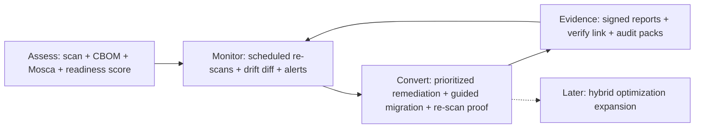

# Qtangl Quantum-Readiness Transformation Roadmap

**Strategic initiative** to reposition Qtangl from a "Quantum Planning API" into a **post-quantum readiness platform** — leading with Assess → Monitor → Convert, while keeping hybrid optimization as the forward-looking expansion story.

This folder is the **transformation playbook**: strategy, brand, customer journey, solution architecture, website spec, content/GTM, scaling, execution phases, epics, and metrics. It complements the historical execution tracks in [optimization_OLD_FUTURE](../optimization_OLD_FUTURE/README.md).

---

## North star

**Help organizations assess quantum crypto exposure, monitor drift until Q-Day, and convert their stack with auditable evidence — then unlock quantum advantage when they're ready.**

*Quantum is the threat on the PQC path, not the engine. Optimization remains the expansion path once defense is proven.*

---

## How to use this roadmap

| Audience | Start here | Then read |
|----------|------------|-----------|
| **Founder / leadership** | [00-transformation-thesis.md](./00-transformation-thesis.md) | [01](./01-positioning-and-brand.md) → [06](./06-gtm-and-pricing.md) → [08](./08-execution-plan.md) → [22](./22-governance-and-operating-cadence.md) |
| **Product / GTM** | [02-customer-journey.md](./02-customer-journey.md) | [03](./03-solution-architecture.md) → [13](./13-product-requirements.md) → [06](./06-gtm-and-pricing.md) → [04](./04-website-transformation.md) |
| **Sales** | [06-gtm-and-pricing.md](./06-gtm-and-pricing.md) | [11](./11-competitive-intelligence.md) → [sales-enablement/](./sales-enablement/battlecards.md) → [vertical-playbooks/](./vertical-playbooks/banking.md) |
| **Marketing / content** | [01-positioning-and-brand.md](./01-positioning-and-brand.md) | [04](./04-website-transformation.md) → [05](./05-content-and-seo.md) → [20](./20-brand-identity-and-design-system.md) |
| **Engineering** | [03-solution-architecture.md](./03-solution-architecture.md) | [13](./13-product-requirements.md) → [19](./19-engineering-operating-model.md) → [09](./09-epics-and-backlog.md) → [06-track-B](../optimization_OLD_FUTURE/06-track-B-pqc-product.md) |
| **Security / compliance buyer-facing** | [12-platform-security-and-trust.md](./12-platform-security-and-trust.md) | [17](./17-legal-regulatory-and-compliance.md) → [21](./21-data-and-threat-intelligence.md) |
| **Customer success** | [14-customer-success-and-retention.md](./14-customer-success-and-retention.md) | [02](./02-customer-journey.md) → [10](./10-metrics-and-risks.md) |
| **Investor / board** | [00-transformation-thesis.md](./00-transformation-thesis.md) | [16](./16-financial-model-and-fundraising.md) → [24](./24-federal-funding-and-grants.md) → [07](./07-scaling.md) → [10](./10-metrics-and-risks.md) → [11](./11-competitive-intelligence.md) |
| **Federal funding / SBIR** | [24-federal-funding-and-grants.md](./24-federal-funding-and-grants.md) | [federal-funding/](./federal-funding/README.md) → [checklist](./federal-funding/checklist-and-tracker.md) → [templates](./federal-funding/templates/nsf-project-pitch.md) |
| **New team member** | [23-glossary-and-references.md](./23-glossary-and-references.md) | [00](./00-transformation-thesis.md) → [02](./02-customer-journey.md) |

**Weekly cadence:** Track K epics in [09-epics-and-backlog.md](./09-epics-and-backlog.md). Cross-check [optimization_OLD_FUTURE/backlog/epics.md](../optimization_OLD_FUTURE/backlog/epics.md) for Tracks B, E, H when implementation starts.

---

## Status legend

Same as main roadmap:

| Status | Meaning |
|--------|---------|
| `ga` | Generally available; production-safe default path |
| `pilot` | Works in demo/fixture mode; design-partner ready with caveats |
| `coming-soon` | Scaffolded or specced; not yet live |
| `research` | Experimental; not committed to product |

Epic statuses: `not-started` | `in-progress` | `blocked` | `done`.

---

## Document map

The roadmap is organized in seven thematic layers. Docs 00–10 are the core strategy + execution spine; 11–23 add the enterprise-grade depth; the subfolders hold operational artifacts.

### Strategy & positioning

| Doc | Purpose |
|-----|---------|
| [00-transformation-thesis.md](./00-transformation-thesis.md) | Why pivot now; lead-with-readiness decision; before/after identity |
| [01-positioning-and-brand.md](./01-positioning-and-brand.md) | Value prop, messaging hierarchy, voice/lexicon, taglines |
| [02-customer-journey.md](./02-customer-journey.md) | Personas, maturity model, Assess → Monitor → Convert system |
| [11-competitive-intelligence.md](./11-competitive-intelligence.md) | Competitor teardowns, positioning map, win/loss framework |

### Product & engineering

| Doc | Purpose |
|-----|---------|
| [03-solution-architecture.md](./03-solution-architecture.md) | Capability map, Convert tier, integrations, platform diagram |
| [13-product-requirements.md](./13-product-requirements.md) | PRD index → [prds/](./prds/assess-prd.md) (Assess, Monitor, Convert) |
| [19-engineering-operating-model.md](./19-engineering-operating-model.md) | CI/CD, testing, SRE/on-call, incident response, SLOs, observability |
| [21-data-and-threat-intelligence.md](./21-data-and-threat-intelligence.md) | Data strategy, standards tracking, benchmarking, Readiness Index |

### Marketing & website

| Doc | Purpose |
|-----|---------|
| [04-website-transformation.md](./04-website-transformation.md) | IA, homepage rewrite spec, new pages, copy modules, SEO |
| [05-content-and-seo.md](./05-content-and-seo.md) | Q-Day hub, framework guides, keyword map, content calendar |
| [20-brand-identity-and-design-system.md](./20-brand-identity-and-design-system.md) | Visual identity, design tokens, WCAG accessibility, trust visuals |

### Go-to-market & revenue

| Doc | Purpose |
|-----|---------|
| [06-gtm-and-pricing.md](./06-gtm-and-pricing.md) | ICP, packaging, pricing, sales motion, partners, funnel |
| [14-customer-success-and-retention.md](./14-customer-success-and-retention.md) | Onboarding, health scores, QBRs, renewal, churn, SLAs |
| [15-partnerships-and-ecosystem.md](./15-partnerships-and-ecosystem.md) | Tech alliances, MSSP channel, marketplaces, integrations |
| [16-financial-model-and-fundraising.md](./16-financial-model-and-fundraising.md) | Unit economics, CAC/LTV/NRR, scenarios, fundraising, data room |
| [24-federal-funding-and-grants.md](./24-federal-funding-and-grants.md) | SBIR/STTR, federal contracts, NIST COI, 30/60/90 roadmap |
| [federal-funding/](./federal-funding/README.md) | Checklists, registration guide, link directory, proposal templates |
| [sales-enablement/](./sales-enablement/battlecards.md) | Battlecards, discovery + demo, ROI calculator, objection handling |
| [vertical-playbooks/](./vertical-playbooks/banking.md) | Banking, government/defense, healthcare playbooks |

### Trust, legal & compliance

| Doc | Purpose |
|-----|---------|
| [12-platform-security-and-trust.md](./12-platform-security-and-trust.md) | Our own posture, trust center, SOC2, dogfooding, disclosure |
| [17-legal-regulatory-and-compliance.md](./17-legal-regulatory-and-compliance.md) | MSA/DPA/BAA, IP, crypto export control, insurance, ToS |

### Organization & governance

| Doc | Purpose |
|-----|---------|
| [18-organization-and-hiring.md](./18-organization-and-hiring.md) | Org design, role specs, comp, culture, hiring, advisors |
| [22-governance-and-operating-cadence.md](./22-governance-and-operating-cadence.md) | RACI, OKRs, meeting cadence, roadmap maintenance |

### Execution & reference

| Doc | Purpose |
|-----|---------|
| [07-scaling.md](./07-scaling.md) | Pilot → SaaS → multi-tenant → partner-led conversion |
| [08-execution-plan.md](./08-execution-plan.md) | Phase 0–3 plan, gates, Gantt, mapping to main tracks |
| [09-epics-and-backlog.md](./09-epics-and-backlog.md) | Track K1–K15 epics register + granular action items |
| [10-metrics-and-risks.md](./10-metrics-and-risks.md) | Transformation KPIs, risks, assumptions |
| [23-glossary-and-references.md](./23-glossary-and-references.md) | PQC glossary, acronyms, standards refs, cross-reference map |

---

## Phase summary

```
Phase 0 (Weeks 0–2)   Strategy lock + brand + website copy spec
Phase 1 (Weeks 2–8)   Website repositioning + readiness landing pages
Phase 2 (Weeks 4–16)  Product journey polish (Assess → Monitor → Convert UX)
Phase 3 (Weeks 8–24)  GTM scale: content engine, partners, self-serve Monitor
```

Full detail: [08-execution-plan.md](./08-execution-plan.md).

---

## Customer journey (system overview)



---

## Related main-roadmap tracks

| Track | Role in transformation |
|-------|------------------------|
| [06-track-B-pqc-product.md](../optimization_OLD_FUTURE/06-track-B-pqc-product.md) | Core PQC product (scan, CBOM, monitoring, remediation) |
| [09-track-E-gtm.md](../optimization_OLD_FUTURE/09-track-E-gtm.md) | Design partners, partnerships, DevRel |
| [12-track-H-product-and-onboarding.md](../optimization_OLD_FUTURE/12-track-H-product-and-onboarding.md) | Demo → pilot → SaaS lifecycle |
| [17-financial-model.md](../optimization_OLD_FUTURE/17-financial-model.md) | Unit economics and pricing bands |

**Collateral:** [demos/pqc_migration/](../../demos/pqc_migration/) · [templates/pqc-pilot-sow.md](../optimization_OLD_FUTURE/templates/pqc-pilot-sow.md)

---

*Last updated: 2026-06-10. Initiative: Track K — Readiness Transformation.*
