# PRD — Assess

**Tier:** Assess (Stage 1) · **Status:** draft · **Owner:** Product

The one-session baseline: from a domain or upload to a signed, prioritized, framework-mapped Q-Day readiness report.

---

## Summary & goal

Enable a security buyer to obtain a complete, defensible baseline of their quantum-vulnerable cryptography in a single working session — inventory, Mosca HNDL risk, prioritized remediation backlog, CBOM, and a signed PDF with a public verify link.

**Success:** Buyer identifies ≥1 critical item they didn't previously track and accepts a Monitor proposal.

---

## Personas & jobs-to-be-done

| Persona | Job |
|---------|-----|
| CISO | "Answer the board's exposure question with evidence" |
| Compliance lead | "Produce audit-ready proof of migration planning" |
| VP Engineering | "Get a prioritized, actionable backlog my teams can execute" |

---

## User stories

- As a **CISO**, I want to scan a domain (or upload a PEM/cloud inventory) and get a readiness score, so that I can report exposure to the board.
- As a **compliance lead**, I want findings mapped to NIST/CMMC/PCI frameworks, so that I can attach them to an audit.
- As a **VP Eng**, I want a prioritized backlog with effort and deadlines, so that I can plan sprints.
- As a **buyer**, I want a signed report with a verify link, so that auditors trust it.
- As an **evaluator**, I want a fixture demo before authorizing a live scan, so that I can assess value with zero risk.

---

## Functional requirements

| ID | Priority | Requirement |
|----|----------|-------------|
| FR-A1 | M | Accept scan target: domain, PEM bundle upload, or cloud inventory JSON (ACM/Key Vault/K8s) |
| FR-A2 | M | Run fixture scenario (bank/CMMC/healthcare) without live scan |
| FR-A3 | M | Run authorized live scan: TLS, CT enumeration, SSH, JWKS, SMTP STARTTLS |
| FR-A4 | M | Classify each asset: algorithm, key size, vulnerability status, severity |
| FR-A5 | M | Compute Mosca HNDL assessment (X+Y vs Z) and per-asset priority |
| FR-A6 | M | Compute readiness score + band + coverage confidence |
| FR-A7 | M | Generate prioritized remediation backlog with action, PQC algorithm, deadline, effort |
| FR-A8 | M | Export PDF, JSON, CSV, CycloneDX CBOM |
| FR-A9 | M | Sign report (Ed25519); expose `/verify?scanId=` |
| FR-A10 | M | Map assets to frameworks (NIST IR 8547, CNSA 2.0, NSM-10, PCI-DSS 4.0, CMMC) |
| FR-A11 | S | PQ TLS handshake proof appendix (OQS) |
| FR-A12 | S | Free mini-assessment mode (fixture-only, email-gated, top-5 findings) |
| FR-A13 | S | Executive / board / auditor report variants |
| FR-A14 | C | What-if readiness projection from selected remediations |
| FR-A15 | C | Compare against industry benchmark band ([21-data-and-threat-intelligence.md](../21-data-and-threat-intelligence.md)) |

---

## Non-functional requirements

| ID | Requirement |
|----|-------------|
| NFR-A1 | Time to report: < 5 min fixture; < 15 min live (typical domain) |
| NFR-A2 | SSRF guards reject private/loopback/metadata targets ([safety.py](../../../backend/app/pqc/safety.py)) |
| NFR-A3 | Scan capped by `QTANGL_PQC_MAX_ENDPOINTS` / `QTANGL_PQC_SCAN_TIMEOUT` |
| NFR-A4 | PEM uploads deleted within 24h |
| NFR-A5 | Report rendering accessible (WCAG 2.2 AA) ([20-brand-identity-and-design-system.md](../20-brand-identity-and-design-system.md)) |
| NFR-A6 | Scan completion rate > 95% |

---

## UX flow

```mermaid
flowchart LR
  Start["Enter domain / upload"] --> Authz["Authorize scan"]
  Authz --> Progress["Live scan progress: CT, TLS, classify"]
  Progress --> Results["Inventory + heatmap + severity donut"]
  Results --> Mosca["Mosca HNDL timeline"]
  Mosca --> Backlog["Prioritized remediation backlog"]
  Backlog --> Export["Export PDF / CBOM + verify link"]
  Export --> Upsell["Drift demo + Monitor proposal"]
```

Components: QDayCommandCenter, InventoryHeatmap, SeverityDonut, RemediationBacklog, ReportDrawer ([03-solution-architecture.md](../03-solution-architecture.md)).

---

## Data & API

| Entity | Notes |
|--------|-------|
| Scan | scanId, tenantId, targetDomain, readinessScore, generatedAt |
| Asset | host, port, kind, algorithm, keySize, vulnerability |
| RemediationItem | priority, action, pqcAlgorithm, deadline, effortDays, severity |

| Endpoint | Purpose |
|----------|---------|
| `POST /pqc/scan` | Start scan (fixture or live) |
| `GET /pqc/scan/{id}` | Poll status |
| `GET /pqc/report/{id}?format=` | pdf/json/csv/cbom/executive/board/auditor |
| `GET /verify?scanId=` | Public signature verification |

---

## Telemetry

| Event | Properties |
|-------|------------|
| `scan_started` | mode (fixture/live/mini), scenario, source |
| `scan_completed` | assets, qVulnerable, readinessScore, durationMs |
| `report_exported` | format |
| `verify_viewed` | scanId, referrer |
| `mini_assess_email_captured` | domain |
| `monitor_proposed` | scanId |

---

## Acceptance criteria

- [x] Live scan completes for a real domain and produces signed PDF + CBOM in one session
- [x] SSRF attempts blocked (metadata IP, RFC1918, loopback)
- [x] Mini-assessment captures email and shows top-5 findings (fixture)
- [x] Verify link validates signature and shows provenance
- [x] Framework mapping present for each in-scope asset class
- [x] Readout flow surfaces drift demo + Monitor proposal

---

## Open questions

- Default live-scan depth for self-serve vs sales-led?
- Mini-assessment rate limiting per email domain?
- Which cloud inventory formats to support first (ACM vs Key Vault)?
