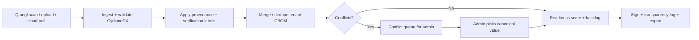
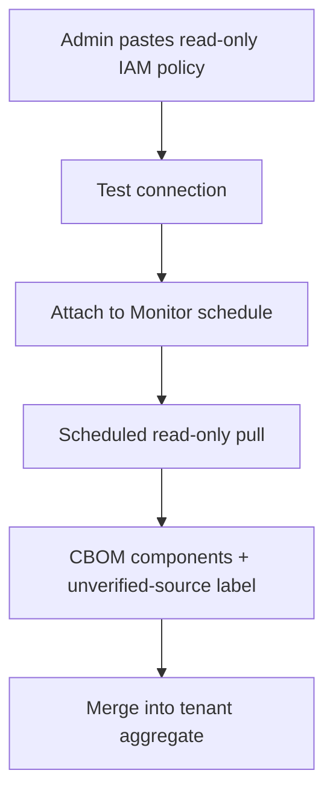

# PRD — CBOM Ingestion & Neutral Aggregation

**Tier:** Cross-cutting (feeds Assess · Monitor · Convert) · **Status:** draft · **Owner:** Product

Accept cryptographic inventory from Qtangl scans and third-party tools, merge it with provenance and honest confidence labels, and produce a single tenant CBOM that powers scoring, drift, and signed evidence.

---

## Summary & goal

Let customers **bring existing CBOMs** (Keyfactor, SandboxAQ, IBM CBOMkit, manual exports, cloud KMS inventory) into Qtangl without re-running discovery. Qtangl normalizes, deduplicates, tags provenance, and produces one **neutral aggregated CBOM** — then signs and tracks it through the evidence layer.

**Success:** ≥40% of enterprise pilots ingest ≥1 third-party CBOM; aggregated CBOM drives readiness score without silent data loss; zero incidents of mislabeled verified coverage.

---

## Personas & jobs-to-be-done

| Persona | Job |
|---------|-----|
| CISO | "Unify crypto inventory from three tools into one score and one audit story" |
| VP Engineering | "Import our Keyfactor export without a rip-and-replace project" |
| Cloud architect | "Pull ACM and Key Vault cert metadata read-only into the CBOM" |
| Compliance lead | "See which components came from which source and what's unverified" |
| MSSP | "Ingest customer CBOMs from their incumbent and deliver Qtangl evidence on top" |

---

## User stories

- As a **CISO**, I want to upload a CycloneDX CBOM from our discovery vendor, so that Qtangl scores our full program not just external TLS.
- As a **VP Eng**, I want duplicate components merged across uploads, so that I don't maintain parallel inventories.
- As a **cloud architect**, I want read-only AWS/Azure connectors, so that KMS and cert metadata stays current without exporting keys.
- As a **compliance lead**, I want every component tagged with source and verification status, so that auditors see what's proven vs imported.
- As a **buyer**, I want merge conflicts surfaced when two sources disagree on algorithm, so that we resolve gaps explicitly.
- As an **admin**, I want to schedule cloud pulls on the Monitor cadence, so that aggregated CBOM reflects drift.

---

## Functional requirements

| ID | Priority | Requirement |
|----|----------|-------------|
| FR-I1 | M | Accept CBOM upload: CycloneDX JSON **1.6** and **1.7** (`application/vnd.cyclonedx+json`) |
| FR-I2 | M | Accept Qtangl-native scan output as a first-class source (`qtangl:agentless-scan`) |
| FR-I3 | M | **Provenance tag** every component: `sourceId`, `sourceType`, `sourceLabel`, `ingestedAt`, `sourceMethod` |
| FR-I4 | M | **Verification status** per component: `verified` (Qtangl live scan), `imported` (trusted upload), `unverified-source` (unknown/unattested) |
| FR-I5 | M | **Merge/dedupe** components by stable key: `(name, type, bom-ref)` with fallback fingerprint (alg + location + serial) |
| FR-I6 | M | On conflict (same key, different alg/size/status): create `MergeConflict` record; do not silent overwrite |
| FR-I7 | M | Aggregated tenant CBOM is the input to readiness score, Mosca, and backlog (with coverage confidence downgrade for unverified share) |
| FR-I8 | M | Export aggregated CBOM as CycloneDX 1.6/1.7 with Qtangl extensions namespace for provenance |
| FR-I9 | M | UI: ingestion history per source; counts verified vs unverified; conflict queue |
| FR-I10 | S | Map common third-party labels (Keyfactor, SandboxAQ, IBM, Fortanix, manual) to `sourceType` enum |
| FR-I11 | S | Scheduled re-ingestion hook for Monitor tier (weekly/monthly) |
| FR-I12 | S | PEM / cert bundle upload → CBOM components with `sourceType: upload` |
| FR-I13 | S | Diff aggregated CBOM between ingest events (feeds Monitor drift) |
| FR-I14 | S | API: `POST /pqc/cbom/ingest`, `GET /pqc/cbom/aggregate`, `GET /pqc/cbom/conflicts` |
| FR-I15 | C | BOM-link / VEX reference attachment per component |
| FR-I16 | C | Webhook on ingest complete with provenance summary |

### Cloud / KMS read-only credential model

| ID | Priority | Requirement |
|----|----------|-------------|
| FR-C1 | M | Store integration credentials encrypted in `TenantIntegration`; never log secret material |
| FR-C2 | M | **Read-only IAM** policy templates: `acm:List*`, `acm:Describe*`, `kms:List*`, `kms:Describe*`, `secretsmanager:List*`, `secretsmanager:Describe*` — explicitly **deny** `*Key*`, `*Decrypt*`, `*GetSecretValue*` |
| FR-C3 | M | Azure: Reader + `Microsoft.KeyVault/vaults/certificates/read` — no key release permissions |
| FR-C4 | M | Pull produces CBOM `cryptographic-asset` components only; **no private key material** in transit or at rest |
| FR-C5 | M | Label cloud-sourced components `verificationStatus: imported` with `sourceMethod: cloud-readonly` unless corroborated by Qtangl scan |
| FR-C6 | S | Connection test endpoint validates credentials and returns scoped asset count before save |
| FR-C7 | S | Credential rotation reminder at 90 days; disable schedule on auth failure (alert tenant) |
| FR-C8 | C | GCP Certificate Manager + Cloud KMS read-only parity |

---

## Non-functional requirements

| ID | Requirement |
|----|-------------|
| NFR-I1 | Ingestion idempotent per `(tenantId, sourceId, contentHash)` — re-upload same file does not duplicate |
| NFR-I2 | Merge engine deterministic: same inputs → same aggregated output |
| NFR-I3 | Max upload size 25 MB (configurable); reject malformed CycloneDX with actionable errors |
| NFR-I4 | Cloud pull timeout 10 min; partial results saved with `pullStatus: partial` |
| NFR-I5 | Unverified-source components never counted at full weight in coverage confidence |
| NFR-I6 | Tenant isolation on all ingest artifacts and integration configs |
| NFR-I7 | Audit log: `cbom_ingested`, `cbom_merged`, `integration_connected` with actor |

---

## UX flow



**Cloud connector flow**



Components: CBOM upload panel on dashboard, integration settings (AWS/Azure), `MergeConflictPanel`, coverage confidence badge. Backend: new `cbom/` package (ingest, merge, cyclonedx adapter); extends [report.py](../../../backend/app/pqc/report.py) `report_to_cbom`.

---

## Data & API

| Entity | Notes |
|--------|-------|
| `CbomSource` | id, tenantId, sourceType, label, lastIngestedAt, status |
| `CbomIngestJob` | sourceId, contentHash, format (cdx16/cdx17), componentCount, status |
| `CbomComponent` | bomRef, name, type, alg, provenanceJson, verificationStatus |
| `AggregatedCbom` | tenantId, version, componentCount, verifiedCount, unverifiedCount, generatedAt |
| `MergeConflict` | componentKey, field, valueA, valueB, sourceA, sourceB, resolvedValue, resolvedAt |
| `TenantIntegration` | provider (`aws` \| `azure`), configJson (roleArn, externalId, regions), encrypted |

**Provenance extension (Qtangl namespace in CycloneDX `properties`)**

```json
{
  "qtangl:sourceId": "src-keyfactor-2026q2",
  "qtangl:sourceType": "third-party",
  "qtangl:sourceLabel": "Keyfactor export",
  "qtangl:sourceMethod": "cbom-upload",
  "qtangl:verificationStatus": "unverified-source",
  "qtangl:ingestedAt": "2026-06-06T12:00:00Z"
}
```

| Endpoint | Purpose |
|----------|---------|
| `POST /pqc/cbom/ingest` | Upload CycloneDX file or JSON body |
| `GET /pqc/cbom/sources` | List sources + last ingest stats |
| `GET /pqc/cbom/aggregate` | Current merged CBOM |
| `GET /pqc/cbom/aggregate?format=cdx16\|cdx17` | Export aggregated CBOM |
| `GET /pqc/cbom/conflicts` | Open merge conflicts |
| `PUT /pqc/cbom/conflicts/{id}` | Resolve conflict |
| `POST /tenant/integrations/aws` | Save read-only AWS integration |
| `POST /tenant/integrations/aws/test` | Validate credentials + preview count |
| `POST /tenant/integrations/azure` | Save read-only Azure integration |
| `POST /pqc/cbom/pull/{integrationId}` | On-demand cloud pull |

---

## Telemetry

| Event | Properties |
|-------|------------|
| `cbom_ingested` | sourceType, format, componentCount, verificationBreakdown |
| `cbom_merged` | totalComponents, newComponents, dedupedCount, conflictCount |
| `cbom_conflict_opened` | field, sourceA, sourceB |
| `cbom_conflict_resolved` | conflictId, resolution |
| `cloud_pull_completed` | provider, assetCount, durationMs, partial |
| `integration_connected` | provider, readOnlyValidated |
| `aggregated_cbom_exported` | format, verifiedPct |

---

## Boundary (what CBOM ingestion is NOT)

| Qtangl owns | Out of scope |
|-------------|--------------|
| Neutral merge + provenance + evidence | Replacing incumbent discovery tools |
| Read-only cloud metadata pull | Key export, decrypt, or HSM provisioning |
| Conflict surfacing | Auto-resolving conflicts without human review (v1) |
| CycloneDX interchange | Proprietary-only inventory lock-in |
| Coverage confidence honesty | Claiming verified coverage for unverified-source components |

Positioning ([ADR-006](../adrs/ADR-006-evidence-layer-and-aggregator-positioning.md)): **aggregate and prove**, not **out-discover**.

---

## Acceptance criteria

- [ ] Upload CycloneDX 1.6 and 1.7 files; invalid schema rejected with line-level hint
- [ ] Re-upload identical file is idempotent (no duplicate components)
- [ ] Qtangl scan + third-party upload merge into single tenant CBOM
- [ ] Duplicate components deduped; conflicting alg values create `MergeConflict`
- [ ] Unverified-source components labeled; coverage confidence reflects verified share
- [ ] Aggregated export valid CycloneDX 1.6/1.7 with Qtangl provenance properties
- [ ] AWS read-only integration: test connection succeeds with template policy; pull ingests certs/KMS metadata only
- [ ] Azure read-only integration: same guarantees; no key material in store
- [ ] Ingest history shows per-source component counts and verification breakdown
- [ ] Aggregated CBOM feeds readiness score and signed report export

---

## Open questions

- Stable dedupe key: prefer `bom-ref` vs custom fingerprint when vendors omit refs? **Decision (v1):** `(name, type, alg)` with `bom-ref` preferred when present.
- Default conflict resolution policy for enterprise (newest wins vs manual-only)? **Decision (v1):** manual-only; never silent overwrite.
- Support SPDX / SWID crypto assets in v1 or defer? **Deferred.**
- Charge CBOM ingestion by source count or include in Monitor tier? **Included in Monitor tier for v1.**
- Which cloud provider first for GA — AWS ACM vs Azure Key Vault (pilot bias)? **Deferred to K17b; AWS first when built.**
