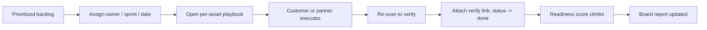

# PRD — Convert

**Tier:** Convert (Stage 4) · **Status:** draft · **Owner:** Product

The high-value, sticky tier: turn the prioritized backlog into a managed migration program with owners, playbooks, what-if planning, and re-scan proof — the system of record everyone (customer, integrator, auditor) logs into.

---

## Summary & goal

Let customers (and their delivery partners) execute the post-quantum migration inside Qtangl — assigning, tracking, and verifying remediation with signed proof — without Qtangl performing the hands-on cryptographic changes.

**Success:** ≥30% of Monitor customers attach Convert; remediation items move to verified-closed with re-scan proof.

---

## Personas & jobs-to-be-done

| Persona | Job |
|---------|-----|
| VP Engineering | "Run the migration program with clear ownership and proof" |
| CISO | "Show the board the score climbing as we remediate" |
| MSSP / integrator | "Deliver migration labor and log proof in one place" |
| Auditor | "Verify each fix was implemented and confirmed" |

---

## User stories

- As a **VP Eng**, I want to assign owners, sprints, and target dates to backlog items, so that teams are accountable.
- As an **engineer**, I want a concrete playbook per asset (e.g. hybrid KEX rollout), so that I know exactly what to do.
- As a **CISO**, I want a what-if projection, so that I can prioritize the highest-impact fixes first.
- As an **MSSP**, I want to update status and attach a re-scan verify link, so that the customer sees proof.
- As an **auditor**, I want each closed item to carry verification evidence, so that I can rely on it.

---

## Functional requirements

| ID | Priority | Requirement |
|----|----------|-------------|
| FR-C1 | M | Editable remediation status: open / in_progress / done / accepted_risk |
| FR-C2 | M | Assign owner, target date, notes per item |
| FR-C3 | M | Per-asset playbook (TLS hybrid KEX, JWKS rotation, SSH keys, code signing) |
| FR-C4 | M | What-if readiness projection from selected items |
| FR-C5 | M | Recommend owner team, sprint, ETA per item |
| FR-C6 | M | Re-scan to verify a fix; attach verify link to item |
| FR-C7 | M | Remediation velocity / completion % metrics |
| FR-C8 | S | Jira / ServiceNow bi-directional sync |
| FR-C9 | S | Partner/MSSP role with scoped access to a tenant |
| FR-C10 | S | Export including remediation status + completion % |
| FR-C11 | C | White-label report branding (Enterprise) |
| FR-C12 | C | Migration roadmap Gantt per tenant |

---

## Non-functional requirements

| ID | Requirement |
|----|-------------|
| NFR-C1 | Remediation status persists across sessions (Postgres) |
| NFR-C2 | Role-based access for partner vs customer vs admin |
| NFR-C3 | Verification re-scan reuses Assess scan path (consistency) |
| NFR-C4 | Audit log of status changes (who/when) |
| NFR-C5 | What-if projection clearly labeled as estimate with assumptions |

---

## UX flow

Components: RemediationBacklog, what-if widget, ReportDrawer. Logic: [remediation/service.py](../../../backend/app/remediation/service.py) (`recommend_remediation_plan`, `simulate_post_migration_readiness`, `remediation_velocity`), [standards.py](../../../backend/app/pqc/standards.py) (`remediation_action_for_asset`).

---

## Data & API

| Entity | Notes |
|--------|-------|
| RemediationStatus | remediationId, status, owner, notes, targetDate, updatedAt |
| VerificationProof | remediationId, rescanId, verifyUrl, confirmedAt |

| Endpoint | Purpose |
|----------|---------|
| `GET /pqc/remediation` | List items + status |
| `PUT /pqc/remediation/{id}/status` | Update status/owner/notes |
| `POST /pqc/remediation/{id}/verify` | Trigger verification re-scan |
| `GET /pqc/remediation/velocity` | Throughput metrics |

---

## Telemetry

| Event | Properties |
|-------|------------|
| `remediation_status_changed` | from, to, owner |
| `playbook_opened` | assetKind |
| `whatif_simulated` | selectedCount, projectedDelta |
| `remediation_verified` | remediationId, rescanId |
| `convert_attached` | tenantId |

---

## Boundary (what Convert is NOT)

| Qtangl owns | Out of scope |
|-------------|--------------|
| Prioritization, playbooks, tracking, what-if | HSM provisioning |
| Re-scan verification + signed proof | Cert re-issuance at CA |
| Program reporting | Load balancer / network changes |
| Partner orchestration | Pen testing, formal attestation |

---

## Acceptance criteria

- [ ] Remediation items persist; status editable in UI
- [ ] Owner, target date, notes saved per item
- [ ] Per-asset playbook displayed
- [ ] What-if projection returns current/projected/delta
- [ ] Verification re-scan attaches verify link and closes item
- [ ] Export includes remediation completion %
- [ ] Partner role can update status within a scoped tenant

---

## Open questions

- Jira vs ServiceNow first for integration?
- Partner access model — per-tenant invite vs partner org?
- Pricing: Convert as Monitor add-on vs Enterprise-only?
