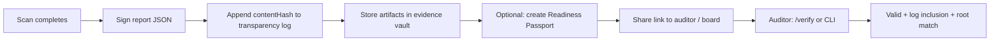
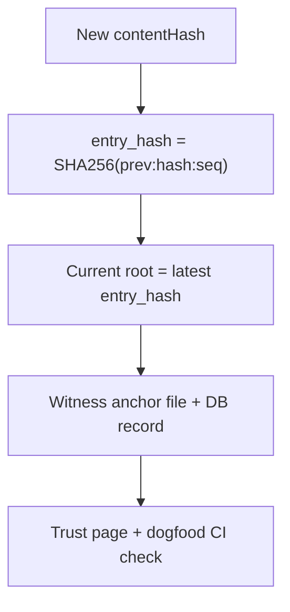

# PRD — Evidence Layer

**Tier:** Cross-cutting (Assess · Monitor · Convert) · **Status:** draft · **Owner:** Product

The trust substrate of the readiness platform: signed artifacts, append-only transparency, tenant evidence retention, shareable passports, and independently verifiable proof — online or offline.

---

## Summary & goal

Give every readiness artifact (scan report, CBOM export, drift receipt, remediation verification) a **cryptographic identity** that buyers, auditors, and partners can validate without trusting Qtangl's UI alone.

**Success:** ≥80% of closed-won deals demo the verify flow; ≥50% of Monitor renewals cite evidence/verify in CSAT; transparency log enabled in production with published anchors.

---

## Personas & jobs-to-be-done

| Persona | Job |
|---------|-----|
| CISO | "Hand the board and auditors proof that doesn't depend on our word" |
| Compliance lead | "Retain signed artifacts for the audit window and share them safely" |
| Auditor / assessor | "Verify signature, content hash, and log inclusion offline" |
| MSSP / partner | "Deliver customer evidence through a revocable passport, not email attachments" |
| Security engineer | "Script verification in CI or SOAR without calling a browser" |

---

## User stories

- As a **CISO**, I want every report signed with a published key fingerprint, so that tampering is detectable.
- As a **compliance lead**, I want scan artifacts retained in an evidence vault per tenant, so that I meet retention policy without local exports.
- As a **buyer**, I want a Readiness Passport link I can revoke, so that I control third-party access to sensitive inventory.
- As an **auditor**, I want to paste report JSON into `/verify` or run a CLI, so that I can validate offline.
- As an **engineer**, I want transparency log inclusion in the verify response, so that I can confirm the hash was logged at signing time.
- As a **partner**, I want the evidence bundle ZIP to include methodology and signature sidecars, so that handoff is one download.

---

## Functional requirements

| ID | Priority | Requirement |
|----|----------|-------------|
| FR-E1 | M | Sign every report JSON with Ed25519; embed `signature` block (alg, keyFingerprint, contentHash, signedAt) |
| FR-E2 | M | Compute deterministic `contentHash` (SHA-256 of canonical report JSON, signature excluded) |
| FR-E3 | M | Append `contentHash` to append-only transparency log on scan complete (idempotent) |
| FR-E4 | M | Expose `GET /pqc/transparency/root`, `GET /pqc/transparency/keys`, `GET /pqc/transparency/{contentHash}` |
| FR-E5 | M | Public verify: `GET /pqc/verify/{scanId}` and `POST /pqc/verify` (paste JSON) |
| FR-E6 | M | Verify UI at `/verify` — scanId lookup + paste-JSON mode; show log inclusion when present |
| FR-E7 | M | Offline CLI `backend/scripts/qtangl_verify.py` — recompute hash, verify signature, optional log inclusion + root check |
| FR-E8 | M | Evidence bundle ZIP: PDF, JSON, CBOM, CSV, methodology, glossary, references, signature sidecar |
| FR-E9 | M | Signing key registry with `active` / `retired` status; public key list for offline verification |
| FR-E10 | M | Anchor transparency log roots to external witness (file/git artifact); store anchor records |
| FR-E11 | S | Evidence vault: tenant-scoped storage of bundles + verify receipts; configurable retention (default 12 months) |
| FR-E12 | S | Readiness Passport: extend ShareLink with label, artifact scope (report/bundle/passport), view audit trail |
| FR-E13 | S | Publish open verify specification (canonical JSON, hash algorithm, signature format, API contract) |
| FR-E14 | S | Trust page lists current signing keys, log root, latest anchor, and CLI quick-start |
| FR-E15 | S | Include transparency receipt in report PDF provenance footer |
| FR-E16 | C | Scheduled anchor job + alert on root drift vs published witness |
| FR-E17 | C | PQC signing algorithm option (ML-DSA) when lib availability and policy allow |
| FR-E18 | C | SIEM export of `report_verified` and `transparency_append` events |

---

## Non-functional requirements

| ID | Requirement |
|----|-------------|
| NFR-E1 | Transparency append is fail-safe: signing succeeds even if log append fails (logged, retried) |
| NFR-E2 | Log stores hashes and metadata only — no PII, no report body |
| NFR-E3 | Verify endpoints are unauthenticated; rate-limited; no tenant enumeration via scanId |
| NFR-E4 | ShareLink / Passport tokens stored as SHA-256 hash; raw token shown once at creation |
| NFR-E5 | Evidence vault encrypted at rest; tenant-isolated ([12-platform-security-and-trust.md](../12-platform-security-and-trust.md)) |
| NFR-E6 | CLI exits 0 on valid signature, 1 on invalid, 2 on usage/file errors |
| NFR-E7 | Golden snapshot tests for contentHash determinism in CI ([test_pqc_golden.py](../../../backend/tests/test_pqc_golden.py)) |
| NFR-E8 | Key rotation: retired keys remain verifiable; new scans use active key only |

---

## UX flow

**Transparency log flow**

Components: `VerifyPageClient` ([web/app/verify/VerifyPageClient.tsx](../../../web/app/verify/VerifyPageClient.tsx)), trust page, ReportDrawer provenance footer. Backend: [signing.py](../../../backend/app/pqc/signing.py), [transparency.py](../../../backend/app/pqc/transparency.py), [anchoring.py](../../../backend/app/pqc/anchoring.py), [key_registry.py](../../../backend/app/pqc/key_registry.py), [report_bundle.py](../../../backend/app/pqc/report_bundle.py).

---

## Data & API

| Entity | Notes |
|--------|-------|
| `SigningKeyRecord` | id, alg, publicKeyB64, keyFingerprint, status, activatedAt, retiredAt |
| `EvidenceLogEntry` | seq, contentHash, keyFingerprint, alg, signedAt, prevEntryHash, entryHash, tenantId |
| `EvidenceAnchorRecord` | rootHash, seq, entryCount, witnessId, method, anchoredAt |
| `ShareLink` / `ReadinessPassport` | extends ShareLink: label, scope (`report` \| `bundle` \| `passport`), createdBy |
| `EvidenceVaultObject` | tenantId, scanId, objectType, storageKey, contentHash, retainedUntil |

| Endpoint | Purpose |
|----------|---------|
| `GET /pqc/verify/{scanId}` | Public verify by scan |
| `POST /pqc/verify` | Verify pasted report JSON |
| `GET /pqc/transparency/root` | Current log root |
| `GET /pqc/transparency/keys` | Public signing key history |
| `GET /pqc/transparency/{contentHash}` | Inclusion proof for hash |
| `GET /pqc/report/{id}?format=evidence` | Evidence bundle ZIP |
| `GET /r/{token}` | Passport resolve → download scoped artifact |
| `POST /tenant/scans/{id}/share` | Create / revoke passport link |

**Open verify spec (v1 outline)**

1. **Canonical JSON:** `json.dumps(report, sort_keys=True, separators=(",", ":"))` with `signature` key removed
2. **Content hash:** `SHA-256(canonical_utf8)` → 64-char lowercase hex
3. **Signature:** Ed25519 over `contentHash` bytes; `keyFingerprint` = SHA-256 of raw public key
4. **Inclusion proof:** `seq`, `entryHash`, `rootHash`, `prevEntryHash` from transparency API
5. **CLI:** `python backend/scripts/qtangl_verify.py report.json [--api-base URL] [--published-root HASH] [--json]`

---

## Telemetry

| Event | Properties |
|-------|------------|
| `report_signed` | scanId, alg, keyFingerprint |
| `transparency_appended` | contentHash, seq, success |
| `report_verified` | scanId, valid, source (`public_verify` \| `paste_verify` \| `cli`) |
| `verify_cli_ping` | valid |
| `passport_created` | scanId, scope, expiresHours |
| `passport_revoked` | linkId |
| `evidence_bundle_downloaded` | scanId, format |
| `anchor_published` | rootHash, witnessId |

---

## Boundary (what the evidence layer is NOT)

| Qtangl owns | Out of scope |
|-------------|--------------|
| Signing, log, verify, bundle, passport | Formal audit attestation or compliance sign-off |
| Hash-only transparency log | Storing customer key material or private keys |
| Published verification spec | Legal e-signature frameworks (ESIGN/UETA) |
| Evidence retention policy enforcement | Customer's long-term WORM archive (export supported) |

Honest scope footer on all artifacts: **"Inventory aid, not a formal audit."**

---

## Acceptance criteria

- [ ] Live scan produces signed report; `contentHash` stable across re-serialization (golden test)
- [ ] Transparency log append on scan complete when `QTANGL_ENABLE_TRANSPARENCY_LOG=true`
- [ ] `/verify?scanId=` shows valid signature and log inclusion (when enabled)
- [ ] Paste-JSON verify works on exported `report.json`
- [ ] `qtangl_verify.py` returns exit 0/1 correctly; `--api-base` fetches inclusion proof
- [ ] Evidence bundle ZIP contains pdf, json, cbom, csv, methodology, signature.json
- [ ] `GET /pqc/transparency/keys` lists active and retired public keys
- [ ] Share link creates revocable passport; expired/revoked tokens rejected
- [ ] Trust page documents verify steps and links to open spec
- [ ] Anchor witness file written; root hash matches API `transparency/root`

---

## Open questions

- Default passport TTL — 7 days (168h) vs configurable per tenant?
- Evidence vault: object storage (S3) vs Postgres blob for bundles at scale?
- Publish verify spec as `/docs/verify` page vs standalone `VERIFY.md` in repo?
- When to enable transparency log by default in production (flag vs always-on)?
- Passport scope: single-scan vs portfolio-level (multi-scan passport)?
