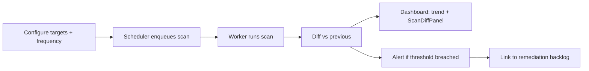

# PRD — Monitor

**Tier:** Monitor (Stage 3) · **Status:** draft · **Owner:** Product

The recurring product: scheduled re-scans, drift detection, and alerts that turn a one-time assessment into a living system of record.

---

## Summary & goal

Detect and alert on changes to an organization's cryptographic posture over time — new quantum-vulnerable assets, algorithm regressions, expiring certificates, and readiness-score movement — so customers maintain (and prove) continuous migration progress.

**Success:** ≥90% Monitor renewal; readiness score trends net-positive per cohort.

---

## Personas & jobs-to-be-done

| Persona | Job |
|---------|-----|
| CISO | "Know if our posture got worse before the auditor does" |
| Compliance lead | "Show continuous evidence, not a stale snapshot" |
| VP Engineering | "Get alerted when a deploy reintroduces weak crypto" |

---

## User stories

- As a **CISO**, I want scheduled re-scans, so that exposure is tracked without manual effort.
- As a **VP Eng**, I want an alert when a new quantum-vulnerable endpoint appears, so that I can fix regressions fast.
- As a **compliance lead**, I want a diff showing what changed since the last audit, so that I can evidence progress.
- As an **admin**, I want to configure frequency and alert thresholds, so that noise stays manageable.
- As a **buyer**, I want a readiness trend chart, so that I can show the board we're improving.

---

## Functional requirements

| ID | Priority | Requirement |
|----|----------|-------------|
| FR-M1 | M | Configure scan frequency (weekly/monthly) per target |
| FR-M2 | M | Trigger scans automatically without manual action |
| FR-M3 | M | Compute diff vs previous scan: new assets, removed, degraded algorithms |
| FR-M4 | M | Flag newly quantum-vulnerable assets |
| FR-M5 | M | Flag certificates expiring within 30 days |
| FR-M6 | M | Compute readiness delta and drift causes |
| FR-M7 | M | Alert via webhook (Slack/HTTPS) and email on threshold breach |
| FR-M8 | M | Persist scan history per tenant |
| FR-M9 | S | Configurable alert thresholds (severity, score drop) |
| FR-M10 | S | Readiness trend chart over time |
| FR-M11 | S | SIEM field mapping (Splunk/Sentinel) doc + payload |
| FR-M12 | C | Anomaly detection on drift (unusual change volume) |
| FR-M13 | C | Scheduled CBOM export to cloud bucket for audit retention |

---

## Non-functional requirements

| ID | Requirement |
|----|-------------|
| NFR-M1 | Scheduled scan on-time reliability > 99% |
| NFR-M2 | Diff computation deterministic and idempotent |
| NFR-M3 | Worker isolation; no cross-tenant scan bleed |
| NFR-M4 | Alert latency < 5 min after scan completion |
| NFR-M5 | Backed by Postgres (history) + Redis (scheduler) — Track D1/D2 |

---

## UX flow

Components: ScanDiffPanel, ScanLog, DashboardClient ([03-solution-architecture.md](../03-solution-architecture.md)). Diff engine: [monitoring/diff.py](../../../backend/app/monitoring/diff.py).

---

## Data & API

| Entity | Notes |
|--------|-------|
| Schedule | tenantId, targetDomain, frequency, threshold |
| ScanDiff | readinessDelta, newQuantumVulnerable, degradedAlgorithms, certExpiring, driftCauses |

| Endpoint | Purpose |
|----------|---------|
| `POST /pqc/monitor/config` | Set schedule + thresholds |
| `GET /pqc/scan/{id}/diff` | Diff vs previous |
| `GET /pqc/monitor/history` | Scan history / trend |
| Webhook v2 | Scan-complete payload ([webhooks.py](../../../backend/app/notifications/webhooks.py)) |

---

## Telemetry

| Event | Properties |
|-------|------------|
| `monitor_configured` | frequency, threshold |
| `scheduled_scan_ran` | onTime, durationMs |
| `drift_detected` | newQVuln, degraded, readinessDelta |
| `alert_fired` | channel, severity |
| `trend_viewed` | range |

---

## Acceptance criteria

- [ ] Scheduled scan runs without manual trigger (B3)
- [ ] Diff report shows delta from previous scan
- [ ] Alert fires on new `quantum_vulnerable` asset
- [ ] Cert-expiry within 30 days surfaced
- [ ] Readiness trend visible on dashboard
- [ ] Webhook payload documented for SIEM ingestion

---

## Open questions

- Default frequency for self-serve Monitor (weekly vs monthly)?
- Alert fatigue controls — digest vs per-event?
- Retention window for scan history at base Monitor tier vs Enterprise?
