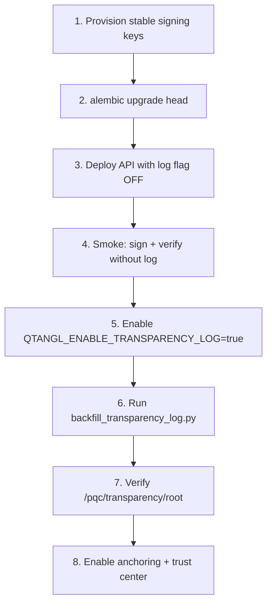

# Evidence Layer Rollout Runbook

Operational guide for enabling the transparency log, signing key registry, and verify surfaces in staging → production. Epic: **K16**. Spec: [verify-spec.md](../../../docs/verify-spec.md).

---

## Prerequisites

| Requirement | Check |
|-------------|-------|
| Postgres `DATABASE_URL` set | Persistence required for log tables |
| Alembic at `004_evidence_layer` or later | `alembic current` shows `004_evidence_layer` |
| Stable signing key provisioned | See env vars below — **never** rely on ephemeral per-process keys in prod |
| CI green | `test_transparency_log.py`, `test_pqc_hardening.py` signing tests |

---

## Environment variables

| Variable | Required | Default | Purpose |
|----------|----------|---------|---------|
| `DATABASE_URL` | **Yes** (prod) | — | Postgres for `evidence_log`, `signing_keys`, `evidence_anchors` |
| `QTANGL_DB_AUTO_MIGRATE` | Recommended | `true` | Auto-create tables on startup (dev); prod prefer Alembic |
| `QTANGL_REPORT_SIGNING_KEY_B64` | **Yes** (prod) | — | Stable Ed25519 private key (base64, 32 bytes raw) |
| `QTANGL_ML_DSA_SECRET_B64` | Recommended | — | ML-DSA-65 secret key (base64) — primary PQ signature |
| `QTANGL_ML_DSA_PUBLIC_B64` | With ML-DSA secret | — | ML-DSA-65 public key (base64) |
| `QTANGL_SIGNING_KEY_FILE` | Alt to env | `data/.signing/ed25519.key` | Persisted Ed25519 key path |
| `QTANGL_ML_DSA_KEY_FILE` | Alt to env | `data/.signing/mldsa65.keypair` | Persisted ML-DSA keypair path |
| `QTANGL_ENABLE_TRANSPARENCY_LOG` | **Yes** to enable | `false` | Master feature flag for log append |
| `QTANGL_TRANSPARENCY_ANCHOR_DIR` | Optional | `data/transparency/anchors` | File witness anchors for log roots |
| `QTANGL_ANCHOR_INTERVAL` | Optional | `100` | Anchor every N log entries |
| `QTANGL_ANCHOR_EVERY_ENTRY` | Optional | `false` | Force anchor on every append (dev only) |
| `QTANGL_PQC_DATA_DIR` | Optional | `backend/data` | Base path for signing keys and anchors |

**Security:** Store signing keys in platform secrets (Railway, etc.) — never commit. Rotate via key registry retirement + new fingerprint (document in trust center).

---

## Migration order

Execute in this sequence. Do not enable the transparency log before migrations complete.



### Step-by-step

**1. Provision signing keys (staging first)**

```bash
# Generate Ed25519 key (example — use your secrets manager in prod)
python -c "from cryptography.hazmat.primitives.asymmetric.ed25519 import Ed25519PrivateKey; from cryptography.hazmat.primitives.serialization import Encoding, PrivateFormat, NoEncryption; import base64; k=Ed25519PrivateKey.generate(); print(base64.b64encode(k.private_bytes(Encoding.Raw, PrivateFormat.Raw, NoEncryption())).decode())"
```

Set `QTANGL_REPORT_SIGNING_KEY_B64` (and ML-DSA vars if `oqs-python` available).

**2. Run Alembic migration**

```bash
cd backend
export DATABASE_URL=postgresql+psycopg://...
alembic upgrade head
```

Creates: `signing_keys`, `evidence_log`, `evidence_anchors` ([004_evidence_layer.py](../../../backend/alembic/versions/004_evidence_layer.py)).

**3. Deploy with log disabled**

Set `QTANGL_ENABLE_TRANSPARENCY_LOG=false` (or unset). Confirm existing scan → report → `/pqc/verify/{scanId}` still works.

**4. Enable transparency log**

```bash
export QTANGL_ENABLE_TRANSPARENCY_LOG=true
```

Redeploy API + worker (signing also runs in `post_complete.py`).

**5. Backfill historical reports (one-time, idempotent)**

```bash
cd backend
export DATABASE_URL=...
export QTANGL_ENABLE_TRANSPARENCY_LOG=true
python scripts/backfill_transparency_log.py --dry-run   # preview
python scripts/backfill_transparency_log.py             # execute
```

**6. Smoke tests**

| Check | Command / URL |
|-------|---------------|
| Log root | `GET /pqc/transparency/root` → `seq` ≥ 1, `rootHash` 64-char hex |
| Key registry | `GET /pqc/transparency/keys` → active key fingerprints |
| Verify + inclusion | `GET /pqc/verify/{scanId}` → `verification.logInclusion.included: true` |
| Offline CLI | `python scripts/qtangl_verify.py report.json --api-base https://api.qtangl.com` |
| Golden hash | `pytest tests/test_pqc_golden.py` |

**7. Production cutover checklist**

- [ ] Signing key backed up in secrets manager
- [ ] `QTANGL_ENABLE_TRANSPARENCY_LOG=true` on API **and** worker
- [ ] Backfill completed; `entryCount` matches signed report count ± skipped
- [ ] Trust center updated with transparency root URL
- [ ] Dogfood scan in CI produces log inclusion ([pqc-dogfood.yml](../../../.github/workflows/pqc-dogfood.yml))
- [ ] Rollback plan: set flag `false` — verify still works; log append stops (non-breaking)

---

## Feature flag behavior

| Flag state | Sign reports | Append to log | Verify endpoint | Key registry |
|------------|--------------|---------------|-----------------|--------------|
| `false` / unset | ✅ | ❌ (silent skip) | ✅ (no `logInclusion`) | On sign only |
| `true` | ✅ | ✅ (fail-safe) | ✅ + `logInclusion` | ✅ |

Log append is **fail-safe**: signing and report delivery never fail if log append errors. Monitor `transparency append failed` warnings in logs.

---

## Rollback

1. Set `QTANGL_ENABLE_TRANSPARENCY_LOG=false` — immediate; no data loss
2. Log tables remain for forensic use; do not drop in rollback
3. If bad key deployed: rotate key env vars, register new fingerprint, retire old key in registry

---

## Related docs

- Open verify spec: [docs/verify-spec.md](../../../docs/verify-spec.md)
- Epic: [09-epics-and-backlog.md](../09-epics-and-backlog.md) K16
- Timeline: [15-timeline-and-milestones.md](../../optimization_OLD_FUTURE/15-timeline-and-milestones.md)
- Trust center: [12-platform-security-and-trust.md](../12-platform-security-and-trust.md)

---

## CBOM ingestion (K17)

After evidence layer (K16), enable neutral CBOM aggregation:

1. `alembic upgrade head` — requires `005_cbom_aggregation`
2. No feature flag — ingest API is always available to authenticated tenants
3. Smoke: `POST /pqc/cbom/ingest` with sample CycloneDX JSON; `GET /pqc/cbom/aggregate`
4. Dashboard: **CBOM aggregation** section shows multi-source counts + import panel
5. Conflicts: resolve via `PUT /pqc/cbom/conflicts/{id}` or dashboard **Merge conflicts** panel

**Decisions (v1):** dedupe key = `(name, type, alg)` with `bom-ref` fallback; conflicts manual-only; cloud/KMS connectors deferred to K17b.
